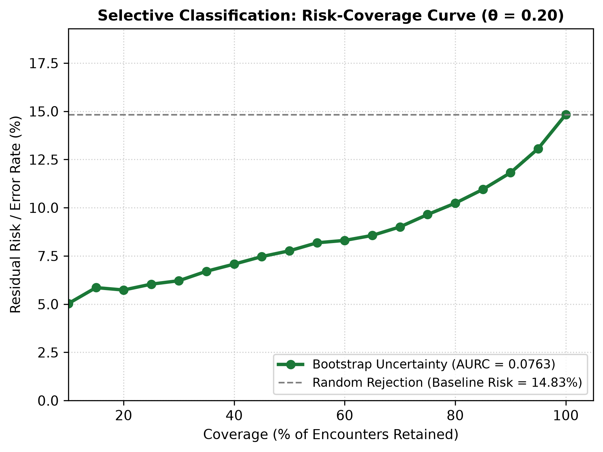

# Document 06: Selective Classification & Risk-Coverage Dynamics

## 1. Selective Prediction Framework

In a selective classification framework, a clinical model is permitted to abstain or refer uncertain patient encounters to expert human review.

By sorting all $14,913$ test encounters by uncertainty ascending and progressively rejecting the most uncertain predictions, we evaluate whether residual risk (classification error rate) decreases monotonically with coverage.

---

## 2. Risk-Coverage Empirical Scoreboard

| Coverage ($c$) | Retained Encounters | Rejected Encounters | Residual Error Rate | Error Reduction ($\Delta$) | Mean Uncertainty Retained |
| :---: | :---: | :---: | :---: | :---: | :---: |
| **100%** | 14,913 | 0 | **14.83%** | 0.0% (Baseline) | 0.0219 |
| **95%** | 14,167 | 746 | **13.07%** | -11.9% | 0.0185 |
| **90%** | 13,422 | 1,491 | **11.82%** | -20.3% | 0.0170 |
| **85%** | 12,676 | 2,237 | **10.95%** | -26.2% | 0.0159 |
| **80%** | 11,930 | 2,983 | **10.23%** | **-31.0%** | 0.0150 |
| **75%** | 11,185 | 3,728 | **9.65%** | -34.9% | 0.0142 |
| **70%** | 10,439 | 4,474 | **9.00%** | -39.3% | 0.0135 |
| **60%** | 8,948 | 5,965 | **8.30%** | -44.0% | 0.0123 |
| **50%** | 7,456 | 7,457 | **7.77%** | **-47.6%** | 0.0113 |
| **40%** | 5,965 | 8,948 | **7.07%** | -52.3% | 0.0104 |
| **30%** | 4,474 | 10,439 | **6.21%** | -58.1% | 0.0095 |
| **20%** | 2,983 | 11,930 | **5.73%** | -61.4% | 0.0086 |
| **10%** | 1,491 | 13,422 | **5.03%** | -66.1% | 0.0075 |

---

## 3. Risk-Coverage Curve & Integral Metrics

The figure below (generated as `figures/risk_coverage_curve.png`) plots residual classification risk against patient population coverage:

### Summary Metrics:
- **Area Under Risk-Coverage Curve (AURC)**: **$0.0763$**
- **Optimal Oracle AURC**: **$0.0116$**
- **Excess AURC (E-AURC)**: **$0.0647$**

---

## 4. Key Clinical Observations

1. **Monotonic Error Reduction**:
   Residual error drops monotonically from $14.83\%$ at full coverage down to $5.03\%$ at $10\%$ coverage, confirming that the uncertainty ordering aligns directly with prediction reliability.
2. **High-Yield Operational Point ($80\%$ Coverage)**:
   Rejecting the top $20\%$ most uncertain encounters ($2,983$ cases) reduces the classification error rate by **$31.0\%$** (from $14.83\%$ down to $10.23\%$).
3. **Workflow Integration**:
   Health systems with limited clinician review capacity can automatically process the top $80\%$ confident encounters while routing the remaining $20\%$ to manual chart review.
