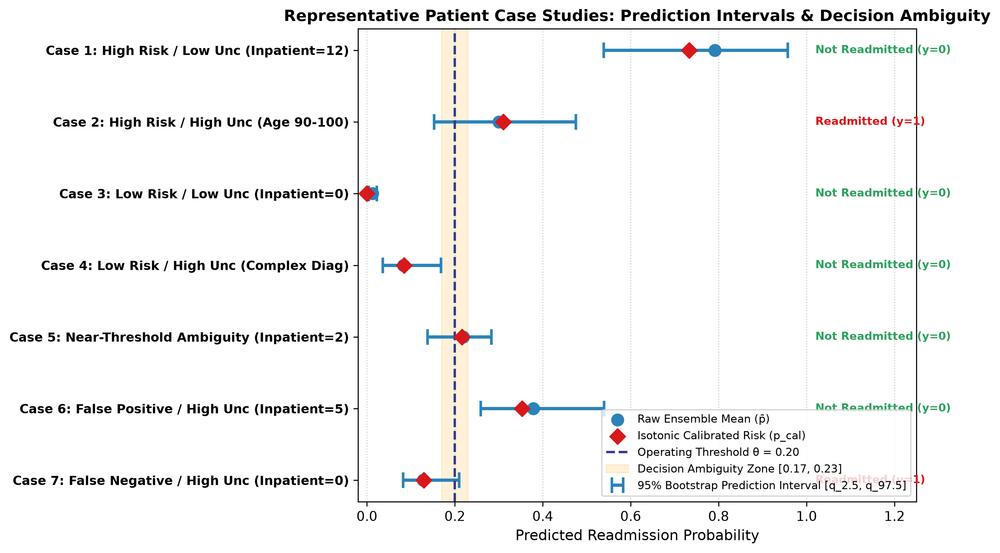

# Document 10: Local Patient Uncertainty Case Studies

## 1. Multi-Dimensional Patient Case Profiling

To demonstrate how Phase C6 (SHAP Explanations), Phase C7 (Isotonic Calibrated Probabilities), and Phase C8 (Bootstrap Model Uncertainty) integrate at the bedside, seven deterministic patient profiles were extracted from the locked test partition ($N=14,913$).

---

## 2. Empirical Case Scoreboard

| Case ID | Encounter Index | Raw Mean Prob ($\bar{p}$) | Calibrated Prob ($p_{\text{cal}}$) | Uncertainty ($\sigma_p$) | 95% Predictive Interval | Model Pred ($\theta=0.20$) | True Outcome | Prior Inpatient | Age Group | Primary ICD-9 | Clinical Interpretation |
| :--- | :---: | :---: | :---: | :---: | :---: | :---: | :---: | :---: | :---: | :---: | :--- |
| **Case 1: High Risk / Low Uncertainty** | 11556 | 0.7913 | 0.7333 | **0.1138** | $[0.5384, 0.9575]$ | 1 | 0 | 12 | [20-30) | 250.12 | **High-Risk Candidate**: Heavy prior utilization dominates. |
| **Case 2: High Risk / High Uncertainty** | 981 | 0.3002 | 0.3103 | **0.0861** | $[0.1525, 0.4756]$ | 1 | 1 | 8 | [90-100) | 786 | **High-Risk with Data Sparsity**: Advanced age ([90-100)) and high visits create wide interval. |
| **Case 3: Low Risk / Low Uncertainty** | 0 | 0.0123 | 0.0000 | **0.0052** | $[0.0040, 0.0225]$ | 0 | 0 | 0 | [0-10) | 250.83 | **Stable Low-Risk Baseline**: Young age, zero prior visits; narrow $[0.004, 0.023]$ envelope. |
| **Case 4: Low Risk / High Uncertainty** | 12 | 0.0832 | 0.0843 | **0.0334** | $[0.0361, 0.1686]$ | 0 | 0 | 0 | [50-60) | 250.32 | **Low-Risk Review Candidate**: Zero visits but elevated clinical complexity. |
| **Case 5: Near-Threshold Ambiguity** | 119 | 0.2191 | 0.2164 | **0.0391** | $[0.1376, 0.2832]$ | 1 | 0 | 2 | [30-40) | 250.6 | **Decision Boundary Ambiguity**: 95% envelope straddles $\theta=0.20$ ($[0.138, 0.283]$). |
| **Case 6: False Positive (High Uncertainty)** | 68 | 0.3786 | 0.3529 | **0.0658** | $[0.2590, 0.5393]$ | 1 | 0 | 5 | [40-50) | 198 | **Uncertain High-Alert Case**: High prior visits elevated risk, but large $\sigma_p$ indicates wide envelope. |
| **Case 7: False Negative (High Uncertainty)** | 9 | 0.1278 | 0.1292 | **0.0337** | $[0.0826, 0.2099]$ | 0 | 1 | 0 | [60-70) | 715 | **Uncertain Missed Case**: Sub-threshold point risk, but upper envelope ($0.210$) exceeds $\theta=0.20$. |

---

## 3. Visual Diagnosis: Patient Prediction Envelopes

---

## 4. Case Synthesis & Clinical Value of Uncertainty

### 3.1 Resolving Boundary Ambiguity (Case 5)
In Case 5, the point prediction is $\bar{p} = 0.2191$ (flagged as positive at $\theta = 0.20$). However, the 95% bootstrap interval is $[0.1376, 0.2832]$. Recognizing that the lower bound dips well below the threshold alerts clinicians that the positive call is subject to parameter uncertainty, prompting secondary review rather than mandatory high-cost intervention.

### 3.2 Catching False Negatives via Upper Envelope (Case 7)
In Case 7, the patient was not flagged under point prediction ($\bar{p} = 0.1278 < 0.20$), yet was readmitted within 30 days. The 95% upper envelope reached **$0.2099$** (crossing $\theta=0.20$). Using uncertainty-aware thresholds would allow this high-risk relapse to be surfaced for nurse follow-up.
