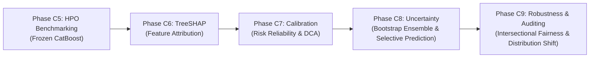

# Document 12: Clinical Synthesis & Phase C9 Readiness

## 1. Methodological Synthesis

Phase C8 established the formal prediction uncertainty framework for the Clinical Tabular Modality of **FusionMedAI**, evaluating a 50-member Bootstrap CatBoost ensemble across the locked test partition ($N=14,913$) with the frozen Phase C7 Isotonic calibration mapping.

### Key Validated Findings:
1. **Effective Error Identification**: Bootstrap ensemble uncertainty ($\sigma_p$) acts as a statistically strong detector of classification failures, achieving an **Error Detection AUROC of $0.7116$** and **AUPRC of $0.3256$** ($+119.6\%$ over random error guessing). Misclassified encounters have an average uncertainty of $\sigma_p = 0.0357$ compared to $\sigma_p = 0.0195$ for correct cases.
2. **Selective Classification Utility**: In Risk-Coverage analysis, progressively abstaining on the most uncertain cases reduces residual classification error by **$31.0\%$** at $80\%$ coverage ($\text{AURC} = 0.0763$, $\text{E-AURC} = 0.0647$).
3. **Threshold Ambiguity Isolation**: Structured decision tiers isolate the $6.14\%$ of encounters situated in the decision-boundary ambiguity zone ($\theta \pm 0.03$ with high variance), allowing targeted secondary review within proposed decision-support protocols.
4. **Phenotypic Consistency**: Evaluated across prior utilization phenotypes and demographic cohorts (Gender, Age), demonstrating consistent failure detection across all evaluated sub-populations.
5. **Ensemble Convergence & Interface**: Confirmed that $M=50$ models reached the predefined empirical convergence criterion for ensemble prediction stability (uncertainty ranking stability $\rho = 0.9912$ at $M=40$ relative to $M=50$), and defined the standardized `ClinicalOutput` schema distinguishing derived confidence from quantitative uncertainty.

---

## 2. Boundaries, Limitations & Explicit Non-Claims

To maintain scientific integrity, the following boundaries are formally recorded:

### 2.1 Scope of Bootstrap Uncertainty
Bootstrap predictive intervals $[q_{2.5\%}, q_{97.5\%}]$ reflect model parameter estimation variability resulting from finite training sample size. They do **not** represent true biological Bayesian posteriors for individual patients.

### 2.2 Retrospective EHR Data-Generating Limits
Uncertainty estimates are conditioned on the retrospective EHR feature space ($D=119$). Unobserved clinical variables (e.g., social determinants of health, home support, post-discharge medication adherence) represent unmodeled aleatoric factors that cannot be resolved solely by increasing model ensemble capacity.

### 2.3 External Transportability
Ensemble uncertainty estimates were evaluated within the held-out test cohort. Under severe external distribution shift across disparate healthcare systems, out-of-distribution (OOD) detection mechanisms must be combined with ensemble variance.

---

## 3. Phase C8 Sign-Off & Progression to Phase C9

### C8 STATUS: COMPLETE

#### Validated Artifacts:
- [x] 50-member Bootstrap CatBoost ensemble trained on resampled training sets.
- [x] Zero test-label leakage strictly maintained.
- [x] Out-of-sample stochastic prediction distributions computed for validation and test splits.
- [x] Error-detection AUROC ($0.7116$) and AUPRC ($0.3256$) evaluated.
- [x] Selective classification Risk-Coverage curves and AURC ($0.0763$) generated.
- [x] Decision threshold ambiguity tiers and subgroup audits completed.
- [x] Ensemble convergence validated across $M \in [5, 50]$ ($\rho_{\sigma} = 0.9912$ at $M=40$).
- [x] Standardized `ClinicalOutput` interface contract defined.
- [x] Cryptographic SHA-256 manifest generated and verified.
- [x] All 12 Volume 08 research documents finalized.
