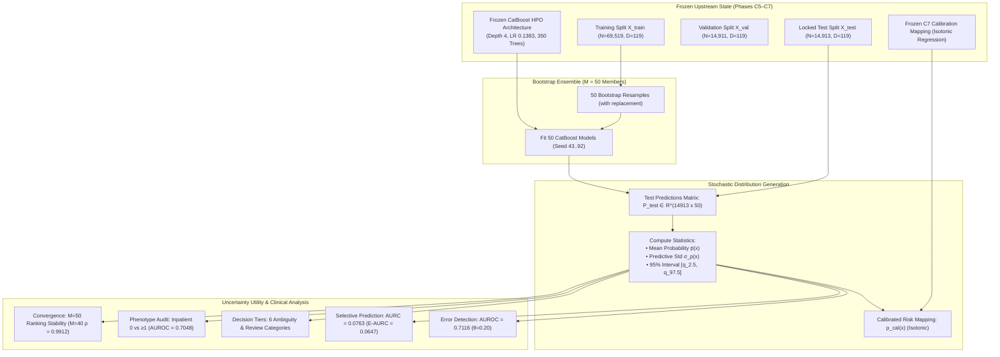

# Research Volume 08: Clinical Prediction Uncertainty & Reliability Profiling

## Overview
This volume documents the formal empirical investigation of **Prediction Uncertainty Estimation** for the Clinical Modality of **FusionMedAI** (Phase C8).

In clinical decision support, point predictions and single calibrated probability values fail to communicate model epistemic confidence. A patient encounter with a predicted readmission probability of $\hat{p} = 0.20$ situated in a dense training region possesses high model certainty, whereas the same probability predicted for an unusual clinical phenotype reflects high model parameter ambiguity.

Following the frozen model contract established in Phase C5, explainability audit in Phase C6, and probability calibration in Phase C7, Phase C8 evaluates predictive uncertainty for the frozen **CatBoost HPO Tuned** candidate model (`depth=4`, `learning_rate=0.1383`, `iterations=350`, `l2_leaf_reg=2.911`, `subsample=0.655`, `random_seed=42`).

We implement a **50-member Bootstrap CatBoost Ensemble** trained on resampled training partitions ($N_{\text{train}}=69,519$) and evaluate out-of-sample prediction distributions on the locked test set ($N_{\text{test}}=14,913$) across error detection, risk-coverage dynamics (AURC / E-AURC), decision-threshold ambiguity tiers, and subgroup stability.

---

## Volume Contents

| Document | Title | Description |
| :--- | :--- | :--- |
| [01_uncertainty_protocol.md](01_uncertainty_protocol.md) | **Uncertainty Protocol & Definitions** | Frozen C7 state lock, bootstrap model uncertainty definitions, and governance. |
| [02_uncertainty_methodology.md](02_uncertainty_methodology.md) | **Ensemble Uncertainty Methodology** | Mathematical formulation of Bootstrap ensemble, variance, prediction intervals, and calibration integration. |
| [03_bootstrap_uncertainty.md](03_bootstrap_uncertainty.md) | **Bootstrap Ensemble Dynamics** | 50-member bootstrap ensemble training, diversity, and parameter dispersion. |
| [04_predictive_distribution.md](04_predictive_distribution.md) | **Predictive Distribution Profiling** | Test set distribution statistics: Mean Uncertainty ($0.0219$), Median ($0.0162$), IQR ($[0.0114, 0.0249]$). |
| [05_error_detection.md](05_error_detection.md) | **Error Detection Evaluation** | Evaluating uncertainty as a misclassification detector: Error AUROC ($0.7116$), AUPRC ($0.3256$). |
| [06_risk_coverage.md](06_risk_coverage.md) | **Selective Classification & Risk-Coverage** | Selective prediction curves: $\text{AURC} = 0.0763$, $\text{E-AURC} = 0.0647$, $31.0\%$ error reduction at $80\%$ coverage. |
| [07_subgroup_uncertainty.md](07_subgroup_uncertainty.md) | **Subgroup & Utilization Phenotype Audit** | Uncertainty reliability audit across prior inpatient history ($0$ vs $\ge 1$), gender, and age brackets. |
| [08_threshold_uncertainty.md](08_threshold_uncertainty.md) | **Threshold Ambiguity & Decision Tiers** | Stratification into 6 operational clinical tiers around operating threshold $\theta=0.20$. |
| [09_convergence_analysis.md](09_convergence_analysis.md) | **Ensemble Convergence Analysis** | Benchmark of ensemble sizes $M \in [5, 50]$: ranking stability ($\rho = 0.9912$ at $M=40$) and AUROC plateau. |
| [10_local_uncertainty_cases.md](10_local_uncertainty_cases.md) | **Representative Patient Case Studies** | 7 deterministic patient profiles connecting C6 SHAP + C7 calibrated risk + C8 uncertainty. |
| [11_clinical_output_contract.md](11_clinical_output_contract.md) | **Multimodal ClinicalOutput Contract** | Standardized JSON payload schema distinguishing derived confidence from quantitative uncertainty. |
| [12_conclusion.md](12_conclusion.md) | **Synthesis & Phase C9 Readiness** | Final methodological synthesis, scientific non-claims, and sign-off for Phase C9. |

---

## Uncertainty Architecture Workflow

---

## Key Experimental Results Summary

| Metric | Measured Test Value ($N=14,913$) | Interpretation / Operational Significance |
| :--- | :---: | :--- |
| **Ensemble Size ($M$)** | $50\text{ models}$ | Selected by empirical convergence audit ($\rho = 0.9912$ ranking correlation at $M=40$ relative to $M=50$). |
| **Mean Predictive Uncertainty ($\sigma_p$)** | $0.0219$ | Average standard deviation of predicted probability across bootstrap models. |
| **Median Predictive Uncertainty** | $0.0162$ | Skewed distribution (IQR: $[0.0114, 0.0249]$, 90th percentile: $0.0421$). |
| **Error Detection AUROC ($\theta=0.20$)** | **$0.7116$** | Uncertainty reliably discriminates between correct ($\mu=0.0195$) and incorrect ($\mu=0.0357$) classifications. |
| **Error Detection AUPRC ($\theta=0.20$)** | **$0.3256$** | $+119.6\%$ relative improvement over random error guessing baseline ($0.1483$). |
| **Risk-Coverage AURC** | **$0.0763$** | Quantifies selective classification efficacy across progressive rejection thresholds. |
| **Excess AURC (E-AURC)** | **$0.0647$** | Distance to theoretical oracle selective predictor ($\text{AURC}_{\text{oracle}} = 0.0116$). |
| **Error Reduction at $80\%$ Coverage** | **$10.23\%$ vs $14.83\%$** | Rejecting the $20\%$ most uncertain encounters reduces residual error by **$31.0\%$**. |

---

## Artifact Manifest Verification

All tables, selective prediction curves, threshold ambiguity figures, local patient cases, and evaluation metrics generated during Phase C8 are tracked under the cryptographic manifest `experiments/clinical/uncertainty/manifests/c8_uncertainty_manifest.json` and verified by `verification/clinical/model/verify_uncertainty.py`.
