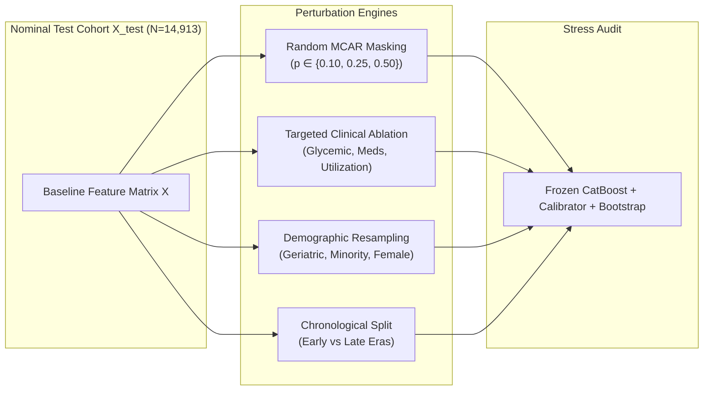

# Document 02: Distribution Shift & Perturbation Methodology

## 1. Theoretical Formulation of Distribution Shift

In supervised clinical risk prediction, training data is sampled from a joint probability distribution $P_{\text{train}}(X, Y)$. Distribution shift occurs when the deployment or test distribution $P_{\text{test}}(X, Y)$ differs from $P_{\text{train}}(X, Y)$.

Phase C9 investigates three primary formal classes of distribution shift:

### 1.1 Covariate Shift ($P_{\text{test}}(X) \neq P_{\text{train}}(X)$ while $P(Y \mid X)$ remains fixed)
The clinical characteristics of the patient cohort change (e.g., higher proportion of elderly multi-morbid patients or different demographic mixtures), but the underlying biological readmission risk conditional on clinical state remains invariant.

### 1.2 Information Degradation / Corrupted Covariates ($\tilde{X} = \mathcal{M}(X)$)
Values in EHR feature fields are corrupted by missingness, omitted laboratory assays, or unrecorded medication changes, transforming the observed feature vector $X$ into degraded vector $\tilde{X}$.

### 1.3 Longitudinal Concept Drift ($P_{\text{test}}(Y \mid X) \neq P_{\text{train}}(Y \mid X)$)
Over multi-year periods (1999–2008), clinical guidelines, discharge protocols, and medication therapies evolve, shifting the empirical relationship between observed admission features and 30-day readmission outcomes.

---

## 2. Shift Perturbation Mechanisms

### 2.1 Missing Completely at Random (MCAR)
For each eligible feature column $j \in \{1, \dots, D\}$, values are independently masked with probability $\alpha \in \{0.10, 0.25, 0.50\}$:
$$\tilde{X}_{ij} = \begin{cases} \text{Missing Value Token} & \text{with probability } \alpha \\ X_{ij} & \text{with probability } 1 - \alpha \end{cases}$$
The masked values are processed through the frozen `ClinicalPreprocessor` imputation and scaling pipeline.

### 2.2 Targeted Feature Ablation
Specific clinical feature sets identified in Phase C6 TreeSHAP attribution analysis are completely masked:
- **Glycemic / Laboratory Panel**: `A1Cresult`, `max_glu_serum`, `num_lab_procedures`.
- **Pharmacotherapy Panel**: `insulin`, `metformin`, `glipizide`, `glyburide`, `pioglitazone`, `rosiglitazone`, `glimepiride`, `change`, `diabetesMed`.
- **Prior Utilization Panel**: `number_inpatient`, `number_emergency`, `number_outpatient`, `time_in_hospital`, `num_procedures`.

### 2.3 Demographic & Population Resampling
Given population subgroup indicators $g_i \in \{1, \dots, K\}$, target population distributions $w = (w_1, \dots, w_K)$ are generated via importance sampling:
$$\mathbb{P}(\text{sample } i) \propto \frac{w_{g_i}}{N_{g_i}}$$
generating resampled evaluation cohorts of size $N=14,913$ with specified demographic proportions.

---

## 3. Quantitative Degradation Metrics

For each shift scenario $s$, performance and reliability metrics are compared against nominal test values:

1. **Discrimination Shift**:
   $$\Delta \text{ROC-AUC} = \text{ROC-AUC}_s - \text{ROC-AUC}_{\text{nominal}}$$
   $$\Delta \text{PR-AUC} = \text{PR-AUC}_s - \text{PR-AUC}_{\text{nominal}}$$

2. **Calibration Slope Degradation**:
   $$\Delta \text{Slope} = \text{Slope}_s - \text{Slope}_{\text{nominal}}$$
   Measures whether probabilities become over-confident ($\text{Slope} < 1.0$) or under-confident ($\text{Slope} > 1.0$).

3. **Expected Calibration Error Shift**:
   $$\Delta \text{ECE} = \text{ECE}_s - \text{ECE}_{\text{nominal}}$$

4. **Uncertainty Inflation Response**:
   $$\Delta \mu_{\sigma} = \mathbb{E}_{s}[\sigma_p] - \mathbb{E}_{\text{nominal}}[\sigma_p]$$
   $$\text{Inflation Ratio} = \frac{\mathbb{E}_{s}[\sigma_p]}{\mathbb{E}_{\text{nominal}}[\sigma_p]}$$
