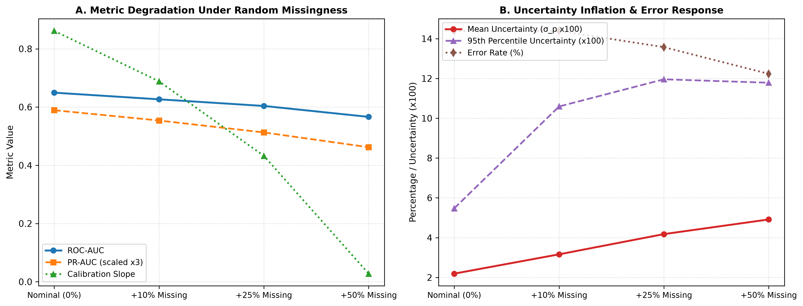

# Document 03: Missingness Shift & Feature Ablation Degradation

## 1. Controlled Missingness Scenarios

To investigate whether the clinical prediction pipeline remains dependable when EHR data quality deteriorates, we evaluate seven controlled missingness scenarios against the nominal locked test set ($N=14,913$):

1. **M0 (Nominal Reference)**: Baseline test split with native missingness handled by Preprocessor.
2. **M1 (+10% Random MCAR)**: 10% additional random masking across all feature columns.
3. **M2 (+25% Random MCAR)**: 25% additional random masking across all feature columns.
4. **M3 (+50% Random MCAR)**: 50% additional random masking across all feature columns.
5. **M4a (Targeted Glycemic/Lab)**: Complete masking of `A1Cresult`, `max_glu_serum`, and `num_lab_procedures`.
6. **M4b (Targeted Medications)**: Complete masking of all 23 diabetic medication therapies and `change` flag.
7. **M4c (Targeted Utilization)**: Complete masking of `number_inpatient`, `number_emergency`, `number_outpatient`, and `time_in_hospital`.

> [!NOTE]
> MCAR perturbations simulate controlled information degradation to test algorithmic sensitivity and should not be interpreted as estimates of actual real-world clinical missing-data mechanisms (which are frequently Missing Not at Random, MNAR).

---

## 2. Empirical Missingness Scoreboard

| Scenario | Description | ROC-AUC | $\Delta \text{ROC-AUC}$ | PR-AUC | Calibration Slope | ECE | Mean Uncertainty ($\sigma_p$) | P95 Uncertainty | Error Rate ($\theta=0.20$) | Error Detection AUROC |
| :--- | :--- | :---: | :---: | :---: | :---: | :---: | :---: | :---: | :---: | :---: |
| **M0: Nominal** | Native Missingness Reference | **$0.6494$** | — | **$0.1964$** | **$0.8617$** | **$0.0059$** | **$0.0219$** | $0.0548$ | $14.38\%$ | **$0.7053$** |
| **M1: MCAR +10%** | $+10\%$ Random Masking | $0.6266$ | $-0.0229$ | $0.1846$ | $0.6884$ | $0.0111$ | $0.0316\text{ }(+44.3\%)$ | $0.1059$ | $14.39\%$ | $0.6768$ |
| **M2: MCAR +25%** | $+25\%$ Random Masking | $0.6038$ | $-0.0456$ | $0.1709$ | $0.4324$ | $0.0215$ | $0.0418\text{ }(+90.6\%)$ | $0.1196$ | $13.57\%$ | $0.6430$ |
| **M3: MCAR +50%** | $+50\%$ Random Masking | $0.5663$ | $-0.0831$ | $0.1540$ | $0.0278$ | $0.0412$ | $0.0491\text{ }(+124.2\%)$ | $0.1178$ | $12.23\%$ | $0.5916$ |
| **M4a: Glycemic** | Complete A1C / Glucose Mask | $0.6470$ | $-0.0024$ | $0.1943$ | $0.7863$ | $0.0059$ | $0.0293\text{ }(+33.6\%)$ | $0.0789$ | $15.32\%$ | $0.7190$ |
| **M4b: Medications**| Complete Diabetes Meds Mask | $0.6445$ | $-0.0049$ | $0.1955$ | $0.8164$ | $0.0049$ | $0.0199\text{ }(-9.1\%)$ | $0.0505$ | $13.50\%$ | $0.6879$ |
| **M4c: Utilization** | Complete Inpatient / Stay Mask | **$0.5795$** | **$-0.0699$** | **$0.1386$** | $0.6030$ | $0.0337$ | **$0.0150\text{ }(-31.6\%)$** | **$0.0327$** | $11.12\%$ | **$0.5638$** |

---

## 3. Visual Diagnosis: Missingness Degradation Curves

The figure below (generated as `figures/missingness_degradation.png`) illustrates discrimination erosion, calibration slope flattening, and uncertainty inflation across missingness levels:

---

## 4. Key Clinical Observations & Failure Analysis

### 4.1 Monotonic Information Erosion Under MCAR
As random missingness increases from $0\% \to 10\% \to 25\% \to 50\%$, discrimination erodes from $0.6494 \to 0.5663$, while the calibration slope flattens ($0.8617 \to 0.0278$). Crucially, **epistemic uncertainty systematically inflates** from $\sigma_p = 0.0219$ to $\sigma_p = 0.0491$ ($+124.2\%$), demonstrating that under uniform feature degradation, the bootstrap ensemble dispersion functions as an active sensitivity indicator.

### 4.2 High Robustness to Glycemic and Medication Omission (M4a, M4b)
Masking laboratory glycemic assays (A1C, glucose serum) or all diabetic medications produces minimal discrimination loss ($\Delta \text{ROC-AUC} \le -0.005$). The model extracts redundant clinical signal from diagnoses and encounter utilization.

### 4.3 Severe Vulnerability Regime & Uncertainty Blind Spot: Prior Utilization (M4c)
When prior inpatient encounters and hospital stay duration are omitted (`M4c`), discrimination drops severely ($\text{ROC-AUC} = 0.5795$, $\text{PR-AUC} = 0.1386$). 

Crucially, because the preprocessor imputes missing numerical utilization with zero counts, the model automatically routes encounters into zero-inpatient terminal tree leaves, **falsely reducing mean uncertainty to $\sigma_p = 0.0150$**. 

This demonstrates that **low uncertainty does not guarantee prediction reliability**. This represents a dangerous **silent failure mode / uncertainty blind spot** where severe information loss is completely masked by baseline defaulting. Downstream multimodal architectures (ACARA-U) must incorporate explicit missingness masks rather than relying solely on tabular dispersion.
