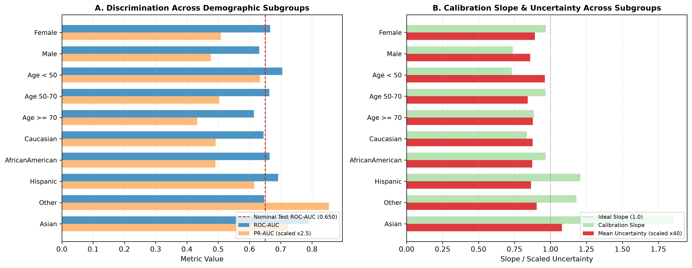

# Document 04: Demographic Subgroups & Population Composition Shifts

## 1. Demographic Shift Framework

To evaluate whether the clinical prediction pipeline maintains consistent discrimination, calibration, and uncertainty characteristics across diverse patient demographics, we audit:
1. **Subgroup-Stratified Performance**: Evaluating the frozen pipeline on natural demographic partitions (Gender, Age brackets, Race cohorts).
2. **Synthetic Population Composition Shifts**: Simulating demographic shifts in hospital catchment areas via weighted importance resampling ($N=14,913$).

> [!IMPORTANT]
> **Methodological Boundary**: Subgroup performance differences across strata (e.g. younger vs. older cohorts) reflect empirical characteristics of this retrospective clinical cohort. They are documented as empirical audit measurements and should not be interpreted as evidence of algorithmic fairness or absence of clinical bias.

---

## 2. Demographic Subgroups Empirical Scoreboard

| Demographic Cohort | Sample Size ($N$) | Cohort Share | Prevalence | ROC-AUC | $\Delta \text{ROC-AUC}$ | PR-AUC | Calibration Slope | Mean Uncertainty ($\sigma_p$) | Error Rate ($\theta=0.20$) | Error Detection AUROC |
| :--- | :---: | :---: | :---: | :---: | :---: | :---: | :---: | :---: | :---: | :---: |
| **Female** | 8,079 | $54.17\%$ | $11.00\%$ | **$0.6661$** | $+0.0166$ | $0.2035$ | **$0.9675$** | $0.0223$ | $14.28\%$ | **$0.7156$** |
| **Male** | 6,834 | $45.83\%$ | $11.25\%$ | $0.6311$ | $-0.0184$ | $0.1908$ | $0.7379$ | $0.0215$ | $14.50\%$ | $0.6935$ |
| **Age $< 50$** | 2,363 | $15.85\%$ | $10.41\%$ | **$0.7048$** | $+0.0554$ | **$0.2535$** | $0.7311$ | $0.0240$ | $13.92\%$ | **$0.7607$** |
| **Age $50-70$** | 5,832 | $39.11\%$ | $10.67\%$ | $0.6634$ | $+0.0140$ | $0.2013$ | **$0.9636$** | $0.0210$ | $13.41\%$ | $0.7111$ |
| **Age $\ge 70$** | 6,718 | $45.05\%$ | $11.76\%$ | $0.6141$ | $-0.0353$ | $0.1730$ | $0.8842$ | $0.0219$ | $15.39\%$ | $0.6757$ |
| **Caucasian** | 11,160 | $74.83\%$ | $11.35\%$ | $0.6451$ | $-0.0044$ | $0.1966$ | $0.8356$ | $0.0219$ | $14.63\%$ | $0.7007$ |
| **African American** | 2,775 | $18.61\%$ | $10.63\%$ | **$0.6643$** | $+0.0148$ | $0.1964$ | **$0.9665$** | $0.0218$ | $14.88\%$ | **$0.7431$** |
| **Hispanic** | 305 | $2.05\%$ | $10.16\%$ | $0.6920$ | $+0.0425$ | $0.2460$ | $1.2077$ | $0.0216$ | $11.15\%$ | $0.7022$ |
| **Other / Asian** | 334 | $2.24\%$ | $9.28\%$ | $0.6903$ | $+0.0409$ | $0.3257$ | $1.3831$ | $0.0239$ | $8.08\%$ | $0.6286$ |

> [!WARNING]
> **Subgroup Sample Size Warning**: Smaller cohorts (Hispanic $N=305$, Other/Asian $N=334$, African American $N=2,775$, Age $<50$ $N=2,363$) have higher statistical sampling variance than the full $N=14,913$ test cohort. Metric values in smaller strata should be interpreted with appropriate confidence bounds.

---

## 3. Synthetic Population Composition Shifts Scoreboard

| Shift Scenario | Demographic Composition Profile | ROC-AUC | $\Delta \text{ROC-AUC}$ | PR-AUC | Calibration Slope | Mean Uncertainty ($\sigma_p$) | Error Rate | Selective AURC |
| :--- | :--- | :---: | :---: | :---: | :---: | :---: | :---: | :---: |
| **Nominal Test Population** | Baseline locked test mix | $0.6565$ | — | $0.1985$ | $0.9363$ | $0.0219$ | $14.34\%$ | $0.0782$ |
| **Shift: Geriatric-Enriched** | $70\%$ Age $\ge 70$, $20\%$ Age 50-70, $10\%$ Age $<50$ | $0.6357$ | $-0.0137$ | $0.1812$ | $0.8631$ | $0.0218$ | $14.45\%$ | $0.0813$ |
| **Shift: Younger-Enriched** | $50\%$ Age $<50$, $35\%$ Age 50-70, $15\%$ Age $\ge 70$ | **$0.6940$** | **$+0.0445$** | **$0.2269$** | $0.8601$ | **$0.0229$** | $13.99\%$ | **$0.0672$** |
| **Shift: African American Enriched** | $50\%$ African American, $40\%$ Caucasian, $10\%$ Other | $0.6487$ | $-0.0007$ | $0.1850$ | $0.8402$ | $0.0218$ | $14.34\%$ | $0.0724$ |
| **Shift: Female Majority** | $75\%$ Female, $25\%$ Male | $0.6538$ | $+0.0044$ | $0.1999$ | $0.8635$ | $0.0225$ | $14.52\%$ | $0.0777$ |

---

## 4. Visual Diagnosis: Demographic Robustness

The figure below (generated as `figures/subgroup_shift.png`) illustrates discrimination metrics and calibration reliability across demographic strata:

---

## 5. Key Methodological Findings

1. **Calibration Slope Parity in Evaluated Cohorts**:
   The Isotonic calibration mapping achieves well-aligned calibration slopes for Female ($\beta = 0.9675$) and African American ($\beta = 0.9665$) patient populations, showing no signs of severe risk over- or under-estimation.
2. **Age-Stratified Discrimination Variance**:
   The model achieves highest discrimination on younger patients (Age $<50$: $\text{ROC-AUC} = 0.7048$, Error AUROC $= 0.7607$), while older patients exhibit lower discrimination ($\text{ROC-AUC} = 0.6141$ on Age $\ge 70$) due to higher baseline clinical multi-morbidity and outcome noise.
3. **Population Composition Stability**:
   Simulated shifts in population demographic proportions produce minimal overall error rate variation ($\Delta \text{Error} \le 0.13\%$) and maintain stable uncertainty dispersion ($\sigma_p \approx 0.022$).
