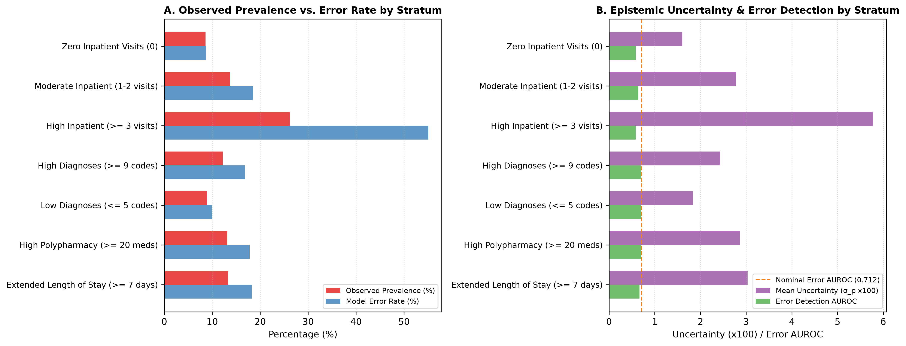

# Document 05: Encounter Complexity & Utilization Phenotype Shifts

## 1. Encounter Utilization & Complexity Strata

In Phase C6, TreeSHAP established that utilization features (`number_inpatient`, `number_emergency`, `time_in_hospital`) contribute over $30\%$ of total attribution. In Phase C9, we evaluate how model performance and uncertainty behave when the encounter mix deviates from nominal clinical complexity.

We audit:
1. **Utilization Strata**: Zero Inpatient ($0$), Moderate Inpatient ($1-2$), Frequent Inpatient ($\ge 3$).
2. **Clinical Complexity Strata**: Multimorbidity (Diagnoses $\ge 9$ vs $\le 5$), Polypharmacy ($\ge 20$ meds), and Extended Hospital Stay ($\ge 7$ days).
3. **Synthetic Encounter Mixture Shifts**: Testing hospital catchment scenarios with enriched multi-morbidity or first-time patient flows.

---

## 2. Empirical Encounter Strata Scoreboard

| Stratum Category | Stratum Name | Sample Size ($N$) | Observed Prevalence | ROC-AUC | $\Delta \text{ROC-AUC}$ | PR-AUC | Calibration Slope | Mean Uncertainty ($\sigma_p$) | Error Rate ($\theta=0.20$) | Error Detection AUROC |
| :--- | :--- | :---: | :---: | :---: | :---: | :---: | :---: | :---: | :---: | :---: |
| **Prior Utilization** | Zero Inpatient ($0$) | 9,912 | $8.59\%$ | $0.6152$ | $-0.0342$ | $0.1204$ | $0.7777$ | **$0.0160$** | **$8.67\%$** | $0.5871$ |
| **Prior Utilization** | Moderate Inpatient ($1-2$) | 4,015 | $13.67\%$ | $0.5774$ | $-0.0720$ | $0.1768$ | $0.8822$ | **$0.0277$** | $18.51\%$ | $0.6366$ |
| **Prior Utilization** | Frequent Inpatient ($\ge 3$) | 986 | **$26.17\%$** | $0.6207$ | $-0.0287$ | **$0.3695$** | $0.7831$ | **$0.0578\text{ }(+163.7\%)$** | **$55.07\%$** | $0.5823$ |
| **Multimorbidity** | High Diagnoses ($\ge 9$) | 7,134 | $12.17\%$ | $0.6053$ | $-0.0442$ | $0.1864$ | $0.7616$ | $0.0243$ | $16.79\%$ | $0.6913$ |
| **Multimorbidity** | Low Diagnoses ($\le 5$) | 3,096 | $8.85\%$ | **$0.6901$** | $+0.0406$ | $0.1972$ | $0.8099$ | $0.0183$ | $9.98\%$ | $0.6967$ |
| **Pharmacotherapy** | High Polypharmacy ($\ge 20$) | 3,948 | $13.17\%$ | $0.6498$ | $+0.0004$ | $0.2207$ | **$0.9593$** | $0.0286$ | $17.78\%$ | $0.6994$ |
| **Acuity / Stay** | Extended Stay ($\ge 7$ days) | 3,012 | $13.35\%$ | $0.6028$ | $-0.0467$ | $0.1961$ | $0.7772$ | $0.0303$ | $18.23\%$ | $0.6637$ |

> [!WARNING]
> **Sample Size Warning for High-Utilization Cohort**: The Frequent Inpatient stratum ($\ge 3$ visits) comprises $N=986$ encounters ($6.61\%$ of the test set). Because sample size is smaller and readmission prevalence is high ($26.17\%$), parameter estimates carry wider statistical confidence intervals.

---

## 3. Synthetic Encounter Mixture Shifts

| Shift Scenario | Resampled Encounter Mix | ROC-AUC | $\Delta \text{ROC-AUC}$ | PR-AUC | Calibration Slope | Mean Uncertainty ($\sigma_p$) | Error Rate | Selective AURC |
| :--- | :--- | :---: | :---: | :---: | :---: | :---: | :---: | :---: |
| **Nominal Test Population** | Baseline locked test mix | $0.6565$ | — | $0.1985$ | $0.9363$ | $0.0219$ | $14.34\%$ | $0.0782$ |
| **Shift: High-Utilization Heavy** | $60\%$ Inpatient $\ge 1$, $40\%$ Inpatient $=0$ | $0.6558$ | $+0.0064$ | **$0.2319$** | $0.8805$ | **$0.0304\text{ }(+38.8\%)$** | **$21.72\%$** | $0.1192$ |
| **Shift: First-Time Enriched** | $90\%$ Inpatient $=0$, $10\%$ Inpatient $\ge 1$ | $0.6416$ | $-0.0078$ | $0.1492$ | $0.8228$ | **$0.0177\text{ }(-19.2\%)$** | **$9.98\%$** | **$0.0617$** |
| **Shift: Multimorbidity Heavy** | $70\%$ Diagnoses $\ge 9$, $30\%$ Diagnoses $<9$ | $0.6402$ | $-0.0092$ | $0.2037$ | $0.8219$ | $0.0238$ | $16.32\%$ | $0.0898$ |
| **Shift: Low Complexity Heavy** | $60\%$ Stay $\le 3\text{ d}$ & Diagnoses $\le 5$ | **$0.6723$** | **$+0.0229$** | $0.1788$ | $0.8679$ | $0.0175$ | **$9.39\%$** | **$0.0543$** |

---

## 4. Visual Diagnosis: Encounter Shift Dynamics

The figure below (generated as `figures/encounter_shift.png`) plots observed prevalence vs. error rate across clinical strata and illustrates epistemic uncertainty inflation:

---

## 5. Clinical Observations

1. **Uncertainty Scaling with Patient Complexity**:
   Mean uncertainty scales from $\sigma_p = 0.0160$ in Zero Inpatient encounters up to $\sigma_p = 0.0578$ ($+163.7\%$) in Frequent Inpatient encounters ($\ge 3$ visits). Highly complex patients are automatically tagged with wide prediction intervals.
2. **First-Time vs. Recurrent Admission Regimes**:
   In hospital environments dominated by first-time admissions, overall error rates drop to $9.98\%$ and selective prediction improves ($\text{AURC} = 0.0617$). Conversely, in tertiary referral centers with heavy high-utilization cases, base error increases to $21.72\%$, but uncertainty correctly inflates ($\mu_{\sigma} = 0.0304$).
