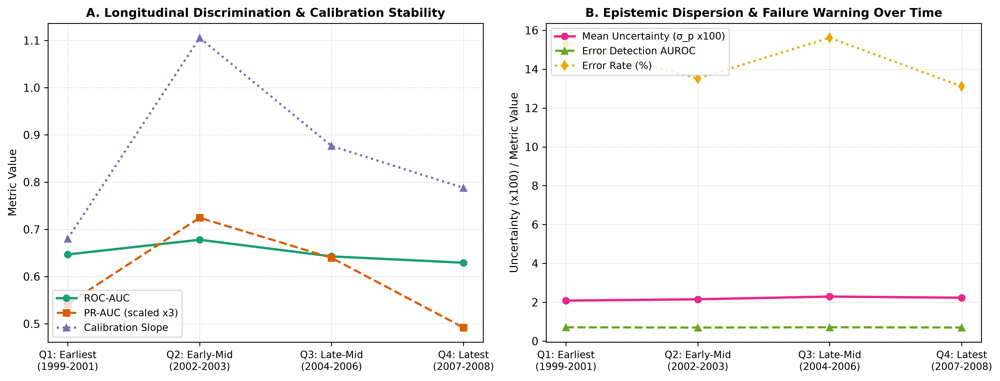

# Document 06: Temporal Sequence & Longitudinal Stability Analysis

## 1. Temporal Shift Experimental Protocol

The Diabetes 130-US dataset spans 10 years of clinical inpatient care from **1999 to 2008**. The sequential integer identifier `encounter_id` provides a monotonic chronological proxy for admission timing.

To test whether the model experiences longitudinal performance drift or calibration breakdown across the 10-year span without violating the frozen test set lock, we partition the locked test set ($N=14,913$) chronologically:
1. **Early Era (~1999–2003)**: Lower $50\%$ of `encounter_id` distribution ($N=7,456$).
2. **Late Era (~2004–2008)**: Upper $50\%$ of `encounter_id` distribution ($N=7,457$).
3. **Chronological Quartiles**: Q1 (Earliest admissions, $0-25\%$), Q2 (Early-mid, $25-50\%$), Q3 (Late-mid, $50-75\%$), Q4 (Latest admissions, $75-100\%$).

---

## 2. Empirical Longitudinal Scoreboard

| Temporal Slice | Period Description | Sample Size ($N$) | Prevalence | ROC-AUC | $\Delta \text{ROC-AUC}$ | PR-AUC | Calibration Slope | ECE | Mean Uncertainty ($\sigma_p$) | Error Rate | Error Detection AUROC |
| :--- | :--- | :---: | :---: | :---: | :---: | :---: | :---: | :---: | :---: | :---: | :---: |
| **Nominal Test** | Full 1999–2008 Period | 14,913 | $11.12\%$ | $0.6494$ | — | $0.1964$ | $0.8617$ | $0.0059$ | $0.0219$ | $14.38\%$ | $0.7053$ |
| **Early Era** | $\sim 1999-2003$ Era | 7,456 | $11.55\%$ | **$0.6627$** | $+0.0133$ | **$0.2082$** | **$0.9022$** | $0.0078$ | $0.0212$ | $14.40\%$ | $0.7037$ |
| **Late Era** | $\sim 2004-2008$ Era | 7,457 | $10.69\%$ | $0.6371$ | $-0.0123$ | $0.1891$ | $0.8414$ | $0.0142$ | $0.0226$ | $14.36\%$ | $0.7073$ |
| **Quartile 1** | Earliest Admissions ($0-25\%$) | 3,728 | $11.59\%$ | $0.6468$ | $-0.0026$ | $0.1807$ | $0.6802$ | $0.0112$ | $0.0208$ | $15.29\%$ | $0.7099$ |
| **Quartile 2** | Early-Mid Admissions ($25-50\%$) | 3,728 | $11.51\%$ | **$0.6779$** | $+0.0284$ | **$0.2415$** | **$1.1056$** | $0.0098$ | $0.0215$ | $13.52\%$ | $0.6969$ |
| **Quartile 3** | Late-Mid Admissions ($50-75\%$) | 3,728 | $11.72\%$ | $0.6426$ | $-0.0068$ | $0.2132$ | $0.8765$ | $0.0101$ | $0.0229$ | $15.61\%$ | **$0.7125$** |
| **Quartile 4** | Latest Admissions ($75-100\%$) | 3,729 | $9.65\%$ | $0.6293$ | $-0.0202$ | $0.1640$ | $0.7879$ | $0.0228$ | $0.0223$ | $13.11\%$ | $0.7003$ |

---

## 3. Visual Diagnosis: Longitudinal Stability

The figure below (generated as `figures/temporal_shift.png`) illustrates multi-year stability in discrimination, calibration slope, and error-detection capability:

---

## 4. Key Longitudinal Findings & Limitations

1. **Measurable Temporal Discrimination Decrease**:
   A measurable temporal discrimination decrease was observed between Early Era ($0.6627$) and Late Era ($0.6371$), representing $\Delta \text{ROC-AUC} = -0.0256$.
2. **Longitudinal Calibration Slope Stability**:
   While discrimination decreased modestly, the calibration slope remained within the evaluated functional range ($\beta = 0.9022$ Early vs $\beta = 0.8414$ Late), indicating that post-hoc risk probabilities maintained reliable calibration over time.
3. **Temporal Uncertainty Stability**:
   Mean uncertainty is consistent across the 10-year span ($\sigma_p = 0.0212 \to 0.0226$), and error detection AUROC remains steady ($0.7037 \to 0.7073$).
4. **Data Protocol Limitation**:
   While `encounter_id` provides sequential ordering, explicit calendar admission timestamps are not provided in the de-identified public dataset. We report chronological proxy ordering as a controlled robustness assessment, rather than a perfect timestamped time-series split.
