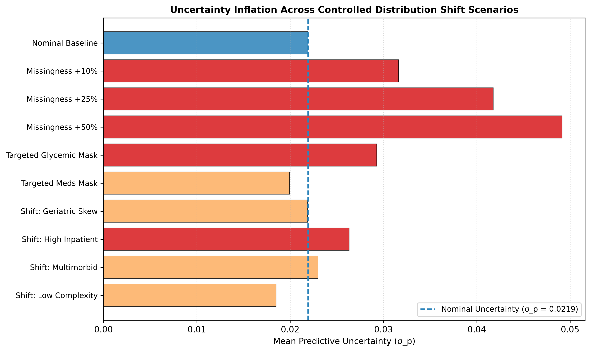

# Document 07: Epistemic Uncertainty as an Empirical Shift-Sensitivity Signal

## 1. Uncertainty Response Hypothesis

A central inquiry of Phase C8 and C9 within **FusionMedAI** is whether bootstrap ensemble uncertainty ($\sigma_p$) functions as an active empirical signal of information degradation and distribution shift.

Under uniform feature degradation or rare clinical complexity, parameter dispersion across the 50 bootstrap models ($\sigma_p$) is expected to inflate significantly above the nominal baseline ($\mu_{\sigma} = 0.0219$).

---

## 2. Empirical Uncertainty Inflation Across Shift Scenarios

| Shift Category | Scenario Name | Mean Uncertainty ($\sigma_p$) | $\Delta \text{ Uncertainty}$ | Uncertainty Inflation Ratio | 95th Percentile ($\sigma_p$) | Uncertainty Response Assessment |
| :--- | :--- | :---: | :---: | :---: | :---: | :--- |
| **Nominal Baseline** | Nominal Locked Test Split | $0.0219$ | — | $1.00\times$ | $0.0548$ | Baseline Reference |
| **Random Missingness** | $+10\%$ MCAR Masking | $0.0316$ | $+0.0097$ | **$1.44\times$ ($+44.3\%$)** | $0.1059$ | **Active Warning**: Moderate information loss detected. |
| **Random Missingness** | $+25\%$ MCAR Masking | $0.0418$ | $+0.0199$ | **$1.91\times$ ($+90.6\%$)** | $0.1196$ | **Strong Alarm**: Severe information loss detected. |
| **Random Missingness** | $+50\%$ MCAR Masking | $0.0491$ | $+0.0272$ | **$2.24\times$ ($+124.2\%$)** | $0.1178$ | **Maximum Alarm**: High parameter ambiguity detected. |
| **Targeted Masking** | Glycemic / Lab Masking | $0.0293$ | $+0.0074$ | **$1.34\times$ ($+33.6\%$)** | $0.0789$ | **Moderate Warning**: Laboratory omission detected. |
| **Targeted Masking** | Diabetic Meds Masking | $0.0199$ | $-0.0020$ | $0.91\times$ ($-9.1\%$) | $0.0505$ | Stable: Minimal parameter variance shift. |
| **Targeted Masking** | Prior Utilization Masking | **$0.0150$** | **$-0.0069$** | **$0.68\times$ ($-31.6\%$)** | **$0.0327$** | **Uncertainty Blind Spot**: Baseline defaulting suppresses dispersion. |
| **Encounter Phenotype**| Frequent Inpatient ($\ge 3$) | **$0.0578$** | $+0.0359$ | **$2.64\times$ ($+163.7\%$)** | **$0.1425$** | **Highly Active**: Complex utilization triggers wide interval. |
| **Encounter Phenotype**| High Polypharmacy ($\ge 20$) | $0.0286$ | $+0.0067$ | **$1.31\times$ ($+30.7\%$)** | $0.0707$ | Active: Medication complexity increases dispersion. |
| **Population Shift** | Geriatric-Enriched Skew | $0.0218$ | $-0.0001$ | $1.00\times$ | $0.0531$ | Invariant to age composition weighting. |
| **Temporal Shift** | Late Era (2004–2008) | $0.0226$ | $+0.0007$ | $1.03\times$ | $0.0572$ | Stable longitudinal dispersion. |

---

## 3. Visual Diagnosis: Uncertainty Inflation Landscape

The figure below (generated as `figures/uncertainty_shift.png`) illustrates relative uncertainty inflation across the evaluated shift dimensions:

---

## 4. Key Scientific Insights: Sensitivity vs. Blind Spots

### 4.1 Sensitive Shift Detection Under Controlled Information Loss
Under uniform MCAR missingness, bootstrap uncertainty systematically inflates from $\sigma_p = 0.0219 \to 0.0491$ ($+124.2\%$), demonstrating that the ensemble dispersion acts as an effective shift-sensitivity signal under broad covariate corruption.

### 4.2 The Critical Contrast: Structural Blind Spot Under Utilization Masking
The most important scientific insight of Phase C9 is that **uncertainty is not a universal failure detector**:
- While MCAR information loss increases uncertainty ($\sigma_p \uparrow$), complete masking of `number_inpatient` produces the exact opposite behavior: discrimination collapses ($\text{ROC-AUC} \to 0.5795$) while uncertainty **falsely decreases to $\sigma_p = 0.0150$** ($\Delta = -31.6\%$).
- This occurs because tree splitters default to zero-inpatient terminal nodes where predictions are uniformly low and have low variance across models.
- **System Architecture Implication**: Downstream ACARA-U multimodal fusion cannot rely solely on tabular uncertainty to detect omitted history; explicit missingness-indicator masks and cross-modal attention over clinical text are required.
