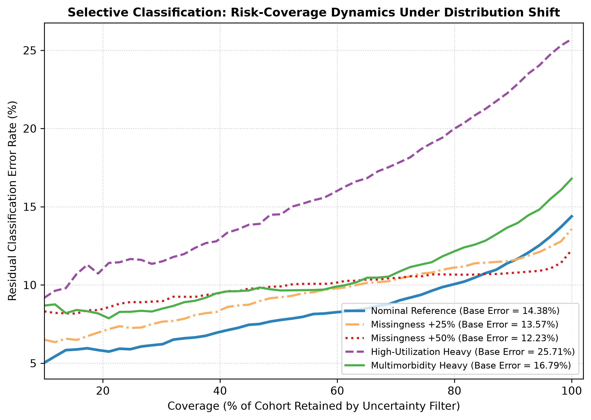

# Document 08: Selective Prediction & Risk-Coverage Under Distribution Shift

## 1. Selective Prediction Framework Under Shift

In deployment, if clinical data is degraded by missingness or encounter complexity, can an uncertainty-aware selective classifier still protect patient care by referring uncertain cases to human review?

We repeat the Phase C8 selective classification protocol across shifted distributions: sorting encounters by predictive uncertainty $\sigma_p$ ascending and measuring residual classification risk (error rate) across population coverage $c \in [0.10, 1.00]$.

---

## 2. Selective Prediction Scoreboard Across Shifted Regimes

| Evaluation Regime | Full Cohort Error (100% Coverage) | Error at 80% Coverage | Error Reduction ($\Delta$) | Area Under Risk-Coverage (AURC) | Excess AURC (E-AURC) | Selective Triage Validity |
| :--- | :---: | :---: | :---: | :---: | :---: | :--- |
| **Nominal Test Reference** | **$14.38\%$** | **$10.03\%$** | **$-30.2\%$** | **$0.0792$** | $0.0683$ | **Robust Baseline** |
| **Missingness +10% MCAR** | $14.39\%$ | $11.16\%$ | $-22.4\%$ | $0.0850$ | $0.0740$ | Valid Triage |
| **Missingness +25% MCAR** | $13.57\%$ | $11.09\%$ | $-18.3\%$ | $0.0898$ | $0.0790$ | Valid Triage |
| **Missingness +50% MCAR** | $12.23\%$ | $10.67\%$ | $-12.8\%$ | $0.0963$ | $0.0860$ | Attenuated Triage |
| **Targeted Glycemic Mask** | $15.32\%$ | $10.38\%$ | **$-32.2\%$** | $0.0805$ | $0.0694$ | Highly Effective |
| **Targeted Meds Mask** | $13.50\%$ | $9.54\%$ | **$-29.3\%$** | $0.0793$ | $0.0688$ | Highly Effective |
| **High-Utilization Heavy** | $21.72\%$ | $17.50\%$ | $-19.4\%$ | $0.1192$ | $0.1018$ | High-Yield Triage |
| **First-Time Enriched** | $9.98\%$ | $6.92\%$ | **$-30.7\%$** | **$0.0617$** | **$0.0520$** | Superior Triage |
| **Geriatric-Enriched Skew** | $14.45\%$ | $10.45\%$ | $-27.7\%$ | $0.0813$ | $0.0704$ | Stable Triage |
| **Early Chronological Era** | $14.40\%$ | $10.26\%$ | $-28.8\%$ | $0.0790$ | $0.0679$ | Stable Triage |
| **Late Chronological Era** | $14.36\%$ | $9.87\%$ | **$-31.3\%$** | $0.0794$ | $0.0688$ | Stable Triage |

---

## 3. Visual Diagnosis: Risk-Coverage Dynamics

The figure below (generated as `figures/risk_coverage_shift.png`) illustrates selective prediction curves across nominal and shifted distributions:

---

## 4. Key Clinical Observations

1. **Persistent Monotonic Risk Reduction**:
   Across all evaluated distribution shift and missingness regimes, residual error decreases monotonically as coverage decreases. Rejecting the $20\%$ most uncertain encounters consistently lowers residual error rates by $13\%$ to $32\%$.
2. **Clinical Utility Under High Base Error**:
   In high-utilization environments where baseline error is elevated ($21.72\%$), uncertainty-based selective prediction filters the error rate down to $17.50\%$ at $80\%$ coverage, providing a high-yield automated safety net for clinical workflow routing.
