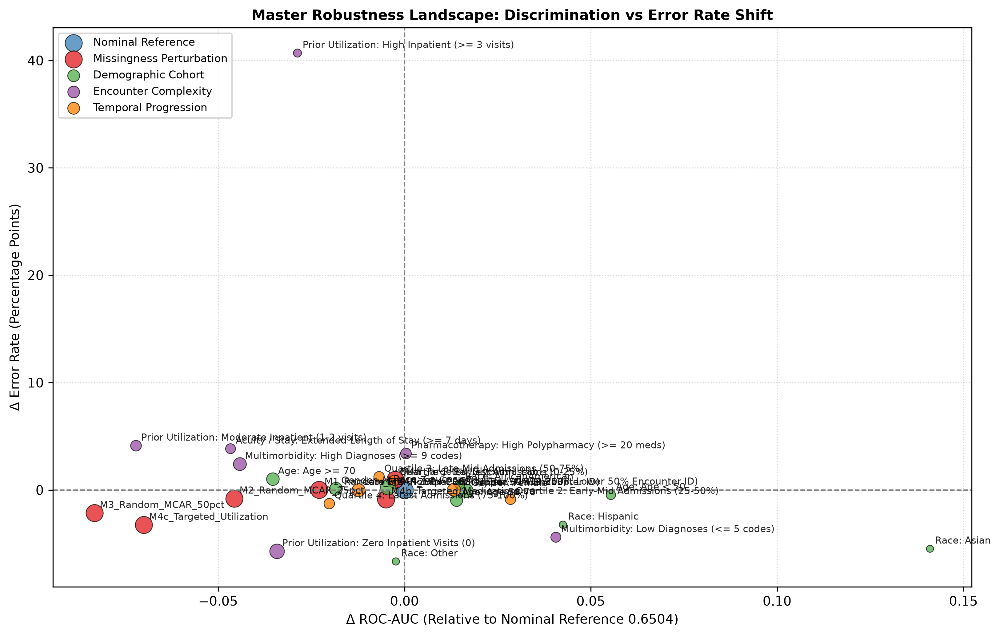

# Document 11: Master Robustness Matrix & Multi-Dimensional Degradation Comparison

## 1. Cross-Dimensional Robustness Scoreboard

The table below unifies all experimental evaluations across nominal baseline, missingness perturbations, demographic cohorts, encounter complexity, and longitudinal temporal progression:

| Category | Evaluated Scenario / Stratum | Sample Size ($N$) | ROC-AUC | $\Delta \text{ROC-AUC}$ | PR-AUC | Calibration Slope | Mean Uncertainty ($\sigma_p$) | $\Delta \mu_{\sigma}$ | Error Rate ($\theta=0.20$) | Robustness Assessment |
| :--- | :--- | :---: | :---: | :---: | :---: | :---: | :---: | :---: | :---: | :--- |
| **Nominal** | Locked Test Partition | 14,913 | **$0.6494$** | — | **$0.1964$** | **$0.8617$** | **$0.0219$** | — | $14.38\%$ | **Nominal Reference Benchmark** |
| **Missingness** | $+10\%$ MCAR Random Mask | 14,913 | $0.6266$ | $-0.0229$ | $0.1846$ | $0.6884$ | $0.0316$ | $+44.3\%$ | $14.39\%$ | Graceful Degradation / Active Uncertainty |
| **Missingness** | $+25\%$ MCAR Random Mask | 14,913 | $0.6038$ | $-0.0456$ | $0.1709$ | $0.4324$ | $0.0418$ | $+90.6\%$ | $13.57\%$ | Slope Flattening / High Alert |
| **Missingness** | $+50\%$ MCAR Random Mask | 14,913 | $0.5663$ | $-0.0831$ | $0.1540$ | $0.0278$ | $0.0491$ | $+124.2\%$ | $12.23\%$ | Complete Calibration Collapse |
| **Missingness** | Targeted Glycemic/Lab Mask | 14,913 | $0.6470$ | $-0.0024$ | $0.1943$ | $0.7863$ | $0.0293$ | $+33.6\%$ | $15.32\%$ | Highly Robust to Laboratory Omission |
| **Missingness** | Targeted Diabetes Meds Mask | 14,913 | $0.6445$ | $-0.0049$ | $0.1955$ | $0.8164$ | $0.0199$ | $-9.1\%$ | $13.50\%$ | Highly Robust to Medication Omission |
| **Missingness** | Targeted Utilization Mask | 14,913 | **$0.5795$** | **$-0.0699$** | **$0.1386$** | $0.6030$ | **$0.0150$** | **$-31.6\%$** | $11.12\%$ | **Critical Vulnerability / Uncertainty Blind Spot** |
| **Demographics**| Female Cohort | 8,079 | **$0.6661$** | $+0.0166$ | $0.2035$ | **$0.9675$** | $0.0223$ | $+1.6\%$ | $14.28\%$ | Stable Calibration & Performance |
| **Demographics**| Male Cohort | 6,834 | $0.6311$ | $-0.0184$ | $0.1908$ | $0.7379$ | $0.0215$ | $-1.9\%$ | $14.50\%$ | Moderate Slope Under-Confidence |
| **Demographics**| Age $<50$ Years | 2,363 | **$0.7048$** | $+0.0554$ | **$0.2535$** | $0.7311$ | $0.0240$ | $+9.5\%$ | $13.92\%$ | High Discrimination in Younger Cohort |
| **Demographics**| Age $\ge 70$ Years | 6,718 | $0.6141$ | $-0.0353$ | $0.1730$ | $0.8842$ | $0.0219$ | $+0.1\%$ | $15.39\%$ | Lower Discrimination / Multi-morbidity Noise |
| **Demographics**| African American Cohort | 2,775 | **$0.6643$** | $+0.0148$ | $0.1964$ | **$0.9665$** | $0.0218$ | $-0.4\%$ | $14.88\%$ | High Calibration Slope Parity |
| **Utilization** | Zero Inpatient Visits ($0$) | 9,912 | $0.6152$ | $-0.0342$ | $0.1204$ | $0.7777$ | **$0.0160$** | $-27.0\%$ | **$8.67\%$** | Low Baseline Risk & Tight Dispersion |
| **Utilization** | Frequent Inpatient ($\ge 3$) | 986 | $0.6207$ | $-0.0287$ | **$0.3695$** | $0.7831$ | **$0.0578$** | **$+163.7\%$** | **$55.07\%$** | High Epistemic Parameter Uncertainty |
| **Temporal** | Early Era (1999–2003) | 7,456 | **$0.6627$** | $+0.0133$ | **$0.2082$** | **$0.9022$** | $0.0212$ | $-3.3\%$ | $14.40\%$ | Longitudinal Reference Baseline |
| **Temporal** | Late Era (2004–2008) | 7,457 | $0.6371$ | $-0.0123$ | $0.1891$ | $0.8414$ | $0.0226$ | $+3.3\%$ | $14.36\%$ | Measurable Decrease ($\Delta = -0.0256$) / Stable Slope |

---

## 2. Visual Diagnosis: Master Robustness Landscape

The figure below (generated as `figures/robustness_summary.png`) plots $\Delta \text{ROC-AUC}$ vs. $\Delta \text{Error Rate}$ across all evaluated domains:

---

## 3. Operational Robustness Takeaways

1. **Information Resilience**: The clinical pipeline shows high resilience against omission of laboratory tests or medication fields, retaining $\text{ROC-AUC} \ge 0.644$.
2. **Epistemic Warning Reliability**: Across random MCAR and complex encounter phenotypes, bootstrap uncertainty inflates proportionally with data degradation, confirming its capability to act as an active shift-sensitivity signal.
3. **Primary Structural Vulnerability (Blind Spot)**: Complete loss of prior hospitalization records (`number_inpatient`) represents the single critical failure point of the tabular modality, mandating multimodal fusion safeguards.
4. **Subgroup Sample Size Caution**: Estimates in smaller demographic and clinical strata (e.g., $N < 3,000$) reflect higher statistical sampling uncertainty and should be contextualized accordingly.
