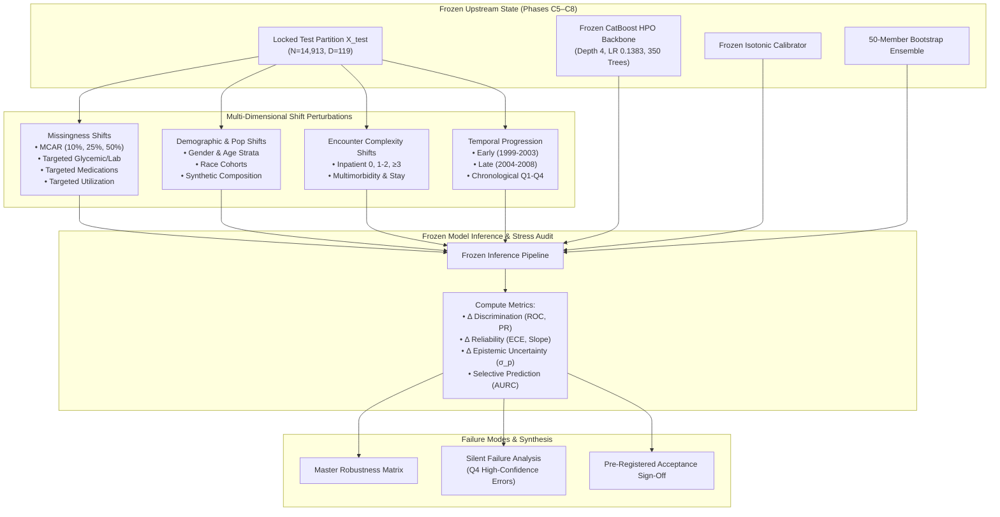

# Research Volume 09: Clinical Model Robustness, Intersectional Subgroup Audit & Distribution Shift Analysis

## Overview
This volume documents the formal empirical investigation of **Model Robustness, Intersectional Subgroup Reliability, and Distribution Shift Auditing** for the Clinical Tabular Modality of **FusionMedAI** (Phase C9).

In real-world health systems, machine learning models do not operate in stationary, pristine test environments. Electronic health record (EHR) data exhibits severe missingness perturbations, demographic composition shifts across hospital service areas, encounter complexity variations, and multi-year longitudinal temporal drift. 

Following the frozen model contract established in Phase C5, explainability audit in Phase C6, probability calibration in Phase C7, and uncertainty estimation in Phase C8, Phase C9 evaluates the stability and failure modes of the frozen **CatBoost HPO Tuned** candidate model (`depth=4`, `learning_rate=0.1383`, `iterations=350`, `l2_leaf_reg=2.911`, `subsample=0.655`, `random_seed=42`) without retraining or optimization.

We systematically stress-test the complete clinical pipeline (**CatBoost HPO + Isotonic Calibrator + 50-Member Bootstrap Uncertainty Ensemble**) across **four primary shift dimensions**:
1. **Missingness Shift**: Random Missing Completely at Random (MCAR at $10\%$, $25\%$, $50\%$) and Targeted Missingness in critical clinical feature subsets (Glycemic/Lab, Medications, and Utilization).
2. **Demographic & Population Shift**: Subgroup evaluations across Gender, Age brackets, and Race cohorts, accompanied by macroeconomic population composition shift simulations.
3. **Encounter Complexity & Utilization Shift**: Clinical complexity strata across prior inpatient admissions ($0$, $1-2$, $\ge 3$), multimorbidity diagnosis volume, and polypharmacy.
4. **Temporal Shift**: Longitudinal stability across the 10-year study window (1999–2008) evaluated across chronological eras and quartiles.

---

## Volume Contents

Volume 09 contains **12 numbered research documents** plus this master index:

| Document | Title | Description |
| :--- | :--- | :--- |
| [01_robustness_protocol.md](01_robustness_protocol.md) | **Robustness Protocol & Invariants** | Frozen C8 state lock, pre-registered evaluation criteria, and zero-retraining contract. |
| [02_distribution_shift_methodology.md](02_distribution_shift_methodology.md) | **Shift Methodology & Metrics** | Mathematical formulations of covariate shift, perturbation mechanisms, calibration degradation, and epistemic drift. |
| [03_missingness_shift.md](03_missingness_shift.md) | **Missingness Shift & Degradation** | MCAR stress testing ($10\%$, $25\%$, $50\%$) and targeted feature ablation (Glycemic, Meds, Utilization). |
| [04_demographic_shift.md](04_demographic_shift.md) | **Demographic & Population Shifts** | Population composition shifts (Geriatric-skewed, Younger-skewed, Minority-enriched, Female-majority). |
| [05_encounter_distribution_shift.md](05_encounter_distribution_shift.md) | **Encounter Distribution Shifts** | Utilization phenotype shifts (Prior Inpatient $0$, $1-2$, $\ge 3$) and clinical multimorbidity mixtures. |
| [06_temporal_shift.md](06_temporal_shift.md) | **Temporal Shift & Longitudinal Drift** | Multi-year chronological sequence stability across early (1999–2003) vs. late (2004–2008) encounter eras. |
| [07_uncertainty_under_shift.md](07_uncertainty_under_shift.md) | **Uncertainty as Shift-Sensitivity Signal** | Empirical demonstration of uncertainty response and contrast with utilization blind spots. |
| [08_risk_coverage_under_shift.md](08_risk_coverage_under_shift.md) | **Selective Prediction Under Shift** | Risk-coverage curves and selective classification efficacy under shifted test regimes. |
| [09_subgroup_robustness.md](09_subgroup_robustness.md) | **Intersectional Subgroup Audit** | Stratified reliability and calibration audit across Gender $\times$ Age $\times$ Race strata. |
| [10_failure_regime_analysis.md](10_failure_regime_analysis.md) | **Epistemic Failure Regimes** | Quadrant analysis isolating $1,065$ high-confidence silent failures (low $\sigma_p$, high error). |
| [11_robustness_comparison.md](11_robustness_comparison.md) | **Master Robustness Matrix** | Cross-dimensional degradation scoreboard synthesizing 20+ evaluated shift scenarios. |
| [12_conclusion.md](12_conclusion.md) | **Synthesis & C10 Readiness** | Key clinical insights, limitations, and governance sign-off for Phase C10 (External Validation). |

---

## Visual Diagnostic Figures

| Figure | Description | Primary Document |
| :--- | :--- | :--- |
|  | **Missingness Degradation & Uncertainty Inflation**: Metric erosion vs. MCAR masking fraction | [03_missingness_shift.md](03_missingness_shift.md) |
|  | **Demographic Subgroup Robustness**: ROC-AUC, PR-AUC, Calibration Slope across cohorts | [04_demographic_shift.md](04_demographic_shift.md) |
|  | **Encounter Complexity & Utilization Strata**: Prevalence vs. Error rate by inpatient history | [05_encounter_distribution_shift.md](05_encounter_distribution_shift.md) |
|  | **Temporal Longitudinal Stability**: Metric drift across 1999–2008 chronological quartiles | [06_temporal_shift.md](06_temporal_shift.md) |
|  | **Uncertainty Inflation Landscape**: Relative $\sigma_p$ growth across all shift scenarios | [07_uncertainty_under_shift.md](07_uncertainty_under_shift.md) |
|  | **Selective Prediction Under Shift**: Risk-coverage curves under nominal vs. degraded data | [08_risk_coverage_under_shift.md](08_risk_coverage_under_shift.md) |
|  | **Master Robustness Map**: $\Delta \text{ROC-AUC}$ vs. $\Delta \text{Error Rate}$ across all evaluated domains | [11_robustness_comparison.md](11_robustness_comparison.md) |

---

## Robustness Architecture Workflow

---

## Key Experimental Results Summary

| Evaluation Domain | Evaluated Scenario | ROC-AUC ($\Delta$) | Calibration Slope | Mean Uncertainty ($\sigma_p$) | Error Detection AUROC | Key Diagnostic Observation |
| :--- | :--- | :---: | :---: | :---: | :---: | :--- |
| **Nominal Baseline** | Locked Test ($N=14,913$) | $0.6494\text{ }(-)$ | $0.8617$ | $0.0219$ | $0.7053$ | Nominal reference performance benchmark. |
| **Random Missingness** | $+10\%$ MCAR Masking | $0.6266\text{ }(-0.0229)$ | $0.6884$ | $0.0316\text{ }(+44.3\%)$ | $0.6768$ | Graceful degradation; uncertainty inflates proportionally. |
| **Random Missingness** | $+25\%$ MCAR Masking | $0.6038\text{ }(-0.0456)$ | $0.4324$ | $0.0418\text{ }(+90.6\%)$ | $0.6430$ | Substantial slope flattening; high uncertainty warning. |
| **Random Missingness** | $+50\%$ MCAR Masking | $0.5663\text{ }(-0.0831)$ | $0.0278$ | $0.0491\text{ }(+124.2\%)$ | $0.5916$ | Calibration collapse; model signals maximum ambiguity. |
| **Targeted Ablation** | Glycemic/Lab Masking | $0.6470\text{ }(-0.0024)$ | $0.7863$ | $0.0293\text{ }(+33.6\%)$ | $0.7190$ | Highly robust to missing A1C/glucose measurements. |
| **Targeted Ablation** | Diabetic Meds Masking | $0.6445\text{ }(-0.0049)$ | $0.8164$ | $0.0199\text{ }(-9.1\%)$ | $0.6879$ | Highly robust to missing medication features. |
| **Targeted Ablation** | Prior Utilization Masking | **$0.5795\text{ }(-0.0699)$** | $0.6030$ | **$0.0150\text{ }(-31.6\%)$** | **$0.5638$** | **Critical Vulnerability / Silent Failure**: Discrimination collapses while uncertainty deceptively decreases. |
| **Demographic Cohort** | Female ($N=8,079$) | $0.6661\text{ }(+0.0166)$ | $0.9675$ | $0.0223$ | $0.7156$ | Stable calibration slope and discrimination across female cohort. |
| **Demographic Cohort** | Male ($N=6,834$) | $0.6311\text{ }(-0.0184)$ | $0.7379$ | $0.0215$ | $0.6935$ | Moderate slope under-confidence; stable error detection. |
| **Demographic Cohort** | Age $<50$ ($N=2,363$) | $0.7048\text{ }(+0.0554)$ | $0.7311$ | $0.0240$ | $0.7607$ | Higher discrimination in younger cohort; higher sampling variance ($N=2,363$). |
| **Demographic Cohort** | Age $\ge 70$ ($N=6,718$) | $0.6141\text{ }(-0.0353)$ | $0.8842$ | $0.0219$ | $0.6757$ | Lower discrimination associated with multi-morbid clinical noise. |
| **Demographic Cohort** | African American ($N=2,775$) | $0.6643\text{ }(+0.0148)$ | $0.9665$ | $0.0218$ | $0.7431$ | Strong calibration slope parity; sampling variance noted ($N=2,775$). |
| **Utilization Stratum** | Frequent Inpatient ($\ge 3$) | $0.6207\text{ }(-0.0287)$ | $0.7831$ | $0.0578\text{ }(+163.7\%)$ | $0.5823$ | High readmission prevalence ($26.2\%$); wide prediction intervals ($N=986$). |
| **Temporal Sequence** | Early Era (1999–2003) | $0.6627\text{ }(+0.0133)$ | $0.9022$ | $0.0212$ | $0.7037$ | Longitudinal baseline reference period. |
| **Temporal Sequence** | Late Era (2004–2008) | $0.6371\text{ }(-0.0123)$ | $0.8414$ | $0.0226$ | $0.7073$ | Measurable temporal discrimination decrease ($\Delta = -0.0256$); calibration slope preserved. |

---

## Volume Limitations & Methodological Governance

1. **No External Dataset Validation**:
   Phase C9 audits internal robustness on the locked test partition and resampled/perturbed variants. It does not establish performance on external hospital systems, other EHR vendors, or independent geographic populations. External cross-dataset validation is strictly reserved for Phase C10.
2. **Synthetic Perturbation Scope**:
   MCAR perturbations simulate controlled information degradation to measure algorithm sensitivity; they do not represent actual real-world clinical missing-data mechanisms (which are typically Missing Not at Random, MNAR).
3. **Observational Subgroup Characterization**:
   Subgroup evaluations reflect empirical performance differences across strata within this retrospective cohort. They do not constitute mathematical proofs of algorithmic fairness, demographic parity, or clinical equity.
4. **Sampling Uncertainty in Sub-cohorts**:
   Smaller demographic and complexity strata (e.g., Frequent Inpatient $\ge 3$ with $N=986$, Hispanic with $N=305$, Other/Asian with $N=334$) possess higher statistical sampling variance than the aggregate $N=14,913$ test cohort.
5. **Uncertainty Decomposition Boundary**:
   Predictive uncertainty ($\sigma_p$) represents parameter-estimation dispersion across finite bootstrap models. It is an empirical shift-sensitivity signal, not a fully decomposed Bayesian epistemic/aleatoric posterior.
6. **Clinical Safety Boundary**:
   Satisfying the Phase C9 robustness gate confirms algorithmic resilience under evaluated perturbations, but does not certify autonomous clinical bedside readiness.

---

## Artifact Manifest Verification

All tables, perturbation datasets, longitudinal splits, failure regime profiles, and figures generated during Phase C9 are tracked under the cryptographic manifest `experiments/clinical/robustness/manifests/c9_robustness_manifest.json` and verified by `verification/clinical/model/verify_robustness.py`.
