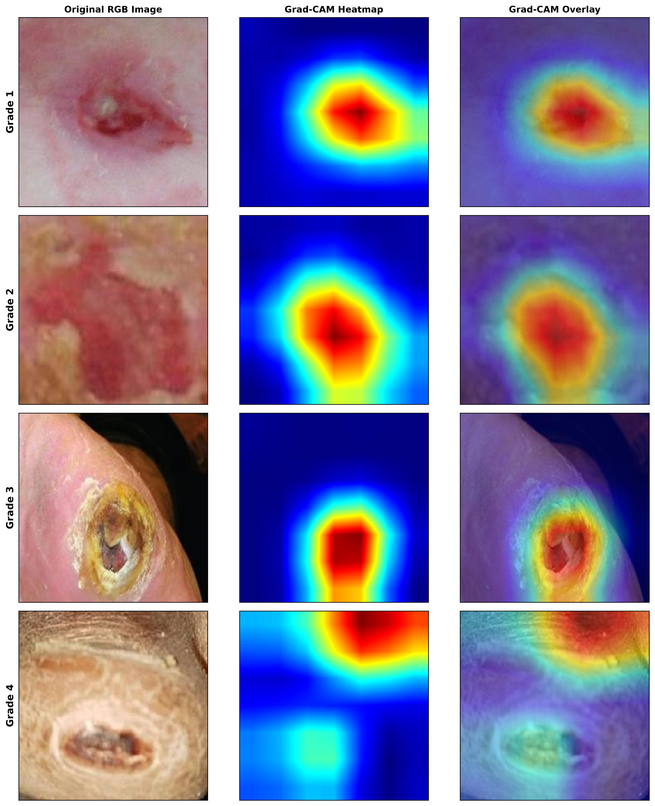
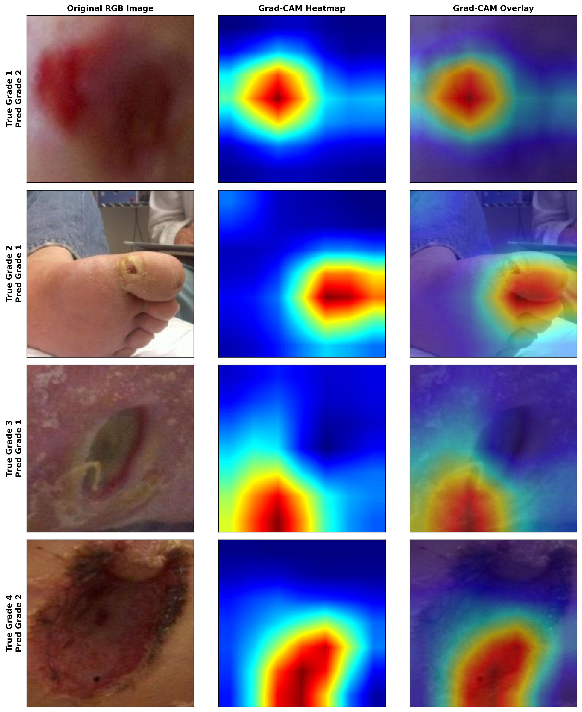

# Chapter 04 — Qualitative Visual Analysis

## 4.1 Overview of Visual Heatmaps

Grad-CAM spatial attributions were visualised using Jet colormap overlays ($\alpha = 0.5$) across representative test samples from Wagner Grades 1 through 4.

### Figure 1: Correct Predictions across Wagner Grades 1–4

### Figure 2: Misclassified Cases across Wagner Grades 1–4

---

## 4.2 Grade-Specific Attribution Observations

### Grade 1 (Superficial Ulcer)
- **Observed Attribution Focus**: Focal concentration over superficial skin lesions and localized erythematous borders.
- **Background Behavior**: Minimal to zero attribution assigned to surrounding healthy skin or imaging background.

### Grade 2 (Deep Ulcer)
- **Observed Attribution Focus**: Concentrated spatial focus centered over open wound bed regions.
- **Margin Attributions**: Secondary attributions along hyperkeratotic ulcer margins.

### Grade 3 (Deep Ulcer with Abscess / Osteomyelitis)
- **Observed Attribution Focus**: Spatial concentration on central wound bed cavities and exudative regions.
- **Clinical Qualification**: Grad-CAM captures 2D visual surface features associated with Grade 3 classification. It does not provide direct 3D imaging of underlying osteomyelitis or deep joint sepsis, which require radiological imaging.

### Grade 4 (Gangrene)
- **Observed Attribution Focus**: Distinct attributions localized over dark, necrotic/gangrenous tissue regions.
