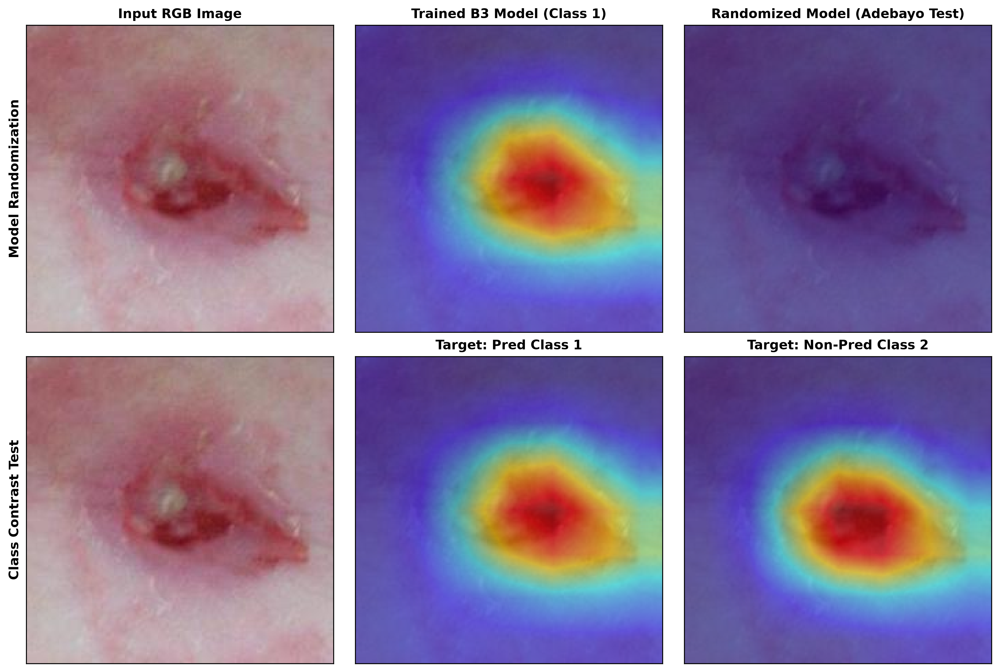

# Chapter 05 — Quantitative Metrics & Sanity Checks

## 5.1 Dataset-Wide Attribution Area Diagnostics

Evaluation was performed across the complete frozen test set ($N = 1,006$). High-attribution area fraction is defined as the proportion of spatial pixels where $\text{CAM}(x, y) \ge 0.5$.

| Evaluation Population | Sample Size ($N$) | Mean High-Attribution Area Fraction ($\ge 0.5$) |
| :--- | :---: | :---: |
| **All Test Samples** | **1,006** | **19.61%** |
| Correct Predictions | 673 | 19.93% |
| Misclassifications | 333 | 18.96% |
| Grade 2 $\to$ Grade 3 Errors | 42 | 19.42% |
| Grade 3 $\to$ Grade 2 Errors | 24 | 18.85% |

---

## 5.2 Attribution Mass Concentration

Attribution concentration measures the percentage of total CAM intensity mass concentrated within the top $K\%$ highest activation pixels ($N=40$ stratified sample, Seed=42):

- **Top 10% Pixels Mass Concentration**: **32.9%**
- **Top 20% Pixels Mass Concentration**: **54.8%**

This metric demonstrates that over half of the total predictive attribution mass is concentrated within 20% of the image spatial area, indicating that attribution is spatially concentrated rather than uniformly distributed.

---

## 5.3 Sanity Checks (Randomization & Class Discrimination)

### Figure 5: Adebayo Model Randomization & Target-Class Contrast Sanity Checks

### 1. Adebayo Model Randomization Test
- **Protocol**: Compare Grad-CAM from the trained EfficientNet-B3 model against an uninitialized (randomly initialized) model.
- **Result**: Mean Pearson Correlation Coefficient ($\text{PCC}$) = **0.0000** ($N=40$).
- **Finding**: The near-zero correlation indicates that the learned model parameters materially determine the resulting Grad-CAM patterns.

### 2. Target-Class Contrast Test
- **Protocol**: Compare Grad-CAM maps for the predicted class vs non-predicted classes.
- **Result**: Mean $\text{PCC}$ between target classes = **-0.0013**.
- **Finding**: The near-zero correlation indicates that Grad-CAM maps differ substantially across target classes, supporting class-dependent attribution behavior.

---

## 5.4 Methodological Boundary & Qualification

> [!IMPORTANT]
> **Scientific Qualification**:
> $$\text{Attribution Visualization} \neq \text{Lesion Segmentation} \neq \text{Clinical Validation}$$
> Grad-CAM identifies which spatial regions influenced the model's unnormalized class scores. It does not constitute automated lesion segmentation or clinical proof of anatomical diagnosis.
