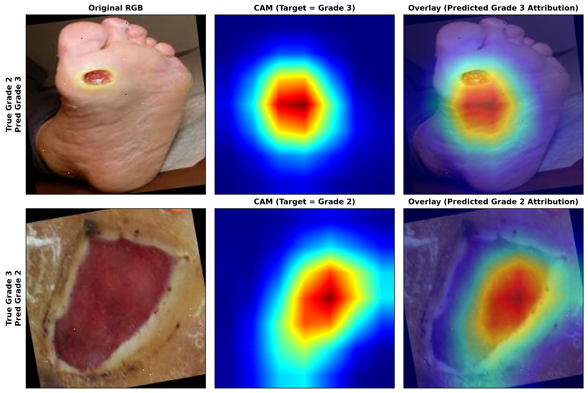
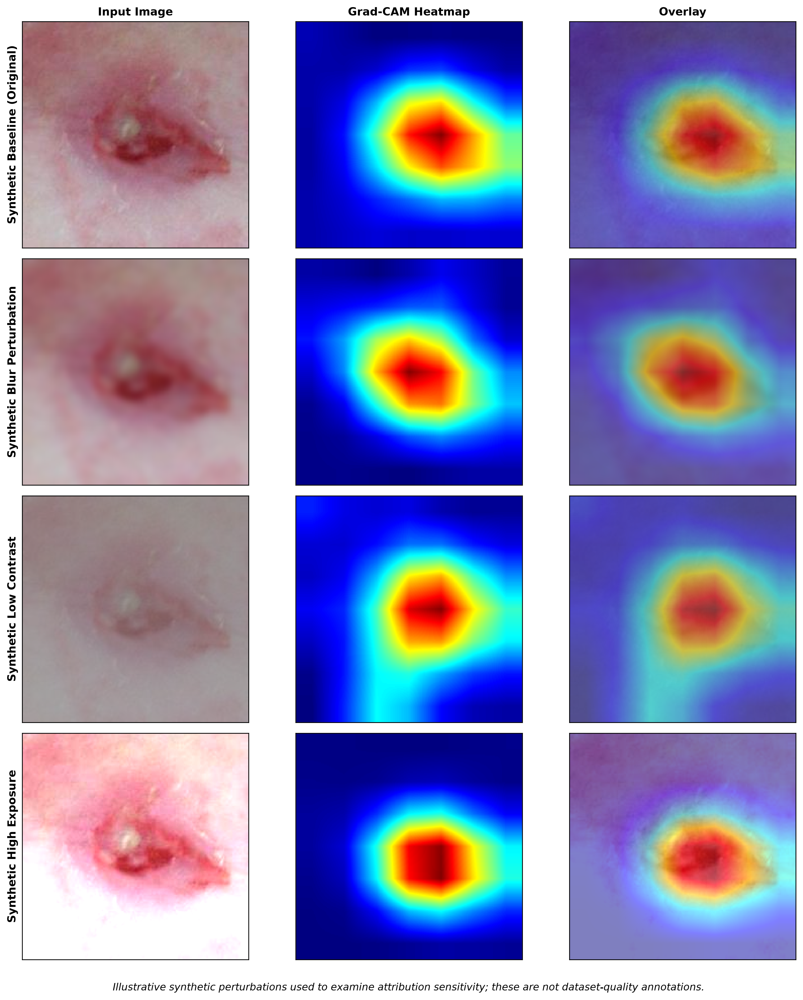

# Chapter 06 — Misclassification Attribution & Quality Analysis

## 6.1 Diagnosis of Misclassified Cases

Visual attributions for false positive and false negative predictions were analyzed to determine whether model errors stem from background shortcuts or genuine wound visual ambiguity.

### Figure 3: Grade 2 ↔ Grade 3 Misclassification Comparison

---

## 6.2 Key Confusion Pair Analysis

### Grade 2 Predicted as Grade 3 ($N = 42$)
- **Attribution Pattern**: Attributions concentrate directly over the central ulcer bed where thick fibrin slough and moist wound exudate are present.
- **Diagnostic Finding**: The attribution patterns are consistent with visual similarity between wound-bed characteristics observed in Grade 2 and Grade 3 cases, rather than obvious background or border artifacts.

### Grade 3 Predicted as Grade 2 ($N = 24$)
- **Attribution Pattern**: Attributions concentrate on the open wound aperture, but miss deep tissue cavity tracking.
- **Diagnostic Finding**: Without 3D depth perception or clinical probing/radiology, 2D RGB image attributions for deep Grade 3 ulcers naturally focus on visible surface erosion, leading to confusion with Grade 2 deep open ulcers.

---

## 6.3 Input Quality Perturbation Sensitivity

### Figure 4: Synthetic Input Perturbation Sensitivity Analysis

Figure 4 documents attribution sensitivity under synthetic quality degradation (blur, low contrast, high exposure):

- **Blur Perturbation**: Causes spatial widening of CAM heatmaps while maintaining primary focus over the wound area.
- **Contrast / Exposure Alterations**: High exposure slightly reduces attribution intensity but retains spatial localization.

> [!NOTE]
> Synthetic perturbations examine algorithmic sensitivity to image degradation; they do not represent ground-truth dataset-quality annotations.
