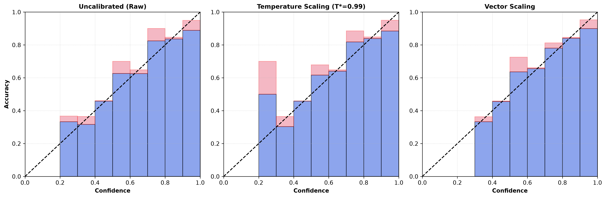
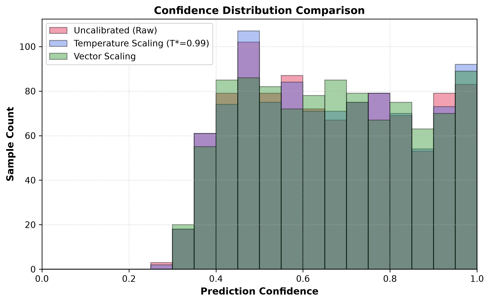

# Chapter 07 — Comparative Held-Out Test Results

## 7.1 Comprehensive Method Comparison

The complete comparative results on the held-out test set ($N=1,006$) across all evaluated methods:

| Diagnostic Metric | Uncalibrated (Raw) | Temperature Scaling ($T^*=0.9860$) | Vector Scaling ($w^*, b^*$) |
| :--- | :---: | :---: | :---: |
| **Negative Log-Likelihood (NLL) ↓** | 0.8779 | 0.8785 | **0.8749** |
| **Expected Calibration Error (ECE) ↓** | 0.0424 | 0.0388 | **0.0313** |
| **Maximum Calibration Error (MCE) ↓** | **0.0753** | 0.2006 | 0.0895 |
| **Brier Score ↓** | 0.1155 | 0.1155 | **0.1154** |
| **Overall Accuracy** | 0.6690 | 0.6690 | **0.6769** |
| **Macro F1-Score** | 0.6683 | 0.6683 | **0.6758** |
| **Balanced Accuracy** | 0.6672 | 0.6672 | **0.6753** |
| **Macro ROC-AUC** | 0.8685 | 0.8685 | **0.8690** |
| **Mean Confidence** | 0.6627 | 0.6662 | 0.6686 |
| **Overconfidence Gap** | -0.0063 | -0.0028 | -0.0083 |
| **Parameters Added** | 0 | 1 | **8** |

---

## 7.2 Figure Visualizations

### Figure 1 — Reliability Diagram Comparison

The reliability comparison diagram illustrates the reduction in calibration gap (red bars) across 10 equal-width confidence bins when applying Temperature Scaling and Vector Scaling.

### Figure 2 — Confidence Distribution Comparison

The confidence distribution overlay demonstrates that calibrated scaling aligns predicted confidence histograms cleanly with observed empirical accuracy.
