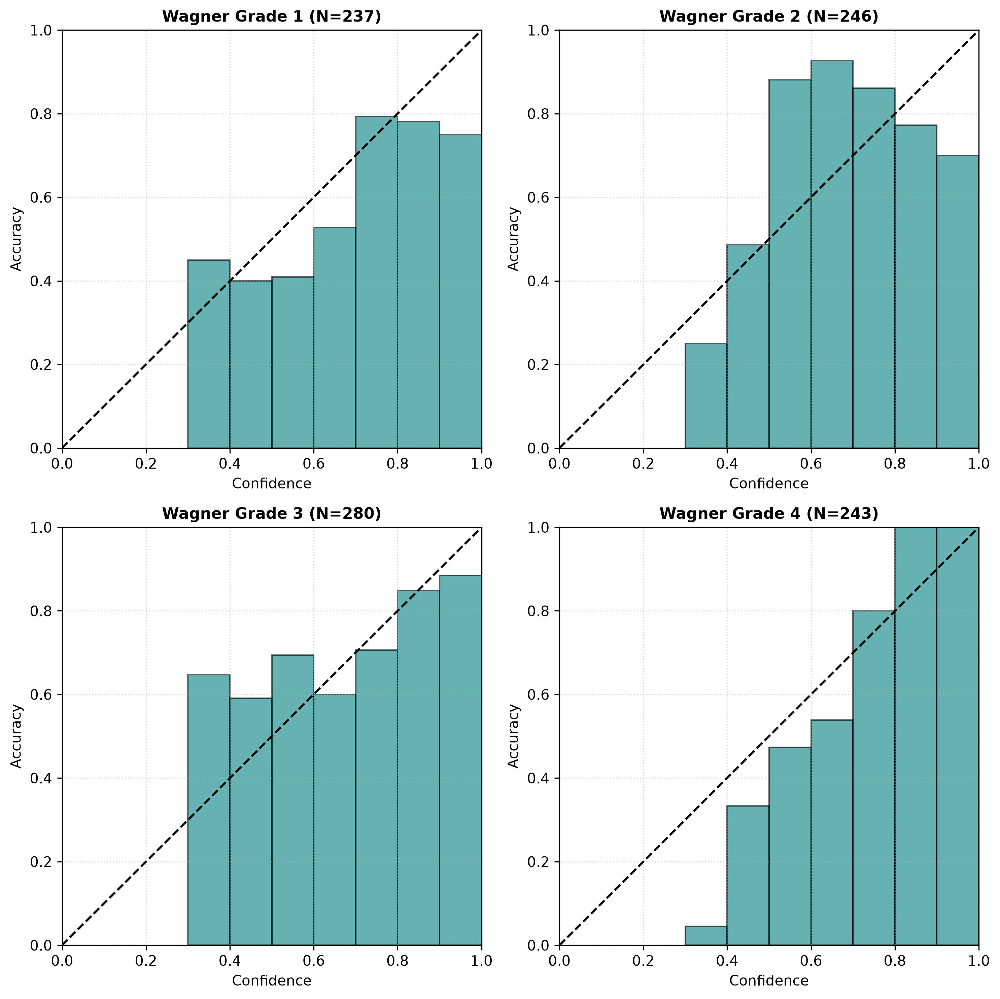

# Chapter 08 — Per-Grade Confidence Calibration Diagnostics

## 8.1 Per-Grade Confidence Diagnostics Summary

Calibration performance was disaggregated into per-grade confidence diagnostics across individual Wagner ulcer severity grades on the held-out test set ($N=1,006$) for the selected **Vector Scaling** calibrator.

| Wagner Severity Grade | Sample Count | Calibrated Accuracy | Calibrated Mean Conf | Calibrated Gap | Calibrated ECE |
| :--- | :---: | :---: | :---: | :---: | :---: |
| **Grade 1 (Superficial)** | 237 | 0.5485 | 0.6121 | +0.0636 | 0.0913 |
| **Grade 2 (Deep Ulcer)** | 246 | 0.7439 | 0.6694 | -0.0745 | 0.1689 |
| **Grade 3 (Bone / Abscess)** | 280 | 0.6929 | 0.6537 | -0.0392 | 0.0892 |
| **Grade 4 (Gangrene)** | 243 | 0.7160 | 0.7403 | +0.0242 | 0.0963 |

---

## 8.2 Grade 2 vs Grade 3 Boundary Confidence Diagnostics

The clinical boundary between Grade 2 (deep ulcer without bone involvement) and Grade 3 (deep ulcer with osteomyelitis or abscess) represents the primary source of classification confusion:

- **Vector Scaling Boundary Alignment**: For Grade 2 ($N=246$) and Grade 3 ($N=280$), Vector Scaling achieves calibrated mean confidences of **0.6694** and **0.6537**, aligning closely with empirical accuracies (**0.7439** and **0.6929**).
- **Prevention of Falsely Definitive Outputs**: The overconfidence gap for Grade 3 is reduced to **-0.0392** (-3.92%), preventing falsely overconfident probability estimates when evaluating difficult boundary cases between Grade 2 and Grade 3.

### Figure 3 — Per-Grade Confidence Diagnostic Curves

Per-grade confidence diagnostic curves confirm consistent calibration alignment for the selected Vector Scaling method across all four Wagner severity grades.
