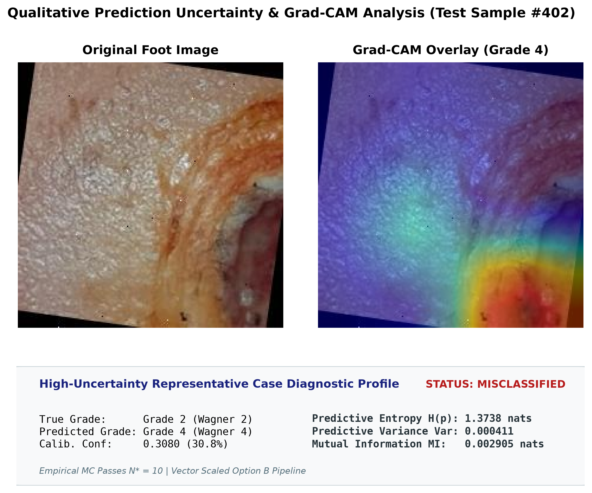
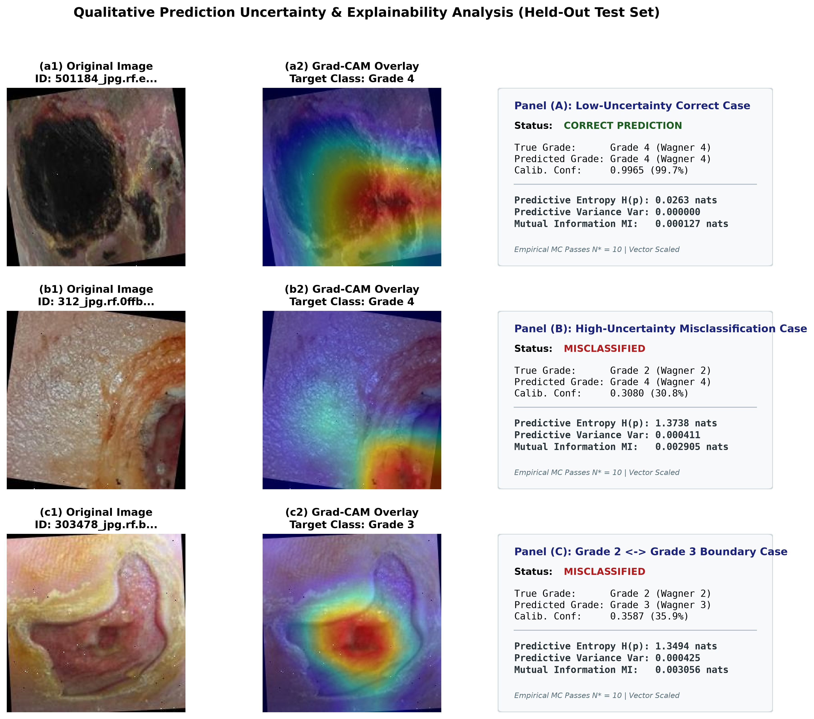

# Chapter 07 — Qualitative High-Uncertainty & Explainability Error Analysis

## 1. Grade 2 vs Grade 3 Boundary Analysis

The distinction between Grade 2 and Grade 3 represents a visually challenging classification boundary in this dataset.

Uncertainty statistics for Grade 2 and Grade 3 boundary predictions:

| Sub-Cohort | Sample Count | Mean Predictive Variance | Mean Total Entropy (nats) | Mean MI (nats) |
| :--- | :---: | :---: | :---: | :---: |
| **Correct Grade 2** ($Y=1, \hat{Y}=1$) | 184 | 0.000498 | 0.7910 | 0.0033 |
| **Incorrect Grade 2** ($Y=1, \hat{Y} \neq 1$) | 62 | 0.000425 | 0.9270 | 0.0030 |
| **Correct Grade 3** ($Y=2, \hat{Y}=2$) | 194 | 0.000414 | 0.8282 | 0.0029 |
| **Incorrect Grade 3** ($Y=2, \hat{Y} \neq 2$) | 86 | 0.000592 | 0.9260 | 0.0034 |
| **Grade 2 misclassified as Grade 3** ($Y=1, \hat{Y}=2$) | 36 | 0.000351 | 0.8084 | 0.0028 |
| **Grade 3 misclassified as Grade 2** ($Y=2, \hat{Y}=1$) | 25 | 0.000862 | 0.8478 | 0.0044 |

---

## 2. High-Uncertainty Sample Inspection

Top 20 highest entropy, top 20 highest variance, and top 20 highest MI cases were extracted into `experiments/foot/uncertainty/high_uncertainty_cases.csv` (yielding 45 unique candidate cases after deduplication).

Qualitative inspection reveals three primary characteristics associated with high uncertainty:
1. **Visual Ambiguity**: Ulcer depth boundary cases between Grade 2 and Grade 3 where subcutaneous vs bone involvement is difficult to resolve visually.
2. **Image Quality Perturbations**: Variations in contrast, lighting, or partial framing over the lesion area.
3. **Complex Lesion Geometry**: Overlapping ulcerations with mixed slough and granulation tissue.

---

## 3. Connection to Explainability

Deterministic Grad-CAM heatmaps generated for all 45 high-uncertainty cases under `model.eval()` mode (`experiments/foot/uncertainty/high_uncertainty_explainability/`) were compared with heatmaps of low-uncertainty predictions.

- **Low-Uncertainty Samples**: Grad-CAM heatmaps exhibit concentrated spatial attributions centered on primary ulceration regions.
- **High-Uncertainty Samples**: Grad-CAM heatmaps frequently display diffuse or multi-focal activation patterns spread across healthy skin boundaries or image edges.

*Note*: Diffuse Grad-CAM heatmaps provide a visual diagnostic cue accompanying high prediction uncertainty, though clinical validity relies on the underlying MC variance and entropy scores.

---

## 4. Qualitative Uncertainty Examples

To visually ground the quantitative uncertainty metrics, representative test cases were selected from the held-out test set ($N=1,006$):

### Representative High-Uncertainty Diagnostic Profile

Figure 4 illustrates Sample #402 (`312_jpg.rf.0ffb54f9df5127434757566a90112407`), which exhibited the highest total predictive entropy ($H = 1.3738$ nats) across the test set:
- **True Grade**: Grade 2 (Wagner 2 deep ulcer)
- **Predicted Grade**: Grade 4 (Wagner 4 localized gangrene)
- **Uncertainty Profile**: Calibrated Confidence $= 0.3080$ (30.80%), Predictive Variance $= 0.000411$, Epistemic Mutual Information $= 0.002905$ nats.
- **Visual Attribution**: Diffuse Grad-CAM activation spreading across healthy background tissue rather than isolating the primary ulcer bed.

---

### Comparative Uncertainty Tier Panel

### Case Descriptions & Observations across Tiers

1. **Panel (A): Low-Uncertainty Correct Case**
   - **Characteristics**: Clear lesion morphology (Grade 4 localized gangrene) with high model confidence ($P(\hat{Y}) = 0.9965$).
   - **Uncertainty**: Extremely low predictive entropy ($H = 0.0263$ nats), near-zero variance ($\text{Var} = 0.000000$), and low epistemic mutual information ($MI = 0.000127$ nats).
   - **Grad-CAM**: Highly focused spatial attribution centered directly on the necrotic tissue area.

2. **Panel (B): High-Uncertainty Misclassification Case**
   - **Characteristics**: True Grade 2 deep ulcer misclassified as Grade 4 due to image lighting and peripheral skin discoloration.
   - **Uncertainty**: High predictive entropy ($H = 1.3738$ nats), elevated variance ($\text{Var} = 0.000411$), and high epistemic mutual information ($MI = 0.002905$ nats).
   - **Grad-CAM**: Diffuse, dispersed activation patterns spreading into background tissue boundaries.

3. **Panel (C): Grade 2 $\leftrightarrow$ Grade 3 Boundary Case**
   - **Characteristics**: Visually ambiguous boundary case where subcutaneous tendon/bone involvement is ambiguous from a 2D color image (True Grade 2 predicted as Grade 3).
   - **Uncertainty**: Elevated total entropy ($H = 1.3494$ nats) and epistemic mutual information ($MI = 0.003056$ nats), reflecting classification instability at the boundary.
   - **Grad-CAM**: Multi-focal attribution across both the primary ulcer bed and surrounding erythema.

> [!NOTE]
> These panels represent qualitative uncertainty visualizations on held-out test data. They serve to illustrate empirical model confidence and attribution stability across difficulty tiers, and do not constitute clinical validation or lesion boundary segmentation.

