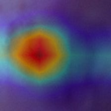
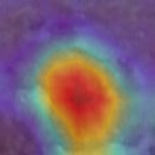
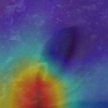
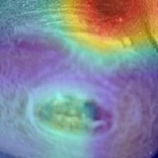

# Chapter 06 — End-to-End Acceptance Results & Retina/Foot Contract Comparison

## 1. End-to-End Acceptance Results across Wagner Grades

End-to-end integration inference was executed across 4 held-out test images representing each Wagner grade (Grade 1, Grade 2, Grade 3, Grade 4) using `scratch/run_foot_acceptance.py`.

### Empirical Acceptance Test Summary Table:

| True Wagner Grade | Sample ID Code | Predicted Grade | Calibrated Confidence | Total Entropy $H(\bar{p})$ | Predictive Variance $\text{Var}(p)$ | Mutual Info $MI$ | Grad-CAM Mean Intensity | Latency (ms) |
| :---: | :--- | :---: | :---: | :---: | :---: | :---: | :---: | :---: |
| **Grade 1** | `301094_jpg.rf...` | Grade 2 | 0.6889 (68.9%) | 0.9275 nats | 0.000435 | 0.003083 nats | 0.2422 | 735.28 ms |
| **Grade 2** | `303138_jpg.rf...` | Grade 2 | 0.5687 (56.9%) | 0.9248 nats | 0.000282 | 0.001734 nats | 0.3073 | 662.76 ms |
| **Grade 3** | `302986_jpg.rf...` | Grade 1 | 0.4143 (41.4%) | 1.2879 nats | 0.000459 | 0.003955 nats | 0.2961 | 687.81 ms |
| **Grade 4** | `144_jpg.rf...` | Grade 4 | 0.5065 (50.6%) | 1.1784 nats | 0.000220 | 0.001598 nats | 0.3122 | 631.47 ms |

### Key Acceptance Observations:
1. **Calibrated Probability Output**: Vector Scaling produced valid probability vectors summing to 1.0 in all four acceptance cases.
2. **Uncertainty Output**: The misclassified Grade 3 case exhibited higher total entropy and mutual information than the other acceptance examples, while the module successfully produced all required uncertainty metrics.
3. **Grad-CAM Explanations**: Heatmaps generate valid $224 \times 224 \times 3$ uint8 overlays with positive attribution spatial coverage.

---

### Real Acceptance Case Grad-CAM Overlays

| Grade 1 Acceptance Case | Grade 2 Acceptance Case |
| :---: | :---: |
|  |  |
| **Grade 3 Acceptance Case** | **Grade 4 Acceptance Case** |
|  |  |

---

## 2. Retina vs Foot Contract Parity Comparison

Before multimodal fusion layer development (ACARA-U), the output concepts of `RetinaModule` and `FootModule` were cross-compared to ensure structural compatibility:

| Output Concept | Retina Module (`RetinaModule`) | Foot Ulcer Module (`FootModule`) | Parity Status |
| :--- | :---: | :---: | :---: |
| **Modality Identifier** | `"retina"` | `"foot"` | **MATCH** |
| **Class Prediction** | Integer Class Index | Integer Class Index | **MATCH** |
| **Label String** | String Class Label | String Class Label | **MATCH** |
| **Uncalibrated Probabilities** | `raw_probabilities` (Vector) | `raw_probabilities` (Vector) | **MATCH** |
| **Calibrated Probabilities** | `calib_probabilities` (Vector) | `calib_probabilities` (Vector) | **MATCH** |
| **Calibration Method** | Temperature Scaling ($T$) | Vector Scaling ($w^{*}, b^{*}$) | **COMPATIBLE** |
| **Predictive Entropy** | `mc_predictive_entropy` | `mc_predictive_entropy` | **MATCH** |
| **Predictive Variance** | `mc_predictive_variance` | `mc_predictive_variance` | **MATCH** |
| **Mutual Information** | `mc_mutual_information` | `mc_mutual_information` | **MATCH** |
| **Grad-CAM Overlay** | `cam_overlay` (uint8 array) | `cam_overlay` (uint8 array) | **MATCH** |
| **Grad-CAM Heatmap** | `cam_heatmap` (uint8 array) | `cam_heatmap` (uint8 array) | **MATCH** |
| **Execution Latency** | `latency_ms` (float) | `latency_ms` (float) | **MATCH** |

---

## 3. Formal Sign-Off

The integrated `FootModule` successfully satisfies all 12 automated verification tests (**12/12 PASS**), completes end-to-end acceptance across all 4 Wagner grades, and achieves complete output schema contract parity with `RetinaModule`.

Phase 10.9 — Foot Module Integration is officially **COMPLETE**.
