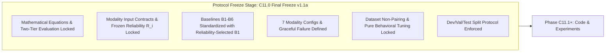

# Phase C11.0 — Research Protocol Overview & Governance (Final Freeze v1.1a)

## 1. Context & Motivation

Multimodal clinical decision support systems frequently fail in clinical deployment due to three structural weaknesses:
1. **Uncalibrated Overconfidence**: Modalities output high nominal probabilities even when faced with corrupted inputs, severe domain shifts, or high predictive dispersion.
2. **Missing Modality Fragility**: Naive fusion architectures (such as feature concatenation or unweighted averaging) break down when one or more modalities are unavailable.
3. **Data Snooping & Post-Hoc Tuning**: Hyperparameters for modality fusion are often adjusted directly on the test set, creating unrealistic performance claims.

Phase C11 addresses these challenges by formalizing **ACARA-U v2** (*Adaptive Calibrated Architecture for Risk Assessment under Uncertainty*), a modular, decision-level multimodal fusion framework that dynamically weights independent clinical modalities based on confidence, prior reliability, normalized predictive uncertainty, input quality, and explicit availability constraints.

---

## 2. Research Protocol Freeze Mandate & Final Freeze v1.1a

Before authoring ingestion pipelines, router logic, or baseline aggregators, this protocol freezes all experimental parameters, mathematical definitions, evaluation protocols, and boundary constraints.

### Protocol Invariants (Final Freeze v1.1a)
1. **No Retrospective Metric Modification**: Performance metrics, loss criteria, and routing boundaries defined herein cannot be modified post-evaluation.
2. **Ablation-First Philosophy**: If predictive uncertainty $U_i$ or quality $Q_i$ does not yield statistically significant improvement in robustness or calibration, the protocol mandates reporting this empirical result without retrospective alteration.
3. **Zero Test-Set Peeking**: The test set is evaluated exactly once after all parameters $\alpha, \beta, \gamma, \eta, \delta$ are locked on the validation set.
4. **Disjoint Dataset Grounding**: The protocol strictly enforces a **Two-Tier Evaluation Framework**. Fused metrics are never evaluated against non-existent unified composite patient labels. Hyperparameters are tuned strictly on behavioral response criteria without synthetic target tuning.

---

## 3. Modality Landscape (Actual Frozen Implementations)

The three constituent modalities in **FusionMedAI** operate as autonomous, self-contained, frozen diagnostic pipelines:

| Modality ($i$) | Clinical Domain | Primary Task | Frozen Architecture | Calibration Method | Uncertainty Method | Primary Output Payload |
| :--- | :--- | :--- | :--- | :--- | :--- | :--- |
| **Retina ($R$)** | Ophthalmology | Diabetic Retinopathy Grading (5-class) | EfficientNet-B3 | Temperature Scaling | MC Dropout ($N=25$ passes) | 5-class calibrated probs, ordinal risk projection $r_R$, predictive variance $U_R$, $R_R = \frac{1}{2}(\text{AUC}_R + 1 - \text{ECE}_R)$ |
| **Foot ($F$)** | Podiatry / Wound Care | Wagner Ulcer Grade (4-class) | EfficientNet-B3 | Vector Scaling (`FootVectorScaler`) | MC Dropout ($N=10$ passes, Option B) | 4-class calibrated probs, severity risk projection $r_F$, predictive entropy $U_F$, $R_F = \frac{1}{2}(\text{AUC}_F + 1 - \text{ECE}_F)$ |
| **Clinical ($C$)** | Internal Medicine / Endocrinology | 30-Day Hospital Readmission (Binary) | CatBoost HPO ($D=119$ features) | Isotonic Calibration | Bootstrap CatBoost Ensemble ($B=20$ models) | Binary calibrated prob, readmission risk $r_C = p_1$, ensemble variance $U_C$, $R_C = \frac{1}{2}(\text{AUC}_C + 1 - \text{ECE}_C)$ |

---

## 4. Phase 11 Lifecycle Milestones

| Phase ID | Milestone Description | Primary Objective |
| :--- | :--- | :--- |
| **C11.0** | **Research Protocol Freeze** | Formal lock of contracts, math, baselines, splits, and boundary declarations (Final Freeze v1.1a). |
| **C11.1** | **Unified Modality Output Contract** | Pydantic / dataclass validation schemas for 8-tuple modality outputs from frozen modules. |
| **C11.2** | **Unified Input / Quality Layer** | Standardized ingestion, image quality & tabular completeness metrics. |
| **C11.3** | **Global Reliability** | Historical reliability indices ($R_i = \frac{1}{2}(\text{AUC}_i + 1 - \text{ECE}_i)$) computed from validation splits. |
| **C11.4** | **ACARA-U v2 Router** | Dynamic routing kernel with hard availability gating and softmax weights. |
| **C11.5** | **Fusion Baselines** | Standardized implementations of B1 (Reliability-Selected), B2 (Avg), B3 (Conf), B4 (Conf+Rel), B5 (Conf+Rel+Unc). |
| **C11.6** | **DCRI Aggregation** | Computation of aggregated risk $R_{\text{fusion}}$ and uncertainty-penalized decision index $DCRI$. |
| **C11.7** | **Conflict / Consensus** | Inter-modality distance metrics, discordance thresholds ($\Delta_{\text{conflict}}$), and consensus flags. |
| **C11.8** | **Missing-Modality Experiments** | Systematic evaluation across all 7 combinations of $\{R, F, C\}$ plus graceful failure on $\emptyset$. |
| **C11.9** | **Modality Degradation** | Stress-testing under synthetic image blur, noise, missing tabular features, and corrupted data. |
| **C11.10** | **Controlled Conflict** | Inoculation of deliberate cross-modality contradictions to assess router safety. |
| **C11.11** | **Calibration** | Calibration preservation analysis on Tier-1 splits and labeled synthetic test benches. |
| **C11.12** | **$\delta$ Selection Protocol** | Optimization of uncertainty penalty parameter $\delta$ on validation split for $DCRI$ triage. |
| **C11.13** | **Ablations** | Step-by-step ladder ablation to isolate marginal gains of $C, R, U, Q, A$. |
| **C11.14** | **Router Sanity Tests** | Invariance, monotonicity, edge-case masking, and gradient sanity verification. |
| **C11.15** | **Main Evaluation** | Unified benchmark execution on frozen test set across all modalities and baselines. |
| **C11.16** | **Statistical Analysis** | Bootstrap confidence intervals, DeLong test, and paired significance tests ($p < 0.05$). |
| **C11.17** | **Failure Analysis** | Systematic categorization of false positives, false negatives, and extreme discordance cases. |
| **C11.18** | **Final C11 Report** | Comprehensive synthesis, publication-ready tables, and deployment recommendations. |
