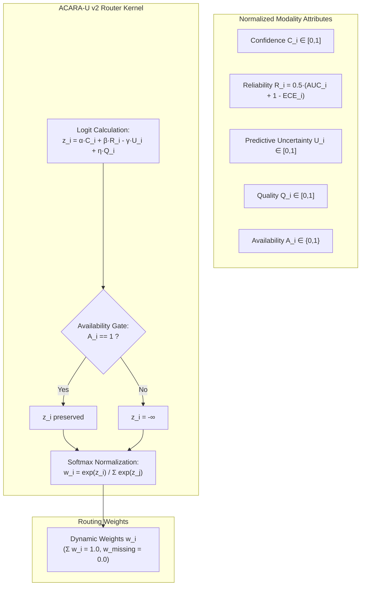
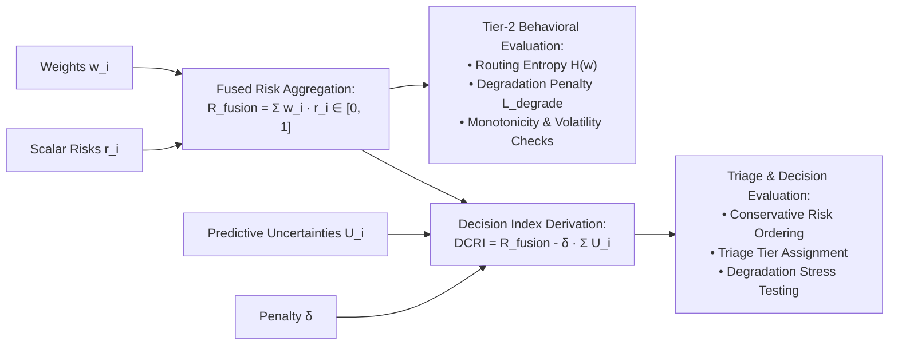

# Phase C11.0 — Mathematical Formulation & Routing Kernel Specification (Final Freeze v1.1a)

## 1. Mathematical Notation & Variables

Let $\mathcal{M} = \{1, 2, \dots, M\}$ denote the set of diagnostic modalities ($M = 3$):
1. $i = 1$: Retina ($R$)
2. $i = 2$: Foot ($F$)
3. $i = 3$: Clinical ($C$)

For each modality $i \in \mathcal{M}$, the ingestion layer receives a frozen attribute vector:
- $r_i \in [0, 1]$: Continuous scalar risk projection derived deterministically from the modality's calibrated output ($r_R = \text{DR severity projection}$, $r_F = \text{ulcer severity projection}$, $r_C = P(\text{readmission})$).
- $C_i \in [0, 1]$: Modality-specific confidence score, normalized to a common semantic interval $[0, 1]$ where $1.0$ denotes maximal model certainty and $0.0$ denotes maximal ambivalence/indifference.
- $R_i \in [0, 1]$: Historical empirical reliability index evaluated on frozen validation cohorts via the standardized formula $R_i = \frac{1}{2}(\text{AUC}_i + (1 - \text{ECE}_i))$.
- $U_i \in [0, 1]$: Normalized predictive uncertainty produced by the modality's frozen uncertainty estimator.
- $Q_i \in [0, 1]$: Input signal quality index (image resolution/sharpness or tabular feature completeness).
- $A_i \in \{0, 1\}$: Binary availability indicator ($1 = \text{Present}$, $0 = \text{Missing}$).

---

## 2. Router Kernel & Dynamic Weighting

### 2.1 Raw Logit Scoring Function
For each modality $i \in \mathcal{M}$, the pre-masking logit $z_i \in \mathbb{R}$ is formulated as:

$$z_i = \alpha C_i + \beta R_i - \gamma U_i + \eta Q_i$$

Where hyperparameters $\Theta = \{\alpha, \beta, \gamma, \eta\}$ are non-negative real coefficients:
$$\alpha \ge 0, \quad \beta \ge 0, \quad \gamma \ge 0, \quad \eta \ge 0$$

### 2.2 Hard Availability Masking
Availability $A_i$ is enforced as a **hard filtering constraint** rather than an additive linear reward:

$$\tilde{z}_i = \begin{cases} z_i & \text{if } A_i = 1 \\ -\infty & \text{if } A_i = 0 \end{cases}$$

> [!IMPORTANT]
> **Hard Masking Invariant**:
> If $A_i = 0$, then $\tilde{z}_i = -\infty \implies e^{\tilde{z}_i} = 0 \implies w_i = 0$. Missing modalities have strictly zero mathematical influence on downstream risk aggregation.

### 2.3 Softmax Weight Normalization
For any scenario with at least one active modality ($\sum_{i=1}^M A_i \ge 1$), normalized weights $w_i \in [0, 1]$ are computed via:

$$w_i = \frac{e^{\tilde{z}_i}}{\sum_{j=1}^M e^{\tilde{z}_j}}$$

$$\sum_{i=1}^M w_i = 1.0, \quad w_i \ge 0 \quad \forall i$$

---

## 3. Separation of Fused Risk ($R_{\text{fusion}}$) and Decision Index ($DCRI$)

### 3.1 Fused Risk Aggregation ($R_{\text{fusion}}$ / $R_{\text{consensus}}$)
$$R_{\text{fusion}} = \sum_{i=1}^M w_i r_i \quad \in [0.0, 1.0]$$

#### Mathematical & Semantic Status:
- Formally bounded in $[0.0, 1.0]$ as a convex combination of modality scalar risk projections.
- Because $r_R$ (DR ordinal severity), $r_F$ (ulcer ordinal severity), and $r_C$ (readmission probability) represent distinct clinical outcomes, $R_{\text{fusion}}$ is a **mathematical risk aggregation scalar**, not a single patient-level clinical outcome probability.
- Probability-based calibration metrics (ECE, Brier) are computed on $R_{\text{fusion}}$ **only in Tier-1 unimodal evaluations or explicitly labeled synthetic benchmark test-beds**, not against a unified clinical ground truth.

### 3.2 Dynamic Clinical Risk Index ($DCRI$)
$$DCRI = R_{\text{fusion}} - \delta \sum_{i \in \mathcal{A}} U_i = \sum_{i=1}^M w_i r_i - \delta \sum_{i \in \mathcal{A}} U_i$$

Where $\mathcal{A} = \{i \in \mathcal{M} \mid A_i = 1\}$ and $\delta \ge 0$ is the uncertainty discount factor.

#### Operational Role:
- Bounded in $[-\delta M, 1.0]$.
- Serves as a **derived conservative decision and triage index** that discounts aggregate risk when predictive uncertainty is elevated.
- **Valid for decision-level analyses**: Risk ranking, conservative patient referral, triage tiering, and degradation stress testing.
- **Not evaluated via Brier/ECE**: Because $DCRI$ can be negative under high predictive uncertainty, it is not treated as a class posterior probability.

---

## 4. Conflict & Discordance Formulation

Intersensor disagreement across the active modality set $\mathcal{A}$ is quantified via the maximum absolute risk divergence:

$$\Delta_{\text{conflict}} = \max_{j, k \in \mathcal{A}} |r_j - r_k|$$

And the weight-adjusted variance:
$$\sigma_{\text{fusion}}^2 = \sum_{i=1}^M w_i (r_i - R_{\text{fusion}})^2$$

When $\Delta_{\text{conflict}} > \tau_{\text{conflict}}$ (default threshold $\tau_{\text{conflict}} = 0.35$), the router emits a `CLINICAL_DISCORDANCE_ALERT`, signaling significant disagreement between available sensors and recommending human clinical oversight.
