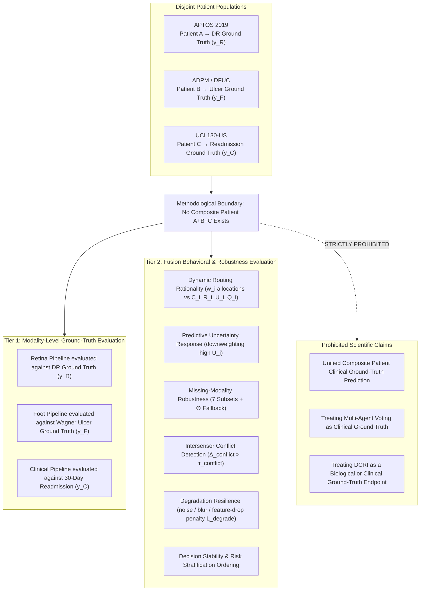

# Phase C11.0 — Methodological Boundaries & Dataset Non-Pairing Declaration (Final Freeze v1.1a)

## 1. The Disjoint Cohort Reality & Ground-Truth Formalization

A foundational scientific constraint governs the entire C11 Multimodal Fusion Phase:

$$\text{Cohort}_{\text{APTOS 2019 (Retina)}} \neq \text{Cohort}_{\text{ADPM / DFUC (Foot)}} \neq \text{Cohort}_{\text{UCI Diabetes 130-US (Clinical)}}$$

These datasets originate from entirely independent patient populations across different healthcare systems, geographies, and timeframes:
- **Retina (APTOS 2019)**: Indian rural and urban ophthalmic screening clinics (fundus imaging for diabetic retinopathy).
- **Foot (ADPM / DFUC)**: Specialized wound care centers in the UK/US (photographic grading of diabetic foot ulcers).
- **Clinical (UCI 130-US Hospitals)**: Inpatient electronic health records from 130 US hospitals (1999–2008 diabetes admissions).

---

## 2. Formal Resolution: Two-Tier Evaluation Framework

Because no patient possesses simultaneous ground-truth labels across all three modalities, the protocol establishes two distinct evaluation tiers:

### Tier 1: Modality-Level Predictive Evaluation (Ground-Truth Validated)
Evaluates whether individual modality backbones are calibrated, robust, and accurate on their respective target tasks:
- **Retina**: Evaluated on APTOS test split against DR ground truth $y_{\text{retina}} \in \{0, 1, 2, 3, 4\}$.
- **Foot**: Evaluated on ADPM test split against Wagner ulcer ground truth $y_{\text{foot}} \in \{0, 1, 2, 3\}$.
- **Clinical**: Evaluated on UCI test split against readmission ground truth $y_{\text{clinical}} \in \{0, 1\}$.

### Tier 2: Decision-Level Fusion & Behavioral Robustness Evaluation (Algorithmic Validation)
Evaluates how the ACARA-U router and fusion algorithms behave under multi-sensor inputs, missing data, noise, and cross-modality contradictions:
- **Dynamic Routing Rationality**: Does the router allocate higher weights $w_i$ to modalities with higher confidence $C_i$, higher reliability $R_i$, higher quality $Q_i$, and lower predictive uncertainty $U_i$?
- **Graceful Missing-Modality Degradation**: Does routing adapt smoothly across all 7 combinations of $\{R, F, C\}$ without crashing?
- **Conflict Detection**: Does the system accurately detect and flag extreme contradictions ($\Delta_{\text{conflict}} > \tau_{\text{conflict}}$)?
- **Synthetic Stress Testing**: When synthetic blur, noise, or missing features are injected into modality $i$, does $w_i \to 0$ adaptively?
- **Risk Stratification & Triage Stability**: Does $DCRI$ provide conservative risk ordering under high predictive uncertainty?

> [!IMPORTANT]
> **Ground-Truth Rule on Multi-Agent Voting & Synthetic Targets**:
> Modality-specific ground truths are used independently for Tier-1 evaluation. Tier-2 fusion experiments evaluate routing behavior, missingness robustness, conflict response, degradation response, and other predefined algorithmic properties. Any constructed benchmark target used for quantitative fusion evaluation (e.g., in controlled multi-sensor simulation benches $y_{\text{synthetic}} = f(y_R, y_F, y_C)$) must be **explicitly labeled as a synthetic / constructed benchmark target** and must **never** be interpreted or reported as clinical ground truth.

---

## 3. Scope of Permissible vs Prohibited Claims

| Dimension | Permissible Scientific Claim | Prohibited Scientific Claim |
| :--- | :--- | :--- |
| **System Scope** | "Evaluates decision-level multimodal risk aggregation, uncertainty-aware dynamic routing, and robustness under missingness and sensor degradation." | "Evaluates individual patient clinical prognosis across combined retinal, foot, and tabular outcomes." |
| **Cohort Structure** | "Controlled synthetic test benches, aligned validation splits, and stratified scenario stress-testing." | "Real-world paired multimodal patient records." |
| **Ground Truth** | "Modality-specific ground truths for Tier 1; explicitly labeled synthetic benchmark targets for Tier 2 simulations." | "Single composite multimodal clinical ground-truth diagnosis for individual subjects." |
| **DCRI Metric** | "A derived algorithmic decision index incorporating normalized predictive uncertainty penalties for conservative triage." | "A biologically verified or clinically validated patient survival/complication index." |
| **Fusion Metrics** | "Behavioral metrics: routing entropy $H(w)$, degradation penalty $\mathcal{L}_{\text{degrade}}$, discordance rate $\Delta_{\text{conflict}}$, triage rank correlation." | "Unqualified clinical ECE/Brier against non-existent unified patient labels." |
