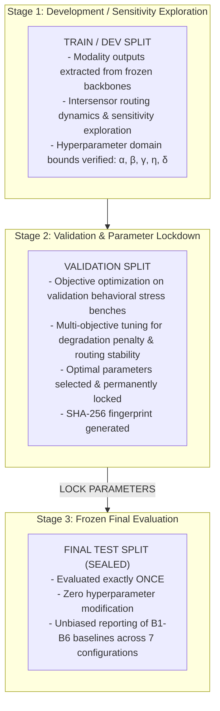

# Phase C11.0 — Hyperparameter Tuning & Split Hygiene Protocol (Final Freeze v1.1a)

## 1. Split Isolation & Anti-Leakage Hierarchy

To ensure scientific reproducibility and defensibility, hyperparameter tuning strictly obeys a three-stage partition hierarchy:

---

## 2. Hyperparameter Search Space & Constraints

The routing and aggregation hyperparameters $\Theta = \{\alpha, \beta, \gamma, \eta, \delta\}$ are constrained within mathematically bounded domains:

| Parameter | Symbol | Domain | Optimization Objective | Interpretation |
| :--- | :--- | :--- | :--- | :--- |
| **Confidence Weight** | $\alpha$ | $[0.0, 5.0]$ | Maximizes weight allocation when a modality exhibits high certainty. | Sensitivity to sample-level normalized confidence $C_i$. |
| **Reliability Weight** | $\beta$ | $[0.0, 5.0]$ | Stabilizes weights against noisy samples using historical validation performance. | Weight of empirical validation reliability $R_i = \frac{1}{2}(\text{AUC}_i + (1 - \text{ECE}_i))$. |
| **Uncertainty Penalty** | $\gamma$ | $[0.0, 5.0]$ | Downweights modalities exhibiting high predictive variance or entropy. | Router penalty for normalized predictive uncertainty $U_i$. |
| **Quality Weight** | $\eta$ | $[0.0, 5.0]$ | Suppresses influence of corrupted, blurred, or incomplete inputs. | Routing bonus for input signal quality $Q_i$. |
| **DCRI Discount Factor**| $\delta$ | $[0.0, 1.0]$ | Calibrates conservatism of the derived $DCRI$ decision index under aggregate uncertainty. | Degree of uncertainty discount in conservative triage. |

---

## 3. Pure Behavioral Validation Objective (No Synthetic Target Tuning)

To avoid introducing circularity or arbitrary assumptions regarding synthetic joint disease targets, parameter selection is conducted strictly via **behavioral robustness and routing rationality optimization** on validation data:

$$\Theta^* = \{\alpha^*, \beta^*, \gamma^*, \eta^*\} = \arg\min_{\Theta} \left[ \mathcal{L}_{\text{degrade}}(\mathcal{D}_{\text{val}}; \Theta) + \lambda_1 \mathcal{L}_{\text{volatility}}(\mathcal{D}_{\text{val}}; \Theta) + \lambda_2 \mathcal{L}_{\text{monotonicity}}(\mathcal{D}_{\text{val}}; \Theta) \right]$$

Where:
- $\mathcal{L}_{\text{degrade}}(\mathcal{D}_{\text{val}}; \Theta) = \mathbb{E}[w_{\text{corrupted}}]$ penalizes assigning non-zero weight to modalities subjected to synthetic noise, blur, or feature deletion during validation stress tests.
- $\mathcal{L}_{\text{volatility}}(\mathcal{D}_{\text{val}}; \Theta) = \text{Var}(w \mid \text{Noise})$ penalizes erratic weight fluctuation under minor input perturbations.
- $\mathcal{L}_{\text{monotonicity}}(\mathcal{D}_{\text{val}}; \Theta)$ enforces the mathematical requirement that routing weights respond monotonically to their components ($\frac{\partial w_i}{\partial C_i} > 0$, $\frac{\partial w_i}{\partial R_i} > 0$, $\frac{\partial w_i}{\partial Q_i} > 0$, and $\frac{\partial w_i}{\partial U_i} < 0$).
- $\delta^*$ is selected independently on validation data to maximize risk stratification separation under predictive uncertainty for conservative triage.

> [!IMPORTANT]
> **Zero Synthetic Target Tuning Mandate**:
> Hyperparameters are tuned strictly on behavioral response criteria. Any synthetic multi-sensor target experiments conducted in Phase C11 are reserved solely for descriptive behavioral benchmarking and never used to optimize routing parameters.

---

## 4. Test Set Lockdown Gate

Before executing any benchmark script on the Test Split:
1. The parameter file `config/fusion/frozen_parameters.json` must be generated.
2. A cryptographic SHA-256 checksum of `frozen_parameters.json` must be recorded in the protocol audit log.
3. The evaluation harness must verify that no gradient, optimization loop, or parameter override is active during test evaluation.
