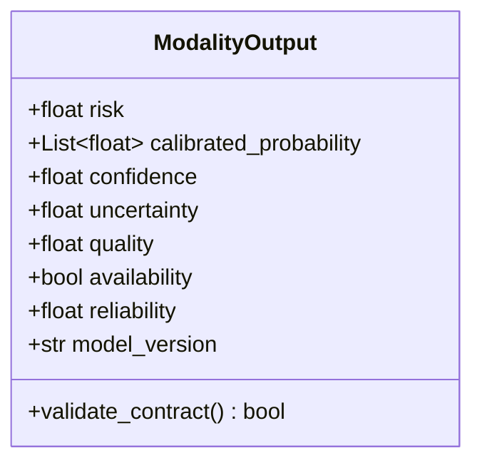
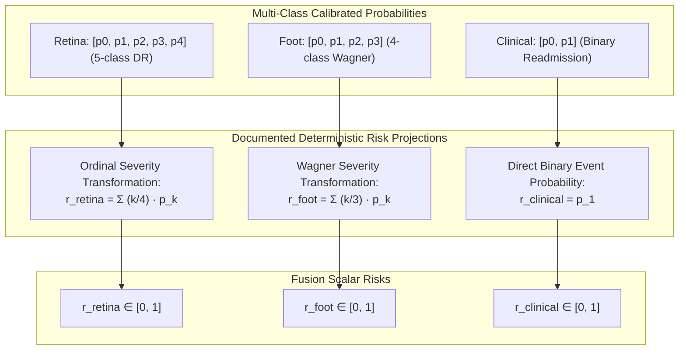

# Phase C11.0 — Unified Modality Input/Output Contract Specification (Final Freeze v1.1a)

## 1. Unified Modality Output Contract (8-Tuple)

Every frozen modality pipeline (Retina, Foot, Clinical) must produce a standardized output payload strictly adhering to the 8-tuple specification before entering the fusion layer.

---

## 2. Schema Specification & Semantic Definitions

| Field Name | Data Type | Domain | Semantic Definition & Role in ACARA-U | Validation Rule |
| :--- | :--- | :--- | :--- | :--- |
| `risk` | `float` | $[0.0, 1.0]$ | **Scalar Risk Projection ($r_i$)**: Continuous scalar risk score derived via a documented modality-specific deterministic projection function. | Must satisfy $0.0 \le \text{risk} \le 1.0$. If `availability=False`, defaults to $0.0$. |
| `calibrated_probability` | `List[float]` | $[0.0, 1.0]^K$ | **Class Distribution Vector**: Full calibrated probability distribution across the $K$ task classes produced by the frozen calibration layer. | $\sum_{k=1}^K p_k = 1.0 \pm 10^{-5}$. Empty list if `availability=False`. |
| `confidence` | `float` | $[0.0, 1.0]$ | **Normalized Confidence ($C_i$)**: Modality certainty mapped to a unified $[0, 1]$ scale ($1.0 = \text{max certainty}$, $0.0 = \text{max ambivalence}$). | Must satisfy $0.0 \le \text{confidence} \le 1.0$. |
| `uncertainty` | `float` | $[0.0, 1.0]$ | **Normalized Predictive Uncertainty ($U_i$)**: Normalized predictive variance or dispersion from the modality's frozen uncertainty estimator. | Must satisfy $0.0 \le \text{uncertainty} \le 1.0$. |
| `quality` | `float` | $[0.0, 1.0]$ | **Input Signal Quality ($Q_i$)**: Objective fidelity measure (image sharpness/illumination or tabular non-missing completeness ratio). | Must satisfy $0.0 \le \text{quality} \le 1.0$. |
| `availability` | `bool` | `True` / `False` | **Availability Indicator ($A_i$)**: Boolean presence flag. If `False`, triggers hard masking $\tilde{z}_i = -\infty \implies w_i = 0$. | Boolean type. |
| `reliability` | `float` | $[0.0, 1.0]$ | **Historical Empirical Reliability ($R_i$)**: Unified composite reliability index combining validation discrimination and calibration fidelity. | Defined deterministically as $R_i = \frac{1}{2}(\text{AUC}_i + (1 - \text{ECE}_i))$. Static constant per model version. |
| `model_version` | `str` | SemVer regex | Deterministic tracking identifier of the frozen model checkpoint. | Non-empty string identifying frozen artifacts. |

---

## 3. Unified Reliability Formulation ($R_i$)

To ensure complete methodological parity across all modalities, $R_i$ is **not** an ad-hoc choice between metrics. It is formally frozen as a composite index evaluated on each modality's frozen validation split:

$$R_i = \frac{1}{2} \cdot \left[ \text{AUC}_i + (1 - \text{ECE}_i) \right] \quad \in [0.0, 1.0]$$

Where:
- $\text{AUC}_i \in [0.5, 1.0]$ is the validation Area Under the ROC Curve (macro one-vs-rest for multi-class Retina and Foot; binary AUC for Clinical).
- $\text{ECE}_i \in [0.0, 1.0]$ is the Expected Calibration Error computed with $M=10$ equal-frequency bins on validation predictions.
- $R_i$ represents a single, uniform semantic quantity: **the modality's joint discrimination-calibration reliability prior**.

---

## 4. Disambiguation: `calibrated_probability` vs Scalar `risk`

To avoid conflating multi-class calibrated probability distributions with scalar clinical risk indices:
- **`calibrated_probability`** represents the post-calibration posterior distribution $P(Y = k \mid x)$ across all classes $k \in \{0, \dots, K-1\}$.
- **`risk` ($r_i$)** represents the unidimensional continuous projection into $[0, 1]$ required for scalar fusion and $DCRI$ calculation.

### Deterministic Risk Projection Formulas:
1. **Retina Modality ($K=5$ classes: No DR, Mild, Moderate, Severe, PDR)**:
   $$r_{\text{retina}} = \sum_{k=0}^4 \left(\frac{k}{4}\right) \cdot p_k$$
   *Note: This is an ordinal severity transformation into $[0, 1]$, not a direct clinical binary outcome probability.*
2. **Foot Modality ($K=4$ classes: Wagner Grade 0, 1, 2, 3+)**:
   $$r_{\text{foot}} = \sum_{k=0}^3 \left(\frac{k}{3}\right) \cdot p_k$$
   *Note: This represents an ulcer progression severity transformation into $[0, 1]$.*
3. **Clinical Modality ($K=2$ classes: No Readmission vs 30-Day Readmission)**:
   $$r_{\text{clinical}} = P(Y = 1 \mid x) = p_1$$
   *Note: This directly represents the calibrated binary event probability.*

---

## 5. Modality-Specific Implementations (Frozen Project State)

```mermaid
flowchart TD
    subgraph Retina_Frozen ["Retina Module: Frozen Architecture"]
        R_Img["Fundus Image"] --> R_Backbone["EfficientNet-B3 Backbone"]
        R_Backbone --> R_Logits["5-Class Logits"]
        R_Logits --> R_Temp["Temperature Scaling"]
        R_Backbone --> R_MCD["MC Dropout: N = 25 Passes"]
        R_Temp & R_MCD --> R_Out["Retina ModalityOutput"]
    end

    subgraph Foot_Frozen ["Foot Module: Frozen Architecture"]
        F_Img["Ulcer Image"] --> F_Backbone["EfficientNet-B3 Backbone"]
        F_Backbone --> F_Logits["4-Class Wagner Logits"]
        F_Logits --> F_Vec["Vector Scaling: FootVectorScaler"]
        F_Backbone --> F_MCD["MC Dropout: N = 10 Passes, Option B"]
        F_Vec & F_MCD --> F_Out["Foot ModalityOutput"]
    end

    subgraph Clinical_Frozen ["Clinical Module: Frozen Architecture"]
        C_Tab["119-Feature Tabular EHR"] --> C_Model["CatBoost HPO Classifier"]
        C_Model --> C_Logits["Readmission Logits"]
        C_Logits --> C_Iso["Isotonic Calibration"]
        C_Tab --> C_Boot["Bootstrap Ensemble: B = 20 Models"]
        C_Iso & C_Boot --> C_Out["Clinical ModalityOutput"]
    end
```

### 5.1 Retina Module Contract Generation
- **Backbone**: EfficientNet-B3 trained on APTOS-2019.
- **Calibration**: Post-hoc Temperature Scaling.
- **Uncertainty Estimator**: Stochastic MC Dropout ($N=25$ forward passes) measuring predictive variance across classes, normalized to $U_{\text{retina}} \in [0, 1]$.
- **Confidence Estimator**: Normalized margin between top two predicted logits, mapped to $C_{\text{retina}} \in [0, 1]$.
- **Quality Estimator**: Objective retinal image sharpness (Laplacian variance) and illumination adequacy, normalized to $Q_{\text{retina}} \in [0, 1]$.

### 5.2 Foot Module Contract Generation
- **Backbone**: EfficientNet-B3 trained on ADPM / DFUC.
- **Calibration**: Post-hoc Vector Scaling via `FootVectorScaler`.
- **Uncertainty Estimator**: Stochastic MC Dropout ($N=10$ passes, Option B) measuring predictive distribution entropy, normalized to $U_{\text{foot}} \in [0, 1]$.
- **Confidence Estimator**: Maximum calibrated class probability $\max_k p_k$, mapped to $C_{\text{foot}} \in [0, 1]$.
- **Quality Estimator**: Wound contrast-to-noise ratio and spatial boundary clarity, normalized to $Q_{\text{foot}} \in [0, 1]$.

### 5.3 Clinical Module Contract Generation
- **Backbone**: CatBoost HPO model trained on 119 preprocessed features from UCI Diabetes 130-US.
- **Calibration**: Post-hoc Isotonic Calibration.
- **Uncertainty Estimator**: Bootstrap CatBoost Ensemble variance across $B=20$ resampled models, normalized to $U_{\text{clinical}} \in [0, 1]$.
- **Confidence Estimator**: Inverted probability distance $C_{\text{clinical}} = 1.0 - 2 \cdot |\hat{p} - 0.5| \in [0, 1]$.
- **Quality Estimator**: Non-missing laboratory and medication feature completeness ratio $\frac{N_{\text{valid}}}{119} \in [0, 1]$.

---

## 6. Contract Validation & Ingestion Rules

1. **Strict Range Invariants**: $r_i, C_i, U_i, Q_i, R_i \in [0.0, 1.0]$ are asserted at contract creation.
2. **Missing State Invariant**: If $A_i = \text{False}$, the payload enforces $w_i = 0$ via $\tilde{z}_i = -\infty$.
3. **Immutability**: All modality output instances are strictly immutable (`frozen=True`) to guarantee zero state mutation during multi-pass benchmark sweeps.
