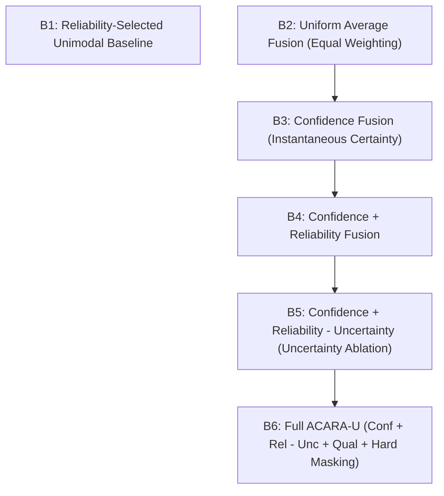
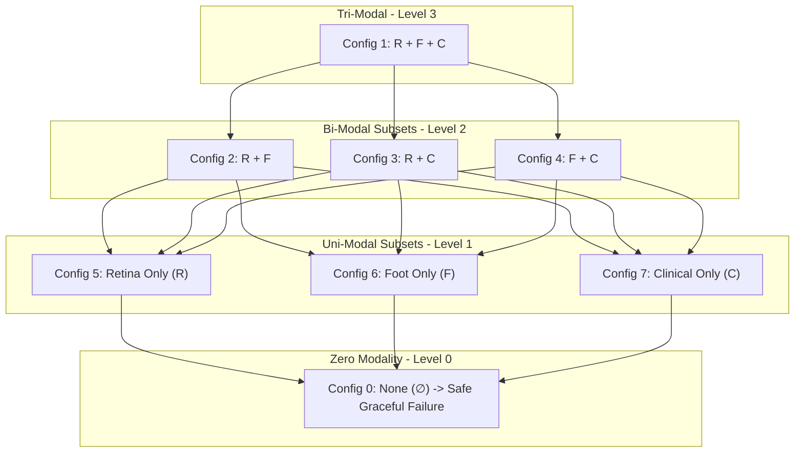

# Phase C11.0 — Experimental Ladder, Baselines, & Modality Configurations (Final Freeze v1.1a)

## 1. The Fusion Experimental Ladder

To ensure rigorous scientific attribution and prevent confirmation bias, ACARA-U is evaluated against an explicit **ablation ladder** rather than solely against naive averaging:

---

## 2. Formal Baseline Definitions (B1–B6)

| ID | Method Name | Scoring Function / Weighting Rule ($z_i$) | Aggregation Formulation | Scientific Hypothesis Tested |
| :--- | :--- | :--- | :--- | :--- |
| **B1** | **Reliability-Selected Unimodal Baseline** | Selection rule: $i^* = \arg\max_{i \in \mathcal{A}} R_i$ where $R_i = \frac{1}{2}(\text{AUC}_i + (1 - \text{ECE}_i))$ | $\hat{y} = r_{i^*}$ | Tests whether multimodal fusion outperforms simply picking the most reliable available individual modality based on validation priors. |
| **B2** | **Uniform Average Fusion** | Uniform weights: $w_i = \frac{1}{|\mathcal{A}|}$ for all $i \in \mathcal{A}$ | $\hat{y} = \frac{1}{|\mathcal{A}|} \sum_{i \in \mathcal{A}} r_i$ | Standard non-adaptive baseline. Assumes all available modalities carry identical predictive fidelity. |
| **B3** | **Confidence Fusion** | $z_i = \alpha C_i$ | $w_i = \text{Softmax}(z_i)$; $\hat{y} = \sum w_i r_i$ | Tests whether instantaneous sample-level confidence improves over uniform equal weighting. |
| **B4** | **Confidence + Reliability** | $z_i = \alpha C_i + \beta R_i$ | $w_i = \text{Softmax}(z_i)$; $\hat{y} = \sum w_i r_i$ | Tests whether anchoring instantaneous confidence with historical empirical reliability ($R_i$) stabilizes routing. |
| **B5** | **Confidence + Rel + Uncertainty** | $z_i = \alpha C_i + \beta R_i - \gamma U_i$ | $w_i = \text{Softmax}(z_i)$; $\hat{y} = \sum w_i r_i$ | **Critical Uncertainty Ablation**: Tests whether actively penalizing modalities with high predictive uncertainty improves robustness. |
| **B6** | **Full ACARA-U** | $z_i = \alpha C_i + \beta R_i - \gamma U_i + \eta Q_i$ with $A_i = 0 \implies \tilde{z}_i = -\infty$ | $w_i = \text{Softmax}(\tilde{z}_i)$; $R_{\text{fusion}} = \sum w_i r_i$; $DCRI = R_{\text{fusion}} - \delta \sum U_i$ | Evaluates the full architecture including input quality bonus and $DCRI$ uncertainty discount. |

> [!IMPORTANT]
> **Protocol Mandate on Uncertainty Attribution**:
> If Baseline B5 does not statistically outperform B4, or if B6 does not outperform B5 under standard validation, the study protocol explicitly prohibits retroactive tuning of parameters. The null contribution of uncertainty will be reported as an empirical finding.

---

## 3. Seven Operational Modality Configurations

The fusion engine is benchmarked across all $2^M - 1 = 7$ non-empty modality subsets:

### Configuration Definitions:
1. **Config 1: $\{R, F, C\}$ (Full Tri-modal)** — Complete examination: Fundus + Foot Ulcer + EHR data.
2. **Config 2: $\{R, F\}$ (Imaging Only)** — Remote telemedicine / photo screening without structured EHR access.
3. **Config 3: $\{R, C\}$ (Retina + Clinical)** — Outpatient endocrinology encounter without active diabetic foot ulceration.
4. **Config 4: $\{F, C\}$ (Foot + Clinical)** — Podiatry wound care center lacking specialized retinal fundus cameras.
5. **Config 5: $\{R\}$ (Retina Unimodal)** — Mobile eye screening clinic.
6. **Config 6: $\{F\}$ (Foot Unimodal)** — Mobile wound photography point-of-care.
7. **Config 7: $\{C\}$ (Clinical Unimodal)** — Primary care EHR database screening without imaging.

---

## 4. The Zero-Modality Edge Case: Graceful Failure

When all modalities are unavailable ($\sum_{i=1}^M A_i = 0$, Config 0: $\{\emptyset\}$):
- The router **must not** synthesize a risk score or $DCRI$ value.
- The router outputs a structured `NO_MODALITY_AVAILABLE` response.
- Status is classified as **Graceful Failure / Safe Rejection**.
- The case is flagged for clinical escalation, not assigned a default risk number.
