# Phase C11.0 — Master Research Protocol Freeze: ACARA-U Multimodal Decision Fusion (Final Freeze v1.1a)

## 1. Executive Summary & Protocol Identification

| Metadata Attribute | Specification |
| :--- | :--- |
| **Phase ID** | **C11.0 — Research Protocol Freeze (Final Freeze v1.1a)** |
| **Framework** | FusionMedAI Multimodal Fusion Engine |
| **Architecture** | **ACARA-U v2** (*Adaptive Calibrated Architecture for Risk Assessment under Uncertainty*) |
| **Input Modalities** | Retina (APTOS-2019 / EfficientNet-B3), Foot (ADPM / EfficientNet-B3), Clinical (UCI 130-US / CatBoost) |
| **Downstream Aggregations** | Routing Weights $w_i$, Fused Risk $R_{\text{fusion}} \in [0, 1]$, Derived Clinical Risk Index $DCRI \in [-\delta M, 1]$ |
| **Methodological Boundary** | Decision-level multimodal risk aggregation & robustness benchmarking under dataset disjointness |
| **Protocol Status** | **FROZEN & IMMUTABLE (Final Freeze v1.1a)** prior to fusion execution |

---

## 2. Phase Execution Order (C11 Roadmap)

The fusion pipeline and experimental validation strictly adhere to the following 19-phase sequence:

```mermaid
flowchart TD
    C11_0["C11.0 Research Protocol Freeze (Final Freeze v1.1a)"] --> C11_1["C11.1 Unified Modality Output Contract"]
    C11_1 --> C11_2["C11.2 Unified Input / Quality Layer"]
    C11_2 --> C11_3["C11.3 Global Reliability (R_i = 0.5·(AUC_i + 1 - ECE_i))"]
    C11_3 --> C11_4["C11.4 ACARA-U v2 Router"]
    C11_4 --> C11_5["C11.5 Fusion Baselines (B1-B6)"]
    C11_5 --> C11_6["C11.6 DCRI Aggregation"]
    C11_6 --> C11_7["C11.7 Conflict / Consensus Analysis"]
    C11_7 --> C11_8["C11.8 Missing-Modality Experiments (7 Configs)"]
    C11_8 --> C11_9["C11.9 Modality Degradation Stress Testing"]
    C11_9 --> C11_10["C11.10 Controlled Conflict Inoculation"]
    C11_10 --> C11_11["C11.11 Calibration & Behavioral Preservation"]
    C11_11 --> C11_12["C11.12 Delta Selection Protocol (DCRI)"]
    C11_12 --> C11_13["C11.13 Systematic Ablations"]
    C11_13 --> C11_14["C11.14 Router Sanity Verification"]
    C11_14 --> C11_15["C11.15 Main Benchmark Evaluation"]
    C11_15 --> C11_16["C11.16 Statistical Significance Testing"]
    C11_17["C11.17 Qualitative & Failure Analysis"]
    C11_16 --> C11_17
    C11_17 --> C11_18["C11.18 Final C11 Comprehensive Report"]
```

---

## 3. Core Protocol Decrees & Final Freeze Highlights

### 3.1 Input Contract Invariance & Disambiguation
All three modalities emit identical 8-tuple contracts:
$$\langle \text{risk},\; \text{calibrated}\_\text{probability},\; \text{confidence},\; \text{uncertainty},\; \text{quality},\; \text{availability},\; \text{reliability},\; \text{model}\_\text{version} \rangle$$
- `calibrated_probability` represents the full class posterior distribution vector.
- `risk` represents the documented scalar risk projection $r_i \in [0, 1]$.
- `reliability` ($R_i$) is frozen as $R_i = \frac{1}{2}(\text{AUC}_i + (1 - \text{ECE}_i))$.

### 3.2 Real Frozen Architectures Reflected
The contracts consume outputs from the actual frozen modules:
- **Retina**: EfficientNet-B3 + Temperature Scaling + MC Dropout ($N=25$).
- **Foot**: EfficientNet-B3 + Vector Scaling (`FootVectorScaler`) + MC Dropout ($N=10$, Option B).
- **Clinical**: CatBoost HPO ($D=119$) + Isotonic Calibration + Bootstrap Ensemble ($B=20$).

### 3.3 Separation of Risk Aggregation ($R_{\text{fusion}}$) and Decision Index ($DCRI$)
- $R_{\text{fusion}} = \sum w_i r_i \in [0, 1]$ is a mathematically bounded risk scalar across heterogeneous modality projections.
- $DCRI = R_{\text{fusion}} - \delta \sum U_i \in [-\delta M, 1]$ is a derived conservative decision/triage index.
- Probabilistic evaluation on $R_{\text{fusion}}$ is permitted only when evaluated against an explicitly constructed, labeled synthetic benchmark target.

### 3.4 Pure Behavioral Validation Tuning (No Synthetic Target Tuning)
Hyperparameters $\Theta^* = \{\alpha^*, \beta^*, \gamma^*, \eta^*\}$ are tuned strictly on behavioral response criteria ($\mathcal{L}_{\text{degrade}}$, $\text{Var}(w \mid \text{Noise})$, monotonicity). Synthetic targets are reserved for optional descriptive benchmarking and are never used to optimize parameters.

### 3.5 Disjoint Dataset Grounding & Two-Tier Evaluation
The protocol acknowledges $\text{APTOS} \ne \text{ADPM} \ne \text{UCI Clinical}$ cohort disjointness:
- **Tier 1 (Modality Ground-Truth Tasks)**: Evaluates unimodal backbones against actual ground truths.
- **Tier 2 (Fusion Behavioral & Robustness)**: Evaluates routing dynamics, missing-modality adaptability across 7 configurations, intersensor conflict detection $\Delta_{\text{conflict}}$, and degradation suppression. Prohibits treating multi-agent voting or composite labels as clinical ground truth.

### 3.6 B1 Baseline Designation
Baseline B1 is formally defined as the **Reliability-Selected Unimodal Baseline** ($i^* = \arg\max_{i \in \mathcal{A}} R_i$), grounded on historical validation reliability priors.

---

## 4. Document Index in Volume_01_Research_Protocol

| Document | Focus Area | Key Formalizations (Final Freeze) |
| :--- | :--- | :--- |
| [`01_Protocol_Overview.md`](./01_Protocol_Overview.md) | Scope & Governance | Actual frozen backbones, 19-phase sequence, Two-Tier evaluation governance |
| [`02_Mathematical_Formulation.md`](./02_Mathematical_Formulation.md) | Router & Metric Mathematics | Hard masking ($A_i=0 \implies w_i=0$), normalized $U_i$ and $C_i$, $R_{\text{fusion}}$ vs $DCRI$ |
| [`03_Input_Output_Contracts.md`](./03_Input_Output_Contracts.md) | Contract Specifications | `calibrated_probability` vs scalar `risk`, $R_i = \frac{1}{2}(\text{AUC}_i + 1 - \text{ECE}_i)$ |
| [`04_Experimental_Ladder_Baselines.md`](./04_Experimental_Ladder_Baselines.md) | Baselines & Modality Configurations | B1-B6 ladder, reliability-selected unimodal B1, 7 operational subsets |
| [`05_Methodological_Boundaries.md`](./05_Methodological_Boundaries.md) | Ground Truth & Disjointness | Two-tier evaluation, prohibition of composite patient ground truth & voting ground truth |
| [`06_Split_Hygiene_and_Tuning.md`](./06_Split_Hygiene_and_Tuning.md) | Hyperparameter Hygiene | Pure behavioral validation tuning ($\mathcal{L}_{\text{degrade}}$, volatility, monotonicity), zero synthetic target tuning |
