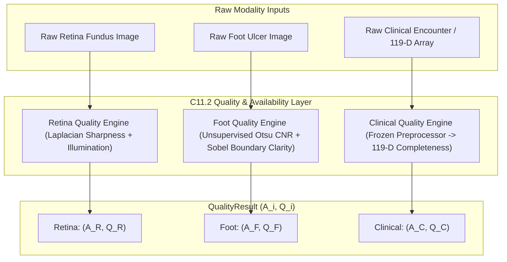

# Phase C11.2 — Unified Input Quality & Availability Layer (Research Protocol)

## 1. Executive Summary & Objective

The objective of **Phase C11.2** is to implement and freeze a deterministic, leakage-free input quality and availability estimation layer across all three clinical modalities (Retina, Foot, Clinical):

$$(A_i, Q_i)$$

Where:
- **$A_i \in \{0, 1\}$ (Availability)**: Binary indicator representing whether valid, decodable, and schema-compliant input data exists for modality $i$.
- **$Q_i \in [0.0, 1.0]$ (Input Signal Quality)**: Continuous scalar quantifying the objective physical/structural fidelity of the input signal, completely independent of model predictions or ground-truth disease labels.

---

## 2. Strict Invariants & Architectural Boundaries

1. **Input Property Exclusivity**: Quality $Q_i$ measures the fidelity of the raw input. It does **not** measure model accuracy, confidence, entropy, or prediction correctness.
2. **Zero Downstream Leakage**: The quality layer does **not** consume model predictions, model confidence $C_i$, predictive uncertainty $U_i$, prior reliability $R_i$, or ground-truth diagnosis labels.
3. **Hard Availability Invariant**:
   $$A_i = 0 \implies Q_i = 0.0$$
4. **Bounded Range**:
   $$A_i = 1 \implies 0.0 \le Q_i \le 1.0$$
5. **Frozen Normalization**: All normalization bounds are strictly computed on the training partition and frozen as immutable constants. Zero test-set min/max scaling.

---

## 3. Modality Quality Formulations

### 3.1 Retina Fundus Image Quality ($Q_R$)
Aggregates high-frequency spatial sharpness and illumination adequacy:
$$Q_R = \frac{Q_{\text{sharp}} + Q_{\text{illum}}}{2} \in [0.0, 1.0]$$

- **Sharpness ($Q_{\text{sharp}}$)**:
  $$S_{\text{raw}} = \text{Var}(\nabla^2 I_{\text{gray}})$$
  $$Q_{\text{sharp}} = \text{clip}\left(\frac{S_{\text{raw}} - S_{\text{low}}}{S_{\text{high}} - S_{\text{low}}}, 0.0, 1.0\right)$$
  Frozen training bounds: $S_{\text{low}} = 4.0$, $S_{\text{high}} = 55.0$.

- **Illumination Adequacy ($Q_{\text{illum}}$)**:
  Mean intensity $\mu_I$ and dynamic range $\sigma_I$:
  $$Q_{\text{mean}} = \begin{cases}
  \text{clip}\left(\frac{\mu_I - 10.0}{35.0 - 10.0}, 0.0, 1.0\right) & \text{if } \mu_I < 35.0 \\
  1.0 & \text{if } 35.0 \le \mu_I \le 95.0 \\
  \text{clip}\left(\frac{140.0 - \mu_I}{140.0 - 95.0}, 0.0, 1.0\right) & \text{if } \mu_I > 95.0
  \end{cases}$$
  $$Q_{\text{contrast}} = \text{clip}\left(\frac{\sigma_I}{20.0}, 0.0, 1.0\right)$$
  $$Q_{\text{illum}} = Q_{\text{mean}} \cdot Q_{\text{contrast}}$$

### 3.2 Diabetic Foot Ulcer Image Quality ($Q_F$)
Aggregates unsupervised tissue contrast-to-noise ratio and boundary edge clarity:
$$Q_F = \frac{Q_{\text{CNR}} + Q_{\text{boundary}}}{2} \in [0.0, 1.0]$$

- **Unsupervised Otsu CNR ($Q_{\text{CNR}}$)**:
  Partitions image into foreground and background via Otsu thresholding without ground-truth masks:
  $$\text{CNR}_{\text{raw}} = \frac{|\mu_{\text{fg}} - \mu_{\text{bg}}|}{\sigma_{\text{bg}} + \epsilon}$$
  $$Q_{\text{CNR}} = \text{clip}\left(\frac{\text{CNR}_{\text{raw}} - 1.8}{13.0 - 1.8}, 0.0, 1.0\right)$$

- **Boundary / Edge Clarity ($Q_{\text{boundary}}$)**:
  Sobel mean gradient magnitude:
  $$B_{\text{raw}} = \frac{1}{HW} \sum \sqrt{G_x^2 + G_y^2}$$
  $$Q_{\text{boundary}} = \text{clip}\left(\frac{B_{\text{raw}} - 15.0}{60.0 - 15.0}, 0.0, 1.0\right)$$

### 3.3 Clinical EHR Record Completeness ($Q_C$)
Measures non-missing feature completeness across the 119-dimensional frozen schema (raw encounters are mapped through the frozen `ClinicalPreprocessor` before completeness evaluation):
$$Q_C = \frac{N_{\text{valid}}}{119} \in [0.0, 1.0]$$

Where $N_{\text{valid}} = \sum_{j=1}^{119} \mathbb{I}(\text{feature}_j \text{ is finite and non-missing})$.

---

## 4. Availability & Failure Semantics

| Condition | Modality | $A_i$ | $Q_i$ | Diagnostic Note |
| :--- | :--- | :---: | :---: | :--- |
| File missing / non-existent | Retina / Foot | `False` | `0.0` | `INPUT_MISSING` |
| Image decode / corrupted bytes | Retina / Foot | `False` | `0.0` | `DECODE_FAILURE` |
| Zero / invalid spatial dimensions | Retina / Foot | `False` | `0.0` | `INVALID_DIMENSIONS` |
| Record missing / null object | Clinical | `False` | `0.0` | `RECORD_MISSING` |
| Schema mismatch / parse error | Clinical | `False` | `0.0` | `PREPROCESSING_FAILURE` |
| Valid input with noise/blur | Retina / Foot | `True` | $\in [0.0, 1.0]$ | Degraded signal preserved |
| Valid tabular with missing fields | Clinical | `True` | $\in (0.0, 1.0)$ | Partially complete record |
