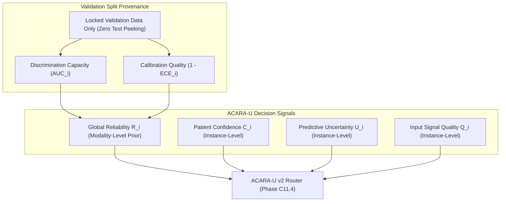

# 01 Reliability Protocol — Phase C11.3

## 1. Methodological Foundations

In the ACARA-U multimodal decision fusion architecture, routing weights $w_i$ are determined dynamically by a logit scoring kernel:

$$z_i = \alpha C_i + \beta R_i - \gamma U_i + \eta Q_i$$

Phase C11.3 isolates and freezes the global empirical reliability coefficient $R_i$. Unlike patient-level properties (confidence $C_i$, uncertainty $U_i$, quality $Q_i$), $R_i$ is a **static modality-level prior** reflecting the historical empirical track record of the frozen diagnostic pipeline.

---

## 2. Mathematical Definition

The global reliability coefficient is defined as:

$$R_i = \frac{1}{2} \cdot \left[ \text{AUC}_i + (1 - \text{ECE}_i) \right]$$

### Invariants:
1. **Bounded Domain**: $0.0 \le R_i \le 1.0$, assuming $\text{AUC}_i, \text{ECE}_i \in [0.0, 1.0]$.
2. **Equal Component Weighting**: 50% discrimination prior and 50% calibration fidelity prior.
3. **Validation-Only Provenance**: Determined exclusively on the locked validation partitions of Retina, Foot, and Clinical models. Zero test-set evaluation is permitted.
4. **Modality Invariance**: $R_i$ is a scalar constant per modality checkpoint; it does not vary across individual patient encounters.
5. **Decoupling**: $R_i$ is computed independently without multiplying by $Q_i$, $C_i$, or subtracting $U_i$.

---

## 3. Strict Prohibitions (Non-Negotiable Boundaries)

- ❌ **No Learned Neural Reliability Model**: No auxiliary neural networks are trained to predict reliability.
- ❌ **No Test-Set Feedback**: Test AUC or Test ECE are strictly prohibited from influencing $R_i$.
- ❌ **No ACARA-U Optimization Feedback**: $R_i$ is not tuned to maximize downstream multimodal fusion performance.
- ❌ **No Ad-Hoc Metric Substitutions**: Multi-class modalities must use Macro OvR AUC; calibration must use 10-bin equal-frequency ECE.
