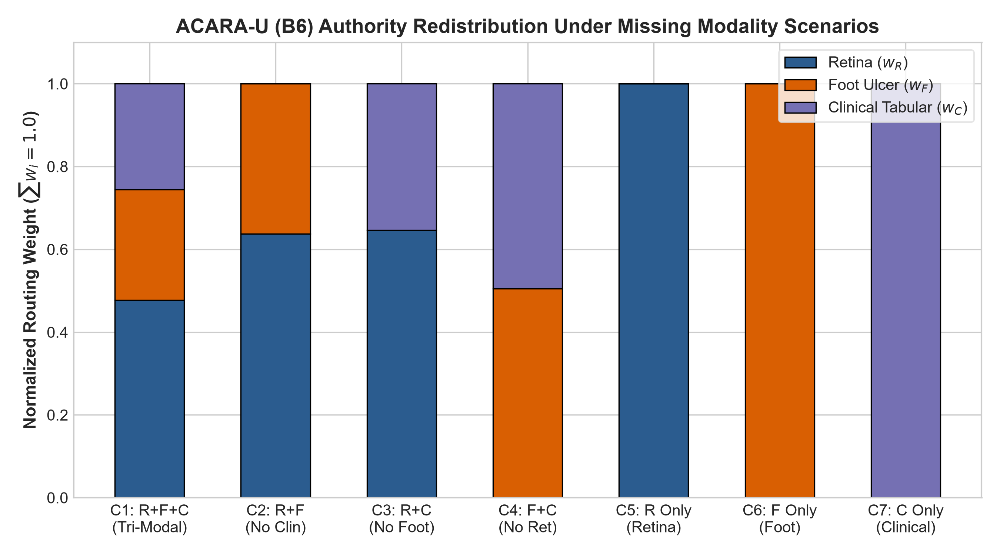

# Missing Modality Evaluation & Matrix Analysis

## Operational Availability Configurations (C1 to C7)

Phase C11.5 systematically verifies the behavior of all 6 baselines across all $2^3 - 1 = 7$ non-empty modality availability configurations:

| Config ID | Active Set $\mathcal{A}$ | Availability Vector $[A_R, A_F, A_C]$ | Description |
| :---: | :---: | :---: | :--- |
| **C1** | $\{R, F, C\}$ | $[1, 1, 1]$ | Full Tri-Modal Acquisition |
| **C2** | $\{R, F\}$ | $[1, 1, 0]$ | Bi-Modal Imaging (Clinical Missing) |
| **C3** | $\{R, C\}$ | $[1, 0, 1]$ | Retina + Clinical (Foot Missing) |
| **C4** | $\{F, C\}$ | $[0, 1, 1]$ | Foot + Clinical (Retina Missing) |
| **C5** | $\{R\}$ | $[1, 0, 0]$ | Retina Only |
| **C6** | $\{F\}$ | $[0, 1, 0]$ | Foot Only |
| **C7** | $\{C\}$ | $[0, 0, 1]$ | Clinical Only |

---

## 42-Cell Comparative Matrix Across Baselines

For each configuration and baseline, authority redistribution and aggregated risk were computed over the controlled cohort:

### 1. Unimodal Configurations (C5, C6, C7)
- Across **all baselines B1 through B6**, whenever only a single modality $m$ is available ($|\mathcal{A}| = 1$), the router assigns $w_m = 1.0$ and $w_j = 0.0 \; (\forall j \ne m)$.
- $R_{\text{fusion}} = r_m$ with zero entropy $H(w) = 0.0$.
- **Invariant**: All decision baselines collapse identically and consistently to unimodal prediction under single-modality availability.

### 2. Bi-Modal Imaging: Retina + Foot (C2)
- **B1 (Reliability)**: Allocates $100\%$ to Retina ($R_R = 0.930 > R_F = 0.922$).
- **B2 (Uniform)**: Static $50\% / 50\%$ split ($H(w) = \ln 2 \approx 0.6931$).
- **B6 (Full ACARA-U)**: Dynamic split (Mean $w_R = 0.6402, w_F = 0.3598, H(w) = 0.6385$), balancing image quality and MC Dropout dispersion.

### 3. Bi-Modal Imaging + Tabular: Foot + Clinical (C4)
- **B1 (Reliability)**: Allocates $100\%$ to Foot ($R_F = 0.922 > R_C = 0.825$).
- **B2 (Uniform)**: Static $50\% / 50\%$ split.
- **B6 (Full ACARA-U)**: Mean $w_F = 0.5133, w_C = 0.4867, H(w) = 0.6865$, reflecting high clinical completeness against foot ulcer image quality.

---

## Zero-Modality Safe Rejection (Config 0)

When $A_R = A_F = A_C = 0$, all 6 baselines emit:
- `status`: `"NO_MODALITY_AVAILABLE"`
- `weights`: `{"retina": 0.0, "foot": 0.0, "clinical": 0.0}`
- `r_fusion`: `0.0`
- `dominant_modality`: `None`
