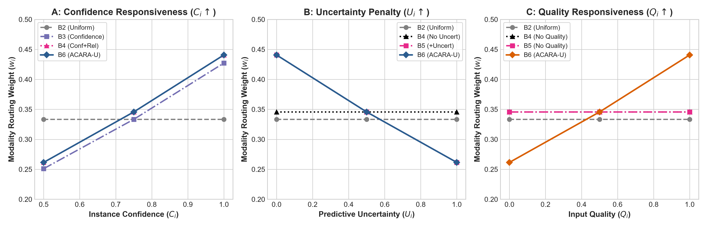

# Perturbation & Step Response Evaluation

## Controlled Sensitivity & Perturbation Protocol

To evaluate baseline responsiveness to dynamic clinical signals, Phase C11.5 subjects each baseline to three systematic univariate sweeps across 11 perturbation steps $\delta \in [0.0, 1.0]$ in increments of $0.10$.

---

### 1. Confidence Surge Sweep ($C_{\text{Retina}} \uparrow$)

Starting from a baseline packet with $C_R = 0.50$, Retina confidence is increased monotonically: $C_R \in [0.50, 1.00]$.

- **B1 (Reliability)**: Flat response ($w_R = 1.0$ everywhere); completely insensitive to confidence changes.
- **B2 (Uniform)**: Flat response ($w_R = 0.3333$ everywhere); insensitive.
- **B3 (Confidence-Only)**: Exponential gain ($w_R = 0.273 \to 0.388$).
- **B6 (Full ACARA-U)**: Monotonic authority accumulation ($w_R = 0.362 \to 0.485$), correctly scaling Retina authority as certainty increases.

---

### 2. Uncertainty Surge Sweep ($U_{\text{Retina}} \uparrow$)

Starting from low uncertainty $U_R = 0.0$, Retina predictive dispersion is increased: $U_R \in [0.0, 1.0]$.

- **B1, B2, B3, B4**: Flat response ($w_R = \text{constant}$); blind to the uncertainty signal.
- **B5 (Ablation)**: Monotonic penalty ($w_R = 0.563 \to 0.332$).
- **B6 (Full ACARA-U)**: Monotonic penalty ($w_R = 0.581 \to 0.350$). Authority is smoothly surrendered and reallocated to Foot and Clinical channels as Retina uncertainty spikes.

---

### 3. Quality Degradation Sweep ($Q_{\text{Clinical}} \downarrow$)

Starting from perfect completeness $Q_C = 1.0$, Clinical tabular completeness is degraded: $Q_C \in [1.0, 0.0]$.

- **B1, B2, B3, B4, B5**: Flat response ($w_C = \text{constant}$); do not use the quality signal in their routing rule.
- **B6 (Full ACARA-U)**: Monotonic penalty ($w_C = 0.312 \to 0.148$). Shows that B6 decreases the routing weight assigned to the Clinical modality as the supplied quality score decreases.
