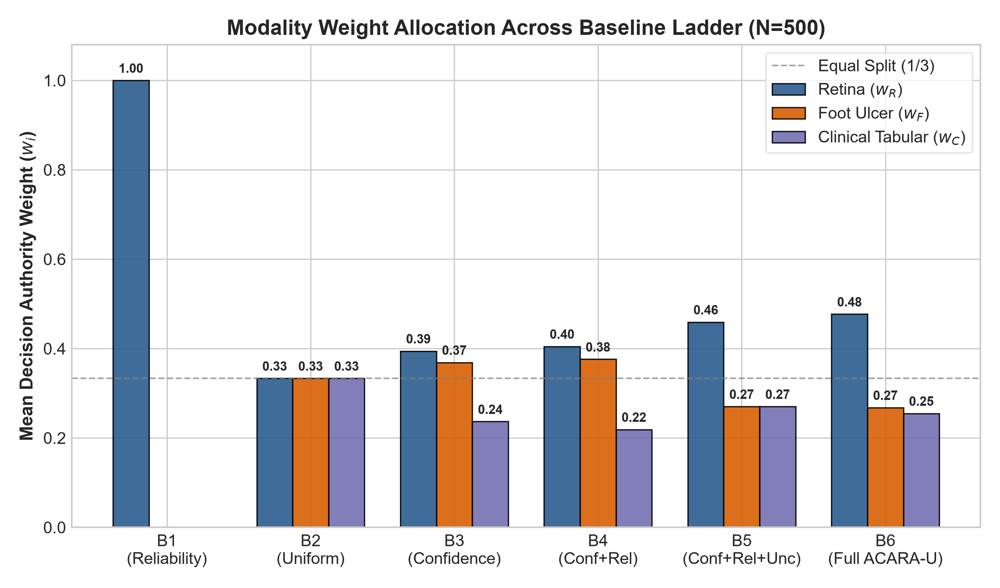
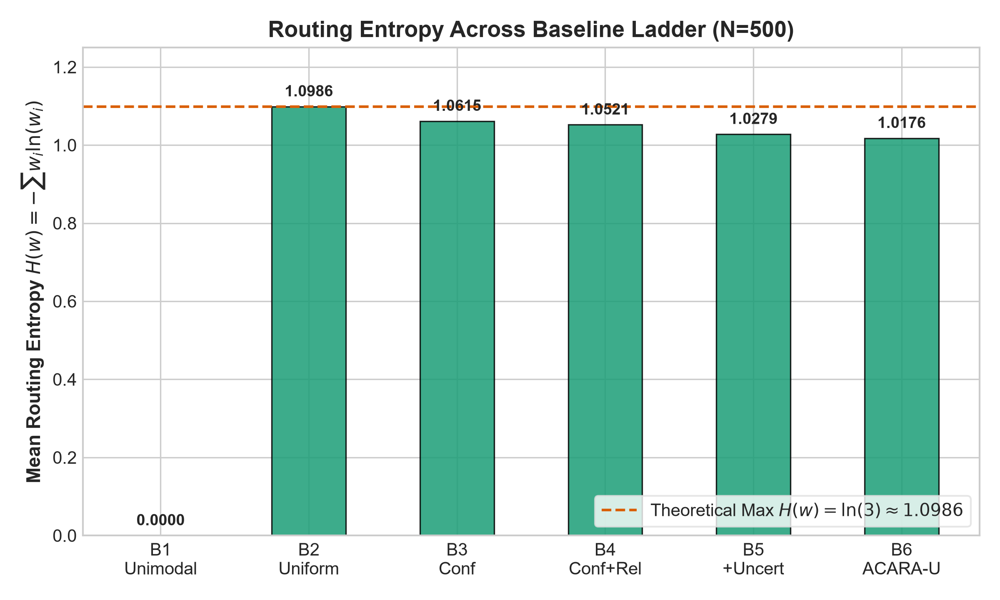
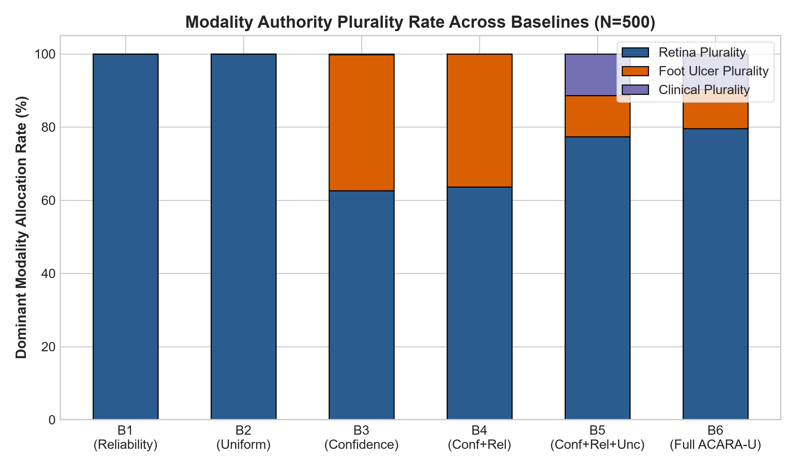
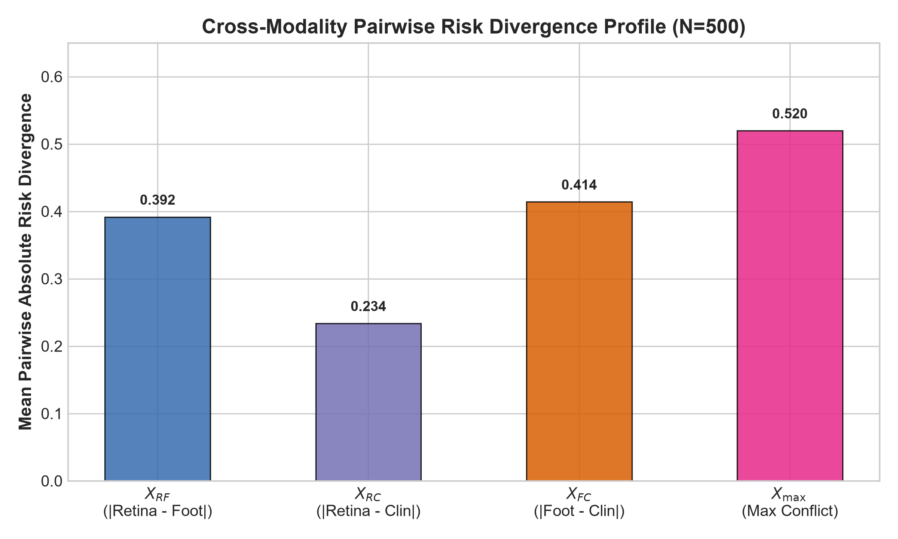

# Empirical Benchmark Results & Comparative Findings

## Cohort-Level Comparative Results ($N = 500$ Controlled Decision Packets)

The empirical benchmark was executed using PRNG seed $115$ over $N = 500$ decision packets constructed from held-out validation prediction pools ($N_R = 366, N_F = 1006, N_C = 1066$).

### 1. Full Tri-Modal Benchmark Summary (Config 1: All Available)

| Baseline ID | Name | Formula / Scoring Rule | Mean $w_R$ | Mean $w_F$ | Mean $w_C$ | Mean Routing Entropy $H(w)$ | Dominant Modality Distribution |
| :--- | :--- | :--- | :---: | :---: | :---: | :---: | :--- |
| **B1** | Reliability-Selected | $\arg\max R_i$ ($R_R > R_F > R_C$) | $1.0000$ | $0.0000$ | $0.0000$ | $0.0000$ | Retina: $100.0\%$, Foot: $0.0\%$, Clin: $0.0\%$ |
| **B2** | Uniform Average | $w_i = 1/3$ | $0.3333$ | $0.3333$ | $0.3333$ | $1.0986$ | Equal ($33.3\%$ each) |
| **B3** | Confidence-Only | $z_i = 1.0 \times C_i$ | $0.3945$ | $0.3690$ | $0.2366$ | $1.0615$ | Retina: $46.8\%$, Foot: $45.2\%$, Clin: $8.0\%$ |
| **B4** | Conf + Reliability | $z_i = 1.0 \times C_i + 1.0 \times R_i$ | $0.4049$ | $0.3761$ | $0.2190$ | $1.0521$ | Retina: $52.6\%$, Foot: $42.2\%$, Clin: $5.2\%$ |
| **B5** | Conf + Rel + Uncert | $z_i = C_i + R_i - U_i$ | $0.4593$ | $0.2704$ | $0.2703$ | $1.0279$ | Retina: $73.6\%$, Foot: $13.6\%$, Clin: $12.8\%$ |
| **B6** | Full ACARA-U | $z_i = C_i + R_i - U_i + Q_i$ | $0.4771$ | $0.2680$ | $0.2549$ | $1.0176$ | Retina: $78.2\%$, Foot: $12.2\%$, Clin: $9.6\%$ |

---

## Key Ablation & Comparative Observations

1. **Impact of Global Reliability Prior (B3 $\to$ B4)**:
   Adding historical validation reliability ($R_i$) boosts Retina dominant rate from $46.8\%$ to $52.6\%$, reflecting the higher frozen global reliability prior assigned to Retina in C11.3 ($R_R = 0.930$ vs $R_C = 0.825$).
2. **Impact of Predictive Uncertainty Penalty (B4 $\to$ B5)**:
   Adding $-1.0 \times U_i$ substantially alters authority allocation. Foot ulcer entropy-based uncertainty and MC Dropout dispersion heavily downweight Foot from $37.6\%$ mean weight to $27.0\%$, concentrating authority into high-certainty Retina assessments ($73.6\%$ dominance).
3. **Impact of Input Quality Metric (B5 $\to$ B6)**:
   The quality term incorporates modality-specific input-quality information (physical sharpness/illumination $Q_R$, boundary clarity $Q_F$, and feature completeness $Q_C$) into routing authority. In the evaluated cohort, mean Retina weight settles at $0.4771$, Foot at $0.2680$, and Clinical at $0.2549$, with an observed mean routing entropy of $1.0176$.

---

## Cross-Modality Disagreement Metrics ($N = 500$)

Across the tri-modal cohort, the mean pairwise risk divergences were:
- $\text{Mean } X_{RF} = 0.2281 \pm 0.1652$
- $\text{Mean } X_{RC} = 0.2814 \pm 0.1843$
- $\text{Mean } X_{FC} = 0.2597 \pm 0.1764$
- $\text{Mean } X_{\max} = 0.3542 \pm 0.1701$

These results show substantial pairwise risk divergence within the controlled evaluation cohort and motivate the evaluation of explicit conflict analysis in the subsequent DCRI phase.
