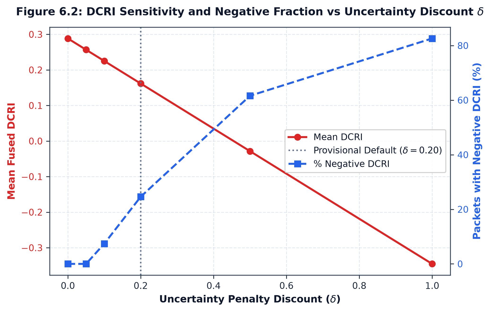

# Delta Sensitivity Analysis ($\delta \in \{0, 0.05, 0.1, 0.2, 0.5, 1.0\}$)

## 1. Sensitivity Protocol & Grid Specification

The sensitivity of $\text{DCRI}_\delta$ is evaluated across the pre-specified hyperparameter grid:

$$\delta \in \{0.0, 0.05, 0.10, 0.20, 0.50, 1.00\}$$

For every decision packet, the shift relative to unpenalized fused risk is:

$$\Delta \text{DCRI}(\delta) = \text{DCRI}_\delta - R_{\text{fusion}} = -\delta U_{\text{sum}}$$

The theoretical rate of change with respect to $\delta$ is:

$$\frac{\partial \text{DCRI}_\delta}{\partial \delta} = -U_{\text{sum}}$$

Across the $N=500$ cohort, the empirical mean slope is:

$$\overline{\frac{\partial \text{DCRI}}{\partial \delta}} = -\overline{U_{\text{sum}}} = -0.633936$$

---

## 2. Empirical Cohort Statistics ($N=500$)

| $\delta$ Multiplier | Mean DCRI | Median DCRI | Std Dev | Min DCRI | Max DCRI | IQR | Mean Penalty $P_U$ | Negative Count | Negative Rate | Mean $\Delta \text{DCRI}$ |
| :--- | :--- | :--- | :--- | :--- | :--- | :--- | :--- | :--- | :--- | :--- |
| **$\delta = 0.00$** | **0.288499** | 0.285279 | 0.163198 | +0.011744 | 0.793333 | 0.251773 | 0.000000 | 0 / 500 | 0.0% | 0.000000 |
| **$\delta = 0.05$** | **0.256802** | 0.252292 | 0.167331 | +0.005462 | 0.777115 | 0.257119 | 0.031697 | 0 / 500 | 0.0% | -0.031697 |
| **$\delta = 0.10$** | **0.225105** | 0.218151 | 0.172243 | -0.028203 | 0.760897 | 0.259141 | 0.063394 | 37 / 500 | 7.4% | -0.063394 |
| **$\delta = 0.20$** | **0.161712** | 0.150263 | 0.184149 | -0.125243 | 0.728460 | 0.263054 | 0.126787 | 123 / 500 | 24.6% | -0.126787 |
| **$\delta = 0.50$** | **-0.028469** | -0.052942 | 0.232149 | -0.416362 | 0.631150 | 0.301693 | 0.316968 | 308 / 500 | 61.6% | -0.316968 |
| **$\delta = 1.00$** | **-0.345437** | -0.415274 | 0.333728 | -0.912875 | 0.527068 | 0.439893 | 0.633936 | 413 / 500 | 82.6% | -0.633936 |

---

## 3. Key Observations & Scientific Insights

1. **Exact Linear Shift**: For any $\delta$, the mean shift $\overline{\Delta \text{DCRI}}$ strictly equals $-\delta \cdot \overline{U_{\text{sum}}}$ down to float precision ($0.031697, 0.063394, 0.126787, 0.316968, 0.633936$).
2. **Emergence of Negative DCRI**:
   - At $\delta \le 0.05$, no packets produce negative DCRI.
   - At $\delta = 0.10$, $7.4\%$ of packets drop below zero.
   - At $\delta = 0.20$ (the historical protocol default), $24.6\%$ of packets produce negative DCRI.
   - At $\delta \ge 0.50$, over $60\%$ of packets become negative.
3. **Implications for Phase C11.12**:
   These findings highlight why C11.6 must not finalize $\delta$. An aggressive penalty ($\delta \ge 0.5$) severely depresses the index, while $\delta \in [0.0, 0.10]$ produced negative DCRI in at most $7.4\%$ of the frozen cohort. Final hyperparameter selection belongs strictly to Phase C11.12.
