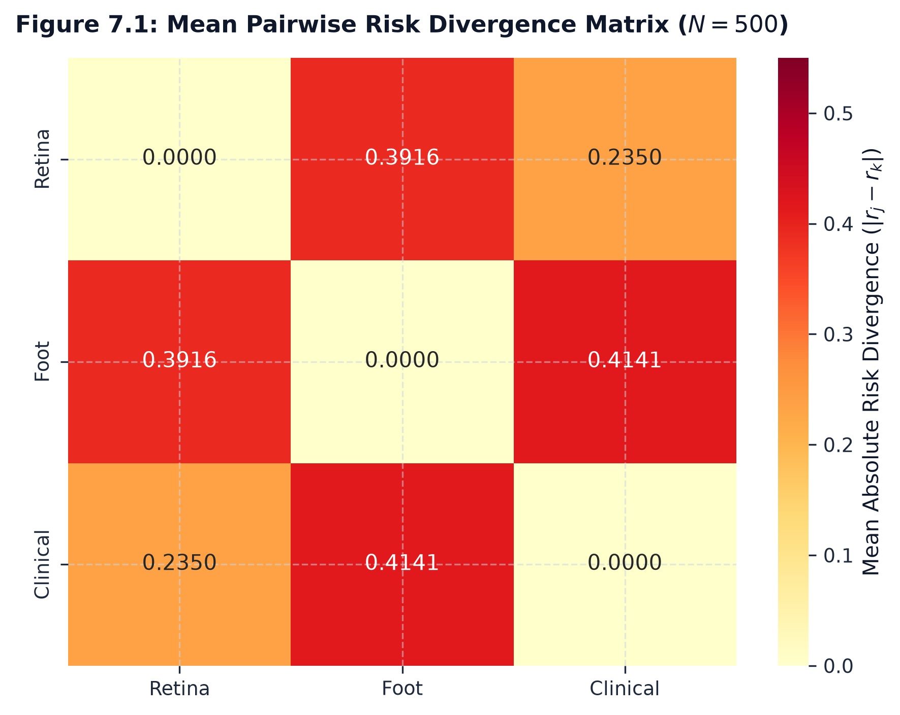

# Pairwise Disagreement Analysis

## 1. Empirical Pairwise Disagreement Statistics ($N=500$)

Across the frozen $N=500$ controlled decision cohort ($\text{seed}=115$), pairwise divergence was evaluated for the three active channels:

| Modality Pair | Mean $X_{jk}$ | Median $X_{jk}$ | Std Dev | Min $X_{jk}$ | Max $X_{jk}$ | P25 | P75 | IQR | Dominant Rate |
| :--- | :---: | :---: | :---: | :---: | :---: | :---: | :---: | :---: | :---: |
| **Retina ↔ Foot ($X_{RF}$)** | **0.391578** | 0.337713 | 0.274178 | 0.000457 | 0.991898 | 0.163208 | 0.581087 | 0.417879 | **47.4%** (237/500) |
| **Foot ↔ Clinical ($X_{FC}$)** | **0.414113** | 0.361991 | 0.262967 | 0.000308 | 0.953582 | 0.202524 | 0.601241 | 0.398717 | **27.0%** (135/500) |
| **Retina ↔ Clinical ($X_{RC}$)** | **0.234970** | 0.163158 | 0.197996 | 0.000220 | 0.893845 | 0.077033 | 0.378971 | 0.301938 | **25.6%** (128/500) |

---

## 2. Key Pairwise Dynamics

1. **Foot Modality Divergence**: Pairs involving the Foot Ulcer modality ($X_{RF} = 0.3916$ and $X_{FC} = 0.4141$) exhibit the highest disagreement. This reflects the higher projected risk distribution in the ADPM cohort ($\overline{r_F} = 0.5372$).
2. **Retina-Clinical Consensus**: The Retina and Clinical channels exhibit the closest alignment ($\overline{X_{RC}} = 0.2350$), driven by lower average baseline risk in both modalities ($\overline{r_R} = 0.2550, \overline{r_C} = 0.0903$).
3. **Dominant Conflicting Pair**: In $47.4\%$ of packets, the Retina ↔ Foot channel pair determines the maximum conflict magnitude $\Delta_{\max}$.
