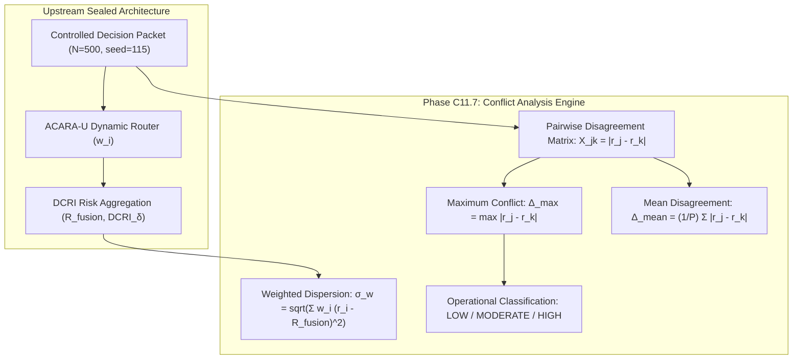

# Volume 07: Cross-Modality Conflict & Discordance Analysis

> **Multimodal Decision Fusion Series — Phase C11.7**  
> **Status**: VERIFIED & SEALED  
> **Verification Gates**: 20 / 20 PASSED  
> **Unit Tests**: 148 / 148 PASSED  
> **Cohort Provenance**: Frozen $N=500$ Controlled Decision Packets ($\text{seed}=115$)

---

## Executive Abstract

Phase C11.7 introduces a dedicated decision-level cross-modality conflict analysis layer for the FusionMedAI framework. When independent prediction channels (Retinal imaging, Diabetic Foot Ulcer grading, and Tabular EHR readmission risk) project differing risk estimates, the conflict engine detects, quantifies, and attributes discordance without modifying upstream ACARA-U routing weights or uncertainty-discounted DCRI values.

---

## Methodological Boundaries & Declarations

1. **Controlled Decision-Level Scope**: Input modalities originate from independent retrospective cohorts (APTOS 2019, ADPM V3.3, UCI Diabetes). Evaluations assess decision-level consistency across standardized contracts, not biological joint pathology.
2. **Zero Modification Invariant**: Conflict metrics are purely diagnostic. Router authority weights ($w_i$), fused risk ($R_{\text{fusion}}$), and uncertainty-discounted index ($\text{DCRI}_\delta$) are strictly immutable.
3. **No Optimization Away**: The system does not tune router weights or risk thresholds to artificially minimize conflict metrics.
4. **Operational Conflict Alerting**: Classification bands ($\Delta_{\max} < 0.20$, $[0.20, 0.35)$, $\ge 0.35$) are pre-specified operational guidelines, not validated clinical boundaries.
5. **Deterministic Explainability**: Structured diagnostics are generated by pure rule-based algorithms with zero natural-language LLMs in the scientific loop.

---

## Volume Organization

| Document | Title | Scope & Scientific Focus |
| :--- | :--- | :--- |
| [01_Conflict_Protocol.md](01_Conflict_Protocol.md) | Research Protocol & Registered Questions | Formalization of 7 pre-registered research questions and experimental boundaries. |
| [02_Mathematical_Formulation.md](02_Mathematical_Formulation.md) | Mathematical Formulation | Definitions of pairwise divergence, max/mean metrics, and weighted consensus dispersion. |
| [03_Pairwise_Conflict.md](03_Pairwise_Conflict.md) | Pairwise Disagreement Analysis | In-depth breakdown across Retina-Foot, Retina-Clinical, and Foot-Clinical pairs. |
| [04_Weighted_Conflict.md](04_Weighted_Conflict.md) | Weighted Dispersion Dynamics | Analysis of $V_w$, $\sigma_w$, and entropy $H(w)$ around ACARA-U consensus. |
| [05_Uncertainty_Conflict_Analysis.md](05_Uncertainty_Conflict_Analysis.md) | Uncertainty $\times$ Conflict Analysis | Decoupling risk disagreement ($\Delta_{\max}$) from predictive uncertainty ($U_{\text{sum}}$). |
| [06_Reliability_Conflict_Analysis.md](06_Reliability_Conflict_Analysis.md) | Reliability Prior Alignment | Behavioral evaluation of router authority bias toward higher-reliability modalities. |
| [07_Perturbation_Evaluation.md](07_Perturbation_Evaluation.md) | Controlled Risk Perturbation | Monotonicity and sensitivity verification under outward and inward risk shifts. |
| [08_Missing_Modality_Evaluation.md](08_Missing_Modality_Evaluation.md) | Modality Availability Evaluation | Systematic evaluation across all 7 availability regimes and zero-modality handling. |
| [09_Results.md](09_Results.md) | Comprehensive Empirical Results | Primary findings, statistical distributions, and high-conflict cohort profiling ($N=500$). |
| [10_Freeze_Report.md](10_Freeze_Report.md) | Phase C11.7 Freeze Report | Certification of 20/20 verification gates and cryptographic SHA-256 artifact freeze. |

---

## Summary of Principal Empirical Findings

Across the frozen $N=500$ controlled decision cohort ($\text{seed}=115$):

- **Maximum Pairwise Disagreement ($\Delta_{\max}$)**: Mean $\Delta_{\max} = 0.520331 \pm 0.241978$ (Median: $0.475961$, Range: $[0.029269, 0.991898]$, IQR: $0.366567$).
- **Mean Pairwise Disagreement ($\Delta_{\text{mean}}$)**: Mean $\Delta_{\text{mean}} = 0.346887 \pm 0.161319$ (Median: $0.317307$).
- **Weighted Consensus Standard Deviation ($\sigma_w$)**: Mean $\sigma_w = 0.215019 \pm 0.108652$ (Median: $0.192409$).
- **Operational Severity Distribution**:
  - **LOW** ($\Delta_{\max} < 0.20$): $45\text{ packets}$ ($9.0\%$)
  - **MODERATE** ($0.20 \le \Delta_{\max} < 0.35$): $92\text{ packets}$ ($18.4\%$)
  - **HIGH** ($\Delta_{\max} \ge 0.35$): $363\text{ packets}$ ($72.6\%$)
- **Dominant Conflicting Pair**:
  - **Retina ↔ Foot**: $237\text{ packets}$ ($47.4\%$)
  - **Foot ↔ Clinical**: $135\text{ packets}$ ($27.0\%$)
  - **Retina ↔ Clinical**: $128\text{ packets}$ ($25.6\%$)
- **Authority Alignment**: Retina ($R_R=0.929956$) was allocated greater authority than Clinical ($R_C=0.825382$) in $98.0\%$ of cases and greater authority than Foot ($R_F=0.922266$) in $93.2\%$ of cases.
