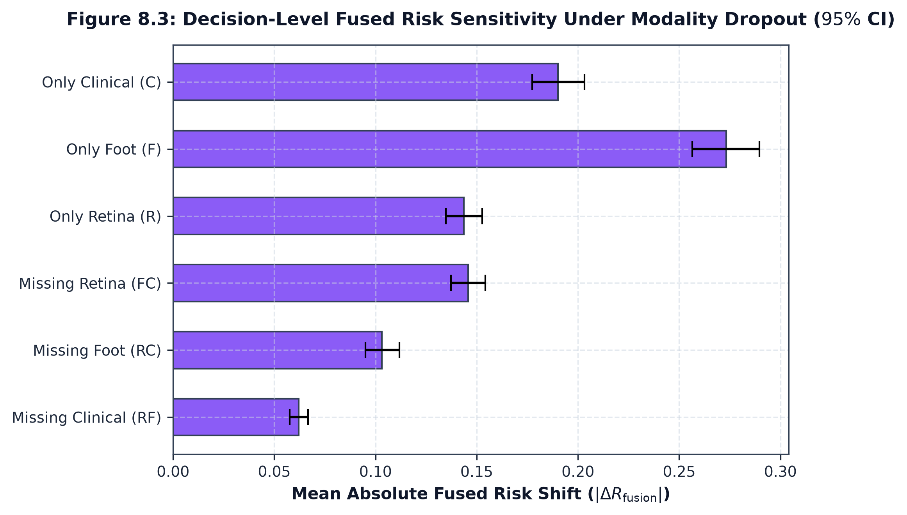

# Risk Continuity & DCRI Sensitivity Analysis

## 1. Risk Shift Distributions ($\Delta R_{\text{missing}}$)

Risk sensitivity measures the absolute shift in decision-level fused risk relative to the tri-modal baseline:

$$\Delta R_{\text{missing}} = |R_{\text{fusion}}^{\text{full}} - R_{\text{fusion}}^{\text{subset}}|$$

| Subset Regime | Mean $\Delta R$ | Median $\Delta R$ | Std Dev | P25 | P75 | P90 | Max | 95% Bootstrap CI |
| :--- | :---: | :---: | :---: | :---: | :---: | :---: | :---: | :---: |
| **`retina_foot` ($-C$)** | **0.062082** | 0.046397 | 0.052183 | 0.021028 | 0.089456 | 0.138240 | 0.312953 | $[0.057628, 0.066712]$ |
| **`retina_clinical` ($-F$)** | **0.103242** | 0.076063 | 0.094595 | 0.033481 | 0.144701 | 0.237077 | 0.514782 | $[0.095084, 0.111734]$ |
| **`foot_clinical` ($-R$)** | **0.145687** | 0.125667 | 0.097022 | 0.066068 | 0.207901 | 0.286208 | 0.505470 | $[0.137358, 0.154205]$ |
| **`retina_only`** | **0.143678** | 0.116641 | 0.103131 | 0.062137 | 0.198305 | 0.297441 | 0.538296 | $[0.134748, 0.152763]$ |
| **`clinical_only`** | **0.190204** | 0.163351 | 0.145892 | 0.076161 | 0.278546 | 0.404285 | 0.695729 | $[0.177456, 0.203266]$ |
| **`foot_only`** | **0.273207** | 0.252037 | 0.187802 | 0.122851 | 0.395759 | 0.540134 | 0.776632 | $[0.256539, 0.289686]$ |

---

## 2. DCRI Shift Distributions ($\Delta \text{DCRI}$)

Under evaluation point $\delta = 0.20$:

| Subset Regime | Mean $\Delta \text{DCRI}$ | Median $\Delta \text{DCRI}$ | Std Dev | P25 | P75 | P90 | Max | 95% Bootstrap CI |
| :--- | :---: | :---: | :---: | :---: | :---: | :---: | :---: | :---: |
| **`retina_foot` ($-C$)** | **0.067204** | 0.053127 | 0.054041 | 0.024982 | 0.096338 | 0.144414 | 0.320682 | $[0.062569, 0.072035]$ |
| **`retina_clinical` ($-F$)** | **0.123969** | 0.111867 | 0.079978 | 0.057393 | 0.180479 | 0.239385 | 0.420847 | $[0.116918, 0.130963]$ |
| **`foot_clinical` ($-R$)** | **0.145728** | 0.125695 | 0.097037 | 0.066042 | 0.207869 | 0.286348 | 0.505494 | $[0.137393, 0.154250]$ |
| **`clinical_only`** | **0.156985** | 0.147101 | 0.114751 | 0.063548 | 0.229415 | 0.315573 | 0.576686 | $[0.147017, 0.167319]$ |
| **`retina_only`** | **0.175524** | 0.158327 | 0.130283 | 0.071617 | 0.257008 | 0.364407 | 0.655848 | $[0.164078, 0.186962]$ |
| **`foot_only`** | **0.278383** | 0.264421 | 0.190184 | 0.127607 | 0.399997 | 0.551842 | 0.776680 | $[0.261442, 0.295094]$ |

---

## 3. Signed DCRI Decomposition ($\delta = 0.20$)

$$\Delta \text{DCRI}_{\text{signed}} = \Delta R_{\text{signed}} - \delta \Delta U_{\text{sum}}$$

| Subset Regime | Mean $\Delta R_{\text{signed}}$ | Mean $\Delta U_{\text{sum}}$ | Mean $\Delta P_U$ ($0.20 \Delta U_{\text{sum}}$) | Mean $\Delta \text{DCRI}_{\text{signed}}$ | Dominant Absolute Component of Signed Shift |
| :--- | :---: | :---: | :---: | :---: | :--- |
| **`retina_foot` ($-C$)** | $-0.057302$ | $+0.038643$ | $+0.007729$ | $-0.065030$ | Risk component ($88.1\%$ of absolute decomposition components) |
| **`retina_clinical` ($-F$)** | $+0.088768$ | $+0.593918$ | $+0.118784$ | $-0.030016$ | Uncertainty component ($57.2\%$ of absolute decomposition components) |
| **`foot_clinical` ($-R$)** | $-0.044153$ | $+0.001375$ | $+0.000275$ | $-0.044428$ | Risk component ($99.4\%$ of absolute decomposition components) |

---

## 4. Scientific Interpretation

1. **Hierarchy of Modality Impact**:
   - Losing Clinical causes the smallest risk shift ($\overline{\Delta R} = 0.062082$).
   - Losing Foot causes moderate risk shift ($\overline{\Delta R} = 0.103242$).
   - Losing Retina causes the largest risk shift ($\overline{\Delta R} = 0.145687$).
2. **Decomposition Divergence**: When Foot drops out, the shift in $\text{DCRI}$ is primarily driven by the **removal of Foot's large uncertainty burden** ($\overline{\Delta U_{\text{sum}}} = +0.593918 \implies \overline{\Delta P_U} = +0.118784$), whereas when Retina or Clinical drops out, the shift is driven almost entirely by authority reallocation.
