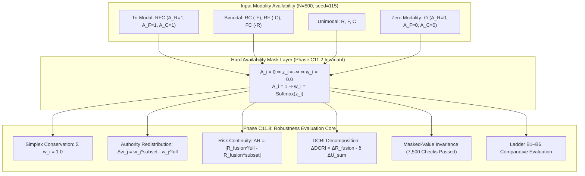

# Volume 08: Missing Modality Robustness Protocol

> **Multimodal Decision Fusion Series — Phase C11.8**  
> **Status**: VERIFIED & SEALED  
> **Verification Gates**: 20 / 20 PASSED  
> **Unit Tests**: 171 / 171 PASSED  
> **Cohort Provenance**: Frozen $N=500$ Controlled Decision Packets ($\text{seed}=115$)

---

## Executive Abstract

Phase C11.8 establishes the missing modality robustness protocol for the FusionMedAI multimodal decision fusion architecture. Operating across the frozen retrospective cohort ($N=500, \text{seed}=115$), this phase systematically investigates how the dynamic router (ACARA-U) and the decision-critical risk index ($\text{DCRI}_\delta$) respond when 1 or 2 modalities drop out across all $2^3 - 1 = 7$ non-empty availability subsets and the fail-closed zero-modality state ($\emptyset$). All analyses are decision-level evaluations using controlled packets constructed from independent modality cohorts; they do not represent patient-level multimodal validation.

---

## Methodological Boundaries & Declarations

1. **Controlled Decision-Level Scope**: Input predictions originate from independent retrospective cohorts (APTOS 2019, ADPM V3.3, UCI Diabetes). Evaluations assess decision-level availability robustness across standardized contracts, not patient-level joint biology. C11.8 evaluates robustness of the fusion mechanism to controlled availability changes; it does not establish that a missing modality causes a clinically meaningful deterioration in patient risk prediction.
2. **Missing $\ne$ Unreliable Distinction**: Modality unavailability ($A_i = 0 \implies w_i = 0.0$) is strictly distinguished from low quality or high predictive uncertainty ($A_i = 1, Q_i = 0.0$ or $U_i \approx 1.0$).
3. **Zero Parameter Tuning**: No routing coefficients ($\alpha, \beta, \gamma, \eta$), risk thresholds, or uncertainty discounts ($\delta=0.20$ evaluation point) are tuned or fitted during C11.8.
4. **No Feature Imputation / Reconstruction**: Missing channels are handled purely via dynamic authority reallocation at the decision output layer, avoiding generative feature hallucination.
5. **Fail-Closed Rejection**: When all channels are missing ($M=0$), the system strictly outputs `NO_MODALITY_AVAILABLE` with zeroed numerical indices.

---

## Volume Organization

| Document | Title | Scope & Scientific Focus |
| :--- | :--- | :--- |
| [01_Missingness_Protocol.md](01_Missingness_Protocol.md) | Research Protocol & Registered Questions | Formalization of 7 research questions, 3 hypotheses (H1, H2, H3), and boundaries. |
| [02_Mathematical_Formulation.md](02_Mathematical_Formulation.md) | Mathematical Formulation | Formal definitions of availability mask, redistribution, sensitivity, and DCRI decomposition. |
| [03_Availability_Regimes.md](03_Availability_Regimes.md) | Availability Regimes Evaluation | Exhaustive matrix across all 8 availability states ($N=500$). |
| [04_Authority_Redistribution.md](04_Authority_Redistribution.md) | Authority Redistribution Dynamics | Analysis of $\Delta w_j$, authority absorption rates, and entropy shifts. |
| [05_Risk_and_DCRI_Sensitivity.md](05_Risk_and_DCRI_Sensitivity.md) | Risk & DCRI Sensitivity Analysis | Distributional shifts ($\Delta R, \Delta \text{DCRI}$), 95% bootstrap CIs, and signed decomposition. |
| [06_Uncertainty_Missingness_Analysis.md](06_Uncertainty_Missingness_Analysis.md) | Uncertainty $\times$ Missingness Interaction | Stratified analysis comparing dropout of low-uncertainty vs high-uncertainty channels. |
| [07_Reliability_Missingness_Analysis.md](07_Reliability_Missingness_Analysis.md) | Reliability $\times$ Missingness Interaction | Behavioral impact of removing higher-reliability ($R_R=0.930$) vs lower-reliability channels. |
| [08_Stress_Testing.md](08_Stress_Testing.md) | Stress Testing & Masked Invariance | Targeted stress dropouts (argmax C, argmin U) and 7,500 masked-invariance proofs. |
| [09_Baseline_Comparative_Analysis.md](09_Baseline_Comparative_Analysis.md) | Baseline Comparative Evaluation | Comparative benchmarking of ACARA-U (B6) against Baselines B1–B5 across all dropouts. |
| [10_Results.md](10_Results.md) | Comprehensive Empirical Results | Primary findings, statistical tables, and formal hypothesis test certifications. |
| [11_Freeze_Report.md](11_Freeze_Report.md) | Phase C11.8 Freeze Report | Certification of 20/20 deep verification gates and SHA-256 cryptographic manifest. |

---

## Summary of Principal Empirical Findings

Across the frozen $N=500$ controlled decision cohort ($\text{seed}=115$):

- **Availability Safety & Invariance (Hypothesis H1 Confirmed / Verified)**: Exactly $0$ availability violations across all $4,000$ packet evaluations ($500 \times 8$ regimes). In $7,500 / 7,500$ corrupted input trials, mutating unavailable modality fields caused exactly $0.000000$ discrepancy in active authority weights, $R_{\text{fusion}}$, and $\text{DCRI}$.
- **Baseline Tri-Modal Authority**: Retina $w_R = 0.503350 \pm 0.071746$, Foot $w_F = 0.256884 \pm 0.052026$, Clinical $w_C = 0.239766 \pm 0.046182$.
- **Single-Modality Dropout Sensitivity ($\overline{\Delta R}$)**:
  - **Missing Clinical (RF)**: $\overline{\Delta R} = 0.062082$ ($95\%\text{ CI: } [0.057628, 0.066712]$)
  - **Missing Foot (RC)**: $\overline{\Delta R} = 0.103242$ ($95\%\text{ CI: } [0.095084, 0.111734]$)
  - **Missing Retina (FC)**: $\overline{\Delta R} = 0.145687$ ($95\%\text{ CI: } [0.137358, 0.154205]$)
- **Comparative Baseline Behavior (Hypothesis H2 Supported)**:
  - Baseline B1 exhibited substantially larger risk sensitivity when Retina was removed ($\overline{\Delta R} = 0.391578$), whereas ACARA-U produced $\overline{\Delta R} = 0.145687$ under the same controlled comparison, redistributing authority across the remaining available modalities while maintaining the active-weight simplex.
- **Uncertainty Stratification (Hypothesis H3 Supported)**:
  - Across modality-specific uncertainty strata, dropping a low-uncertainty channel produced larger observed mean risk shifts than dropping a high-uncertainty channel, with relative differences of approximately $19–33\%$ (Retina: $0.1584$ vs $0.1332$, Foot: $0.1189$ vs $0.0894$, Clinical: $0.0689$ vs $0.0543$). This is an observational association rather than a causal estimate.
