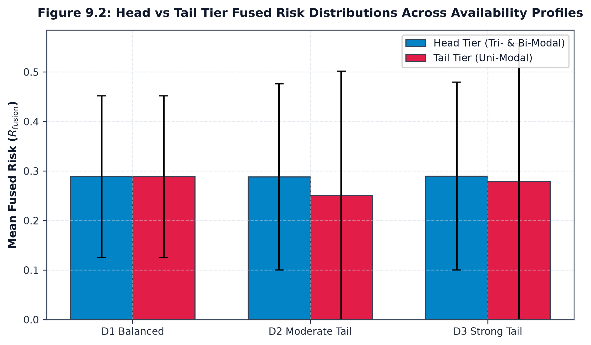

# Head-Middle-Tail Stratification & Classification

## 1. Rank-Based Canonical Tiering

To avoid arbitrary percentage thresholds that distort under varying distribution profiles, Phase C11.9 establishes a pre-specified **rank-based tiering rule**:

Combinations within a given distribution $D$ are sorted in descending order of frequency $N_c$. The 7 combinations are partitioned deterministically into three operational tiers:

- **HEAD (Ranks 1–2)**: The two highest-frequency combinations ($N_{\text{head}} = N_{(1)} + N_{(2)}$).
- **MIDDLE (Ranks 3–4)**: The next two combinations ($N_{\text{middle}} = N_{(3)} + N_{(4)}$).
- **TAIL (Ranks 5–7)**: The three lowest-frequency combinations ($N_{\text{tail}} = N_{(5)} + N_{(6)} + N_{(7)}$).

*Special Rule for Balanced Distribution (D1)*: Under D1 where all frequencies are effectively equal ($14.4\% \approx 14.2\%$), all 7 combinations are classified into `HEAD` ($N_{\text{head}} = 500, N_{\text{middle}} = 0, N_{\text{tail}} = 0$) to reflect absence of a long-tail skew.

---

## 2. Tier Composition Summary Across Distributions

| Distribution | HEAD Tier ($N$) | MIDDLE Tier ($N$) | TAIL Tier ($N$) | Head-to-Tail Ratio ($HTR$) |
| :--- | :--- | :--- | :--- | :---: |
| **D1 (Balanced)** | RFC (72), RF (72), RC (72), FC (71), R (71), F (71), C (71) $\to$ **500** | — (0) | — (0) | **N/A** (No tail) |
| **D2 (Moderate)** | RFC (175), RF (125) $\to$ **300 (60%)** | RC (75), FC (50) $\to$ **125 (25%)** | R (30), F (25), C (20) $\to$ **75 (15%)** | **4.00** |
| **D3 (Strong Tail)** | RFC (250), RF (125) $\to$ **375 (75%)** | RC (50), FC (40) $\to$ **90 (18%)** | R (20), F (10), C (5) $\to$ **35 (7%)** | **10.71** |

---

## 3. Head-to-Tail Ratio ($HTR$) Formalization

The Head-to-Tail Ratio is formalized as:

$$
HTR = \frac{N_{\text{head}}}{N_{\text{tail}}} = \frac{\sum_{c \in \text{HEAD}} N_c}{\sum_{c \in \text{TAIL}} N_c} \quad (\text{for } N_{\text{tail}} > 0)
$$

- For D1: $HTR = \text{N/A}$ (no tail combinations under a uniform distribution).
- For D2: $HTR = 300 / 75 = 4.00$ (moderate 4:1 dominance).
- For D3: $HTR = 375 / 35 = 10.71$ (severe 10.7:1 long-tail dominance).

This rank-based classification places the most frequent multi-modal combinations in the head and the least frequent unimodal combinations in the tail within the controlled decision-packet experiment.
