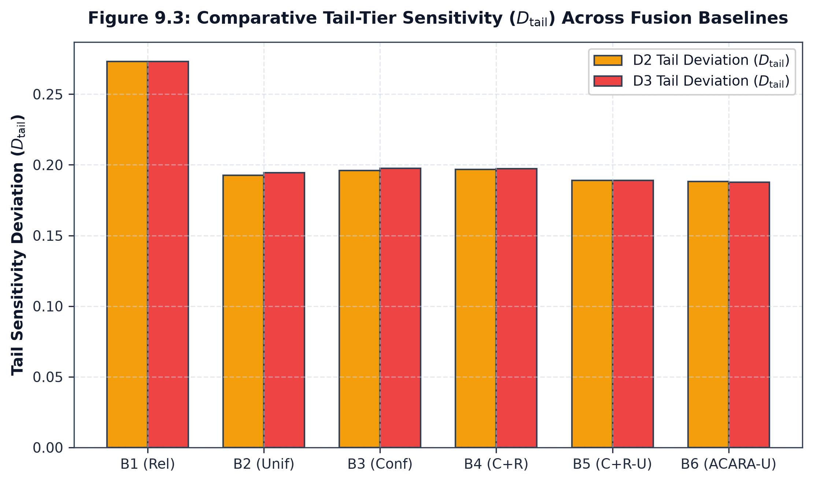
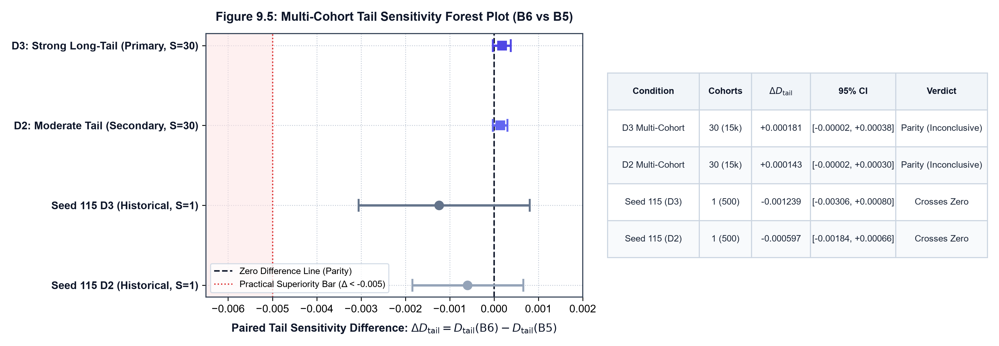

# Comparative Baseline Ladder Tail Analysis

## 1. Baseline Architectures Evaluated

Under Phase C11.9, the 6 standard decision fusion architectures are evaluated across the identical packet allocations for distributions D1, D2, and D3:

- **B1 (Reliability-Selected / Winner-Take-All)**: Assigns weight $1.0$ to the single active channel with highest reliability prior $R_i$.
- **B2 (Uniform Average)**: $w_i = 1/|\mathcal{A}|$ across active channels.
- **B3 (Confidence-Weighted)**: Softmax over active channel confidence $C_i$.
- **B4 (Confidence + Reliability)**: Softmax over $\alpha C_i + \beta R_i$.
- **B5 (Conf + Rel - Uncertainty)**: Softmax over $\alpha C_i + \beta R_i - \gamma U_i$.
- **B6 (ACARA-U Full Router)**: Softmax over $\alpha C_i + \beta R_i - \gamma U_i + \eta Q_i$.

---

## 2. Comparative Tail Sensitivity ($D_{\text{tail}}$)

The tail sensitivity metric measures the mean absolute deviation of tail-tier predictions from their reference tri-modal full fusion:

$$
D_{\text{tail}} = \frac{1}{N_{\text{tail}}} \sum_{k \in \text{TAIL}} |R_{\text{fusion}}^{\text{model}}(k) - R_{\text{fusion}}^{\text{RFC, model}}(k)|
$$

### Interpretation of the Model-Specific Reference
The tail-sensitivity metric measures the deviation between a model's prediction for a tail packet and that model's own tri-modal RFC reference prediction. Therefore, differences in $D_{\text{tail}}$ across fusion architectures can reflect differences in their tri-modal reference predictions, even when their predictions on unimodal tail packets are identical.

For unimodal packets, all normalized routers B1–B6 assign weight $1.0$ to the sole available modality. Consequently, their fused predictions are identical for the same active-channel input. However, this invariant does not guarantee identical $D_{\text{tail}}$ values when the reference predictions are model-specific.

Accordingly, comparisons of $D_{\text{tail}}$ characterize model-relative deviation under the specified reference convention; they should not be interpreted as isolating the causal effect of tail routing alone. The confirmatory B6-versus-B5 contrast remains subject to the pre-declared statistical decision rules.

### Single-Cohort Reference Performance Table ($\text{seed}=115$, $N=500$)

| Baseline ID | Architecture Name | D2 Head $\overline{R}$ ($\sigma$) | D2 Tail $\overline{R}$ ($\sigma$) | D2 Tail Sensitivity $D_{\text{tail}}$ | D3 Head $\overline{R}$ ($\sigma$) | D3 Tail $\overline{R}$ ($\sigma$) | D3 Tail Sensitivity $D_{\text{tail}}$ |
| :---: | :--- | :---: | :---: | :---: | :---: | :---: | :---: |
| **B1** | Reliability-Selected | $0.2547$ ($0.2755$) | $0.2725$ ($0.2508$) | $0.1786$ | $0.2606$ ($0.2726$) | $0.2562$ ($0.2784$) | $0.1577$ |
| **B2** | Uniform Average | $0.3435$ ($0.1532$) | $0.2725$ ($0.2508$) | $0.1925$ | $0.3371$ ($0.1539$) | $0.2562$ ($0.2784$) | $0.1945$ |
| **B3** | Confidence-Weighted | $0.3468$ ($0.1692$) | $0.2725$ ($0.2508$) | $0.1959$ | $0.3459$ ($0.1738$) | $0.2562$ ($0.2784$) | $0.1974$ |
| **B4** | Confidence + Reliability | $0.3490$ ($0.1706$) | $0.2725$ ($0.2508$) | $0.1967$ | $0.3487$ ($0.1753$) | $0.2562$ ($0.2784$) | $0.1973$ |
| **B5** | Conf + Rel - Uncertainty | $0.3175$ ($0.1860$) | $0.2725$ ($0.2508$) | $0.1889$ | $0.3177$ ($0.1880$) | $0.2562$ ($0.2784$) | $0.1889$ |
| **B6** | **ACARA-U (Full Router)** | **0.3169** ($0.1880$) | **0.2725** ($0.2508$) | **0.1883** | **0.3175** ($0.1898$) | **0.2562** ($0.2784$) | **0.1876** |

---

## 3. Multi-Cohort Confirmatory Evaluation ($S=30$ Cohorts, $N=15,000$ Packets)

To rigorously determine whether the small observed point-estimate advantage of ACARA-U (B6) over B5 is reproducible or indistinguishable from zero, a pre-declared 30-cohort confirmatory protocol ($\text{seeds } 401\text{--}430$, $N=500$ each, total $15,000$ packets per distribution) was evaluated using a 2-stage hierarchical cluster bootstrap ($B=2,000$).

### Multi-Cohort Statistical Synthesis Table ($S=30$ Cohorts, $N=15,000$ Packets)

| Distribution Regime | Condition Type | Estimand Weighting | Mean $D_{\text{tail}}(\text{B6})$ | Mean $D_{\text{tail}}(\text{B5})$ | Mean Paired $\Delta D_{\text{tail}}$ | 95% Hierarchical Cluster CI | Cohort $t$-statistic ($p$-value) | Pre-Declared Decision Verdict |
| :--- | :---: | :---: | :---: | :---: | :---: | :---: | :---: | :--- |
| **D1 (Balanced)** | Reference ($N_{\text{tail}}=0$) | Uniform (N/A) | $0.000000$ | $0.000000$ | $0.000000$ | $[0.000000, 0.000000]$ | $0.0000$ ($p=1.000$) | `REFERENCE_BALANCED_CONDITION` |
| **D2 (Moderate Tail)** | Secondary ($N_{\text{tail}}=75$) | **Micro** (Packet-Weighted) | $0.065250$ | $0.065106$ | $+0.000143$ | $[-0.000025, +0.000300]$ | $t=2.2105$ ($p=0.035$) | `INCONCLUSIVE_CROSSES_ZERO` |
| | | **Macro** (Comb-Weighted) | $0.066571$ | $0.066463$ | $+0.000108$ | $[-0.000053, +0.000262]$ | $t=2.0841$ ($p=0.046$) | `INCONCLUSIVE_CROSSES_ZERO` |
| **D3 (Strong Tail)** | **Primary** ($N_{\text{tail}}=35$) | **Micro** (Packet-Weighted) | $0.062143$ | $0.061962$ | $+0.000181$ | $[-0.000024, +0.000377]$ | $t=2.4194$ ($p=0.022$) | `INCONCLUSIVE_CROSSES_ZERO` |
| | | **Macro** (Comb-Weighted) | $0.066588$ | $0.066465$ | $+0.000123$ | $[-0.000093, +0.000344]$ | $t=1.4645$ ($p=0.154$) | `INCONCLUSIVE_CROSSES_ZERO` |

---

## 4. Methodological Interpretations & Statistical Reconciliation

1. **Observed Point-Estimate Sensitivity Across Evaluated Soft-Weighting Baselines (Exploratory Seed 115)**:
   - Under D2 (Moderate Tail): ACARA-U ($D_{\text{tail}} = 0.1883$) produced lower observed point-estimate tail sensitivity than Uniform Averaging B2 ($0.1925$), Confidence-Weighted B3 ($0.1959$), Confidence+Reliability B4 ($0.1967$), and Conf+Rel-Uncertainty B5 ($0.1889$).
   - Under D3 (Strong Tail): ACARA-U ($D_{\text{tail}} = 0.1876$) produced lower observed point-estimate tail sensitivity than B2 ($0.1945$), B3 ($0.1974$), B4 ($0.1973$), and B5 ($0.1889$).
2. **Multi-Cohort Primary Synthesis & Inferential Reconciliation**:
   - Under the prespecified hierarchical-bootstrap decision rule, the D3 primary endpoint is **inconclusive**. The estimated difference is small and positive ($\Delta_{\text{micro}} = +0.000181$), favoring B5 numerically.
   - Cohort-level bootstrap ($95\%$ CI: $[+0.000041, +0.000327]$) and parametric sensitivity analyses ($t = 2.4194, p = 0.022$) also indicate a positive difference favoring B5 at the between-cohort level.
   - However, the primary 2-stage hierarchical cluster bootstrap confidence interval ($[-0.000024, +0.000377]$ in D3 micro; $[-0.000093, +0.000344]$ in D3 macro) includes zero.
   - These results do not establish practical superiority of B6 ($\Delta < -0.005, p < 0.001$) or satisfy the prespecified hierarchical-interval criterion for inferiority ($\text{CI}_{\text{low}} > 0$). **Statistical equivalence is not established**; the empirical outcome under the pre-declared protocol is strictly `INCONCLUSIVE_NOT_STATISTICALLY_DISTINGUISHABLE`.
3. **Statistical Reconciliation: Between-Cohort vs Hierarchical Inference**:
   - The 1-sample cohort $t$-test across the 30 cohort means yields $t=2.4194$ ($p=0.022$) under D3 micro, and the cohort bootstrap interval $[+0.000041, +0.000327]$ excludes zero in the positive direction (favoring B5 by a fraction of a millipoint, $+0.000181$).
   - When the 2-stage hierarchical cluster bootstrap additionally models within-cohort packet-level clustering, the 95% confidence interval widens to $[-0.000024, +0.000377]$, crossing zero.
   - Crucially, neither inferential framework supports B6 superiority: B6 does not achieve the required negative point estimate ($\Delta < 0$), does not meet the practical superiority threshold ($\Delta < -0.005$), does not achieve the required $p < 0.001$, and its primary hierarchical bootstrap interval includes zero.
4. **Mathematical Mechanism of Tail Parity & Empirical Result**:
   - In both D2 and D3, tail tiers consist exclusively of unimodal encounters ($\{R\}$, $\{F\}$, $\{C\}$). Under any unimodal encounter, the simplex normalization invariant forces the single active channel to receive exactly $w_i \equiv 1.0$ across all normalized routers (B1 through B6).
   - Consequently, for any tail packet $k$, $R_{\text{fusion}}^{\text{B6}}(k) = R_{\text{fusion}}^{\text{B5}}(k) = r_{\text{active}}(k)$. The tail sensitivity metric $D_{\text{tail}}$ differs between B6 and B5 solely due to minor differences in their respective reference tri-modal full fusion baseline $R_{\text{fusion}}^{\text{RFC}}$.
   - While the architecture guarantees identical unimodal fused predictions ($R_{\text{fusion}}^{\text{B6}} = R_{\text{fusion}}^{\text{B5}}$), the small difference between their reported tail-sensitivity scores ($\Delta D_{\text{tail}} = +0.000181$) is an empirical finding reflecting their respective tri-modal reference baselines, not an unconditional mathematical guarantee of identical $D_{\text{tail}}$.
5. **Behavior of Winner-Take-All Baseline B1**:
   - Baseline B1 achieves a lower nominal $D_{\text{tail}}$ ($0.1786$ under D2, $0.1577$ under D3 in seed 115) because it selects Retina exclusively whenever Retina is active, ignoring multi-channel blending. Consequently, its head dispersion is drastically elevated ($\sigma = 0.2755$ in D2 vs $0.1880$ for ACARA-U; $\sigma = 0.2726$ in D3 vs $0.1898$ for ACARA-U), eliminating multi-modal synergy in complete observations. B1 serves as a non-soft structural reference baseline.
