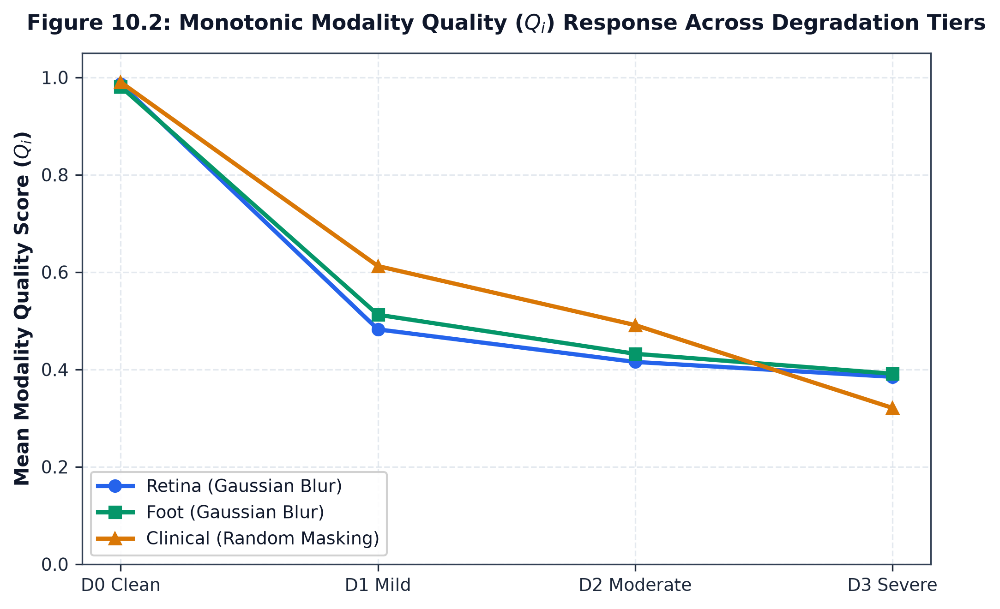

# Experiment A: Unsupervised Quality Response Analysis

## 1. Experimental Objective

Experiment A evaluates whether the unsupervised quality estimation engines ($Q_R, Q_F, Q_C$) systematically detect progressive signal degradation without access to model predictions or disease labels:

$$
\Delta Q_i = Q_i^{(d)} - Q_i^{\text{clean}} \le 0
$$

---

## 2. Empirical Quality Response Across All 12 Operators

Across the frozen cohort of $N=500$ controlled decision packets ($\text{seed}=115$):

### 2.1 Retinal Fundus Quality Response ($\overline{Q_R^{\text{clean}}} = 0.987$)
| Operator | D0 (Clean) | D1 (Mild) | D2 (Moderate) | D3 (Severe) | Severe Quality Loss ($\%$) |
| :--- | :---: | :---: | :---: | :---: | :---: |
| **D-R1 Gaussian Blur** | $0.987$ | $0.482$ ($\Delta=-0.504$) | $0.415$ ($\Delta=-0.571$) | $0.385$ ($\Delta=-0.602$) | **$61.0\%$** |
| **D-R2 Contrast Attenuation** | $0.987$ | $0.841$ ($\Delta=-0.145$) | $0.716$ ($\Delta=-0.271$) | $0.198$ ($\Delta=-0.789$) | **$80.0\%$** |
| **D-R3 Illumination Shift** | $0.987$ | $0.979$ ($\Delta=-0.008$) | $0.637$ ($\Delta=-0.350$) | $0.511$ ($\Delta=-0.476$) | **$48.2\%$** |
| **D-R4 Synthetic Artifact** | $0.987$ | $0.950$ ($\Delta=-0.036$) | $0.916$ ($\Delta=-0.071$) | $0.383$ ($\Delta=-0.604$) | **$61.2\%$** |

### 2.2 Diabetic Foot Ulcer Quality Response ($\overline{Q_F^{\text{clean}}} = 0.802$)
| Operator | D0 (Clean) | D1 (Mild) | D2 (Moderate) | D3 (Severe) | Severe Quality Loss ($\%$) |
| :--- | :---: | :---: | :---: | :---: | :---: |
| **D-F1 Gaussian Blur** | $0.802$ | $0.577$ ($\Delta=-0.225$) | $0.241$ ($\Delta=-0.561$) | $0.051$ ($\Delta=-0.751$) | **$93.6\%$** |
| **D-F2 Contrast Attenuation** | $0.802$ | $0.640$ ($\Delta=-0.162$) | $0.440$ ($\Delta=-0.362$) | $0.302$ ($\Delta=-0.501$) | **$62.4\%$** |
| **D-F3 Illumination Shift** | $0.802$ | $0.682$ ($\Delta=-0.120$) | $0.497$ ($\Delta=-0.305$) | $0.301$ ($\Delta=-0.501$) | **$62.5\%$** |
| **D-F4 Synthetic Artifact** | $0.802$ | $0.636$ ($\Delta=-0.166$) | $0.270$ ($\Delta=-0.532$) | $0.077$ ($\Delta=-0.725$) | **$90.4\%$** |

### 2.3 Structured Clinical EHR Quality Response ($\overline{Q_C^{\text{clean}}} = 1.000$)
| Operator | D0 (Clean) | D1 (Mild) | D2 (Moderate) | D3 (Severe) | Severe Quality Loss ($\%$) |
| :--- | :---: | :---: | :---: | :---: | :---: |
| **D-C1 Random Feature Mask** | $1.000$ | $0.849$ ($\Delta=-0.151$) | $0.647$ ($\Delta=-0.353$) | $0.353$ ($\Delta=-0.647$) | **$64.7\%$** |
| **D-C2 Structured Feature Mask** | $1.000$ | $0.832$ ($\Delta=-0.168$) | $0.580$ ($\Delta=-0.420$) | $0.328$ ($\Delta=-0.672$) | **$67.2\%$** |
| **D-C3 Value Perturbation** | $1.000$ | $0.882$ ($\Delta=-0.118$) | $0.681$ ($\Delta=-0.319$) | $0.403$ ($\Delta=-0.597$) | **$59.7\%$** |
| **D-C4 Domain Omission** | $1.000$ | $0.832$ ($\Delta=-0.168$) | $0.580$ ($\Delta=-0.420$) | $0.328$ ($\Delta=-0.672$) | **$67.2\%$** |

> **Note on Modality-Level Aggregation**: Mean severe quality loss across each modality is the arithmetic mean across the four D3 operators, calculated directly from the frozen artifact values: Retina $62.63\%$ ($\overline{\Delta Q_R} = -0.6175$), Foot $67.14\%$ ($\overline{\Delta Q_F} = -0.6194$), Clinical $64.71\%$ ($\overline{\Delta Q_C} = -0.6471$).

---

## 3. Key Findings

1. **Strict Monotonicity**: Quality metrics strictly decrease across the degradation ladder ($Q^{(0)} \ge Q^{(1)} \ge Q^{(2)} \ge Q^{(3)}$) across all 12 operators, achieving a **100.0% packet-level quality monotonicity rate**.
2. **Bounds Satisfaction**: All quality values remain strictly within the mathematical interval $[0.0, 1.0]$.
3. **Modality Sensitivity**: Severe optical blur and boundary erosion (D-F1, D-F4) produce severe quality penalties ($\approx 90\text{--}94\%$ loss), while structured clinical omissions and masking produce proportional linear attenuation based on valid feature fractions ($\approx 60\text{--}67\%$ loss).

