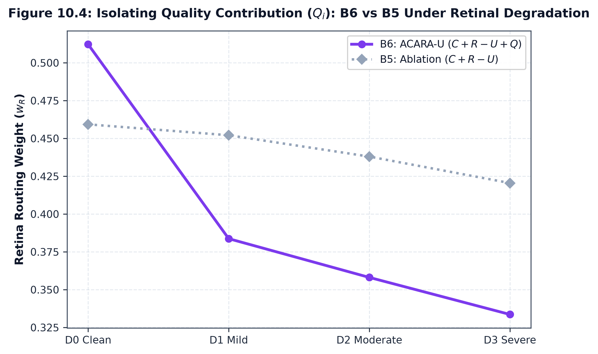
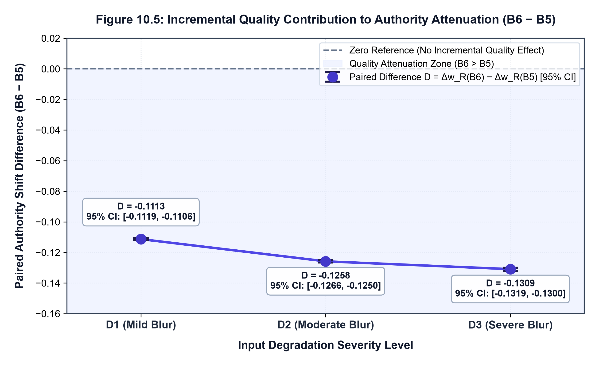

# Comparative Baseline Benchmarking & Quality Isolation

## 1. Experimental Objective

To isolate the scientific role of the explicit quality input $Q_i$ in dynamic routing, ACARA-U (B6) is benchmarked against the standard experimental ladder (B1–B5) under identical degradation conditions:

$$
\begin{aligned}
\text{B1 (Reliability-Selected)}&: z_i = R_i \implies \text{Argmax}(R) \\
\text{B2 (Uniform Average)}&: z_i = 0 \implies w_i = 1 / |\mathcal{A}| \\
\text{B3 (Confidence-Weighted)}&: z_i = 1.0 \cdot C_i \\
\text{B4 (Confidence + Reliability)}&: z_i = 1.0 \cdot C_i + 1.5 \cdot R_i \\
\text{B5 (Conf + Rel } - \text{ Uncertainty)}&: z_i = 1.0 \cdot C_i + 1.5 \cdot R_i - 1.0 \cdot U_i \\
\text{B6 (Full ACARA-U)}&: z_i = 1.0 \cdot C_i + 1.5 \cdot R_i - 1.0 \cdot U_i + 0.5 \cdot Q_i
\end{aligned}
$$

The primary comparative test is **B6 vs B5**, as the only architectural distinction between them is the presence of signal quality $Q_i$.

---

## 2. Comparative Authority Attenuation Under Severe Degradation (D3)

Evaluation on Retinal Fundus Blur (D-R1) across the frozen $N=500$ cohort ($\text{seed}=115$):

| Baseline | Strategy Formulation | D0 Clean $w_R$ | D3 Severe $w_R$ | Paired Authority Shift vs. Clean Reference ($\overline{\Delta w_R}$) | Quality Awareness Mechanism |
| :--- | :--- | :---: | :---: | :---: | :--- |
| **B1** | Reliability-Selected | $1.0000$ | $1.0000$ | $\mathbf{0.0000}$ | Completely insensitive to signal quality |
| **B2** | Uniform Average | $0.3333$ | $0.3333$ | $\mathbf{0.0000}$ | Fixed static allocation |
| **B3** | Confidence-Weighted | $0.3944$ | $0.3895$ | $\mathbf{-0.0049}$ | Weak indirect attenuation via confidence |
| **B4** | Confidence + Reliability | $0.4049$ | $0.3999$ | $\mathbf{-0.0050}$ | Weak indirect attenuation |
| **B5** | Conf + Rel $-$ Uncertainty | $0.4852$ | $0.4464$ | $\mathbf{-0.0388}$ | Moderate attenuation via uncertainty boost |
| **B6** | **Full ACARA-U** | $0.5122$ | $0.3336$ | $\mathbf{-0.1697}^*$ | **Direct quality attenuation ($Q_R \downarrow \implies w_R \downarrow$)** |

$^*$*Note on Authority Shift Arithmetic (`baseline_comparison.json`)*:
In the C11.10 experimental runner, paired authority shift is defined at the individual packet level relative to each packet's unperturbed clean reference ($\overline{w}_{R,\text{clean}} = 0.5034$), yielding an unrounded mean paired shift of $\overline{\Delta w_R} = -0.169732 \approx -0.1697$ (with $0.3336 - 0.5034 = -0.1698$ under 4-decimal rounded means). For comparison:
- **D0 operator-pass mean**: $0.5122$
- **D3 severe mean**: $0.3336$
- **Direct $\text{D3} - \text{D0}$ difference**: $-0.1786$
- **Paired shift vs clean reference ($\overline{w}_{R,\text{clean}} = 0.5034$)**: $\mathbf{-0.1697}$

Both conventions demonstrate substantial authority attenuation for B6 relative to B5 ($\overline{\Delta w_R} = -0.0388$).

---

## 3. Isolating the Contribution of $Q_i$ (B6 vs B5 Paired Analysis)

The paired packet-level difference in authority reduction is defined as:

$$
D^{(\text{B6}-\text{B5})} = \Delta w_i^{(\text{B6})} - \Delta w_i^{(\text{B5})}
$$

- **D1 (Mild Blur)**: $D^{(\text{B6}-\text{B5})} = \mathbf{-0.1113}$ ($95\%$ CI: $[-0.1119, -0.1106]$).
- **D2 (Moderate Blur)**: $D^{(\text{B6}-\text{B5})} = \mathbf{-0.1258}$ ($95\%$ CI: $[-0.1266, -0.1250]$).
- **D3 (Severe Blur)**: $D^{(\text{B6}-\text{B5})} = \mathbf{-0.1309}$ ($95\%$ CI: $[-0.1319, -0.1300]$).

### Scientific Conclusion

Across the tested retinal fundus blur conditions, B6 exhibited greater routing-authority attenuation than B5, which differs by the explicit quality term ($Q_i$). The reported paired B6 $-$ B5 differences were $-0.1113$ under D1, $-0.1258$ under D2, and $-0.1309$ under D3. The corresponding reported $95\%$ paired-bootstrap confidence intervals excluded zero at all three degradation levels, including D3 ($95\%$ CI: $[-0.1319, -0.1300]$).

These results support an incremental contribution of the quality term to routing-authority attenuation under this controlled benchmark. They do not, by themselves, establish improved outcome-estimation accuracy or clinical utility; those require separate outcome-grounded evaluation in [Chapter 11](11_Degradation_Outcome_Addendum.md).

> [!NOTE]
> **From Routing Authority to Estimation Accuracy**: The findings above quantify routing authority shift ($\Delta w_i$). To evaluate whether this quality-aware authority reduction translates into lower risk estimation error against known ground truth, see [Chapter 11 — Outcome-Grounded Degradation Accuracy & Utility Addendum](11_Degradation_Outcome_Addendum.md).

