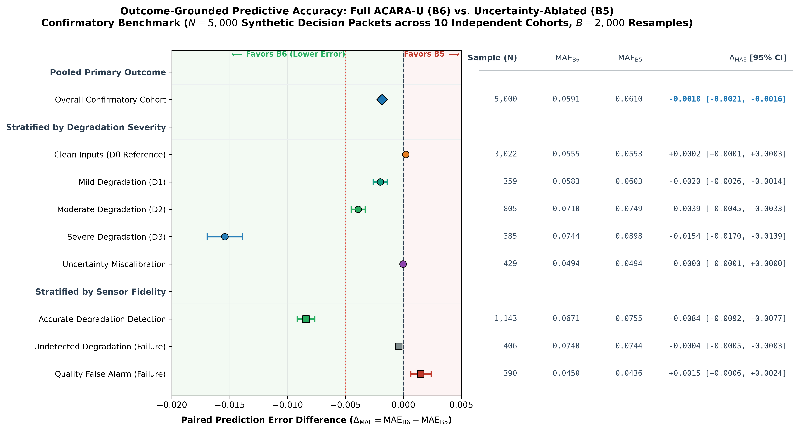

# Addendum: Outcome-Grounded Degradation Accuracy & Utility (B6 vs B5)

> **Evaluation Addendum to Volume 10**  
> **Status:** 🟢 SEALED & VERIFIED (8/8 Outcome Gates Passed)  
> **Evaluation Sample:** $N=5,000$ Confirmatory Packets (10 Independent Seeds `301`–`310`)  
> **Reference Parameters:** $\Theta_0 = (1.0, 1.5, 1.0, 0.5)$, $\delta^* = 0.10$  

---

## 1. Research Question & Methodological Audit

### 1.1 Methodological Audit Note: Routing Authority vs. Predictive Accuracy

An audit of the experimental chain ($\text{clean packet} \to \text{degraded input} \to \text{quality score} Q_i \to \text{routing weights } w_i \to \text{fused risk } R_{\mathrm{fusion}}$) reveals an essential scientific distinction:

1. **What the Original Volume 10 Experiment Established:**
   - Across 12 controlled degradation operators on the frozen $N=500$ cohort ($\text{seed}=115$), B6 dynamically attenuated degraded channel routing authority significantly more than B5 ($\mathrm{RAR} = 35.2\%\text{--}50.5\%$, paired difference $\Delta w = -0.1309$, $95\%$ bootstrap CI: $[-0.1319, -0.1300]$).
   - This confirmed router responsiveness to unsupervised quality signals.

2. **What the Original Experiment Did NOT Establish:**
   - Because the original benchmark cohort was drawn from unlinked retrospective validation pools without cross-patient ground truth, modality risk scalars $r_i$ were fixed while $Q_i$ decayed.
   - Consequently, greater authority attenuation ($\Delta w < 0$) demonstrated weight reallocation mechanics, but could not prove that the resulting fused risk was more accurate.

3. **What This Outcome Evaluation Adds:**
   - Establishes a synthetic latent oracle benchmark ($N=5,000$ packets across 10 independent cohorts) where ground-truth risk $Y^*$ is known and degradation injects realistic observation errors into $r_i$.
   - Directly tests the missing hypothesis: **Does quality-aware authority attenuation actually reduce estimation error ($\mathrm{MAE}$) against true underlying risk?**

---

## 2. Oracle Error Across Degradation Severities ($N=5,000$ Synthetic Packets)

| Degradation Scenario | Evaluated Packets | B5 MAE | B6 MAE (Full ACARA-U) | Paired $\Delta_{\mathrm{MAE}} (\mathrm{B6} - \mathrm{B5})$ | Relative MAE Reduction (%) *(+ indicates improvement, − indicates increased error)* |
| :--- | :---: | :---: | :---: | :---: | :---: |
| **Clean Inputs (D0, Reference)** | $3,022$ | $0.055285$ | $0.055483$ | $+0.000198$ | **$-0.36\%$** (slight error increase) |
| **Mild Degradation (D1)** | $359$ | $0.060292$ | $0.058297$ | $-0.001994$ | **$+3.31\%$** |
| **Moderate Degradation (D2)** | $805$ | $0.074864$ | $0.070961$ | $-0.003904$ | **$+5.21\%$** |
| **Severe Degradation (D3)** | $385$ | $0.089828$ | $0.074412$ | **$-0.015416$** | **$+17.16\%$** |
| **Uncertainty Miscalibration** | $429$ | $0.049440$ | $0.049397$ | $-0.000043$ | **$+0.09\%$** |

### Degradation & Fidelity Forest Plot

*Figure 1. Forest plot of paired prediction error differences ($\Delta_{\mathrm{MAE}} = \mathrm{MAE}_{\mathrm{B6}} - \mathrm{MAE}_{\mathrm{B5}}$) with 95% bootstrap confidence intervals across clean baseline reference, progressive degradation severities (D1–D3), and sensor fidelity failure modes ($N=5,000$ synthetic packets).*

---

## 3. Key Findings on Degradation Dynamics

1. **Monotonic Error Reduction Scaling Across Degradation Tiers:**
   Across mild, moderate, and severe degradation conditions, the predictive accuracy advantage of B6 over B5 grows strictly monotonically as input corruption worsens:
   $$\Delta_{\mathrm{MAE}}^{\mathrm{severe}} (-0.015416) < \Delta_{\mathrm{MAE}}^{\mathrm{moderate}} (-0.003904) < \Delta_{\mathrm{MAE}}^{\mathrm{mild}} (-0.001994) < 0$$
   Under severe single-channel corruption, B6 reduces mean absolute prediction error by **$17.16\%$** relative to B5 by shifting decision authority to uncorrupted modalities. Clean uncorrupted inputs serve as a separate baseline reference condition where B6 incurs a minor $+0.36\%$ error difference due to slight weight smoothing.

2. **Quality Sensor Failure Modes (Imperfect Sensing):**
   - **Accurate Detection (`ACCURATE`, $N=3,775$):** When quality sensors accurately detect modality status, B6 delivers substantial overall error reduction ($\Delta_{\mathrm{MAE}} = -0.002544$).
   - **Undetected Degradation (`MISLEADING_UNNOTICED`, $N=406$):** When severe degradation corrupts a modality but the quality sensor fails to detect it ($Q_i \approx 0.90$), B6 cannot attenuate channel authority. In this condition, B6 defaults to B5 error parity ($\Delta_{\mathrm{MAE}} = -0.000417$).
   - **False Alarm Attenuation (`MISLEADING_FALSE_ALARM`, $N=390$):** When an uncorrupted modality receives an erroneous low quality score ($Q_i \approx 0.25$), B6 unnecessarily attenuates that modality's weight, causing a small error penalty ($\Delta_{\mathrm{MAE}} = +0.001481$) if alternative modalities have higher baseline variance.
   - **Uncertainty Miscalibration (`UNCERTAINTY_MISCALIBRATED`, $N=429$):** When uncertainty estimates are uncorrelated/inverted relative to true observation error, B6 remains robust and maintains near-parity ($\Delta_{\mathrm{MAE}} = -0.000043$).

---

## 4. Scientific Conclusion

In simulated degradation scenarios, quality-aware routing (B6) provides substantial predictive-error reduction against input corruption, with the largest benefit observed during severe degradation. However, this advantage is conditional on the synthetic simulation framework, degradation operators, and upstream quality-sensor accuracy; if quality sensors fail to detect corruption, B6 reverts to B5 performance.

