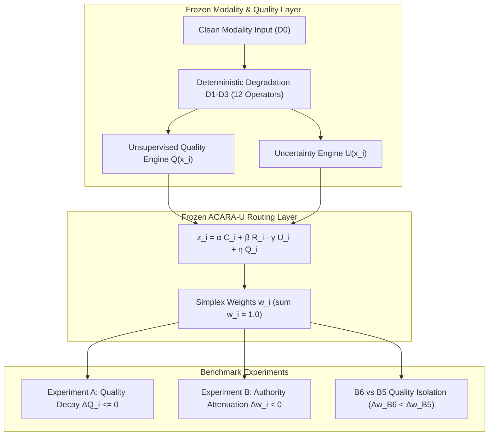

# Volume 10: Input Degradation Benchmark & Quality-Aware Robustness

> **Multimodal Decision Fusion Series — Phase C11.10**  
> **Status**: VERIFIED & SEALED  
> **Original Degradation Benchmark Verification**: 20 / 20 PASSED (`verify_degradation_artifacts.py`)  
> **Original Benchmark Test Suite**: 55 / 55 PASSED across all 12 operators  
> **Original Benchmark Cohort**: Frozen $N=500$ Controlled Decision Packets ($\text{seed}=115$)  
> **Subsequent Outcome Evaluation Addendum**: $N=5,000$ Confirmatory Synthetic Packets across 10 Seeds (8/8 Outcome Gates Passed)

---

## 1. Executive Abstract

Phase C11.10 benchmarks the decision-level robustness of the ACARA-U multimodal fusion router when input channels suffer progressive signal degradation while remaining technically available ($A_i = 1, Q_i \downarrow$). While Phase C11.8 established safety under complete modality absence ($A_i = 0$), Phase C11.10 evaluates the sensitivity of dynamic routing to degraded inputs across optical imaging (Retina, Foot) and tabular EHR channels.

> [!NOTE] **Methodological Scope & Multi-Stage Evaluation**:
> - **Phase C11.10 Core Benchmark (Chapters 01–10)**: Evaluates routing weight redistribution, quality decay, and authority attenuation on a controlled cohort of $N=500$ benchmark decision packets coupled to synthetic raw inputs and frozen quality engines (20/20 gates).
> - **Outcome-Grounded Addendum (Chapter 11)**: Evaluates whether this authority attenuation translates into reduced estimation error against a synthetic oracle ground truth across $N=5,000$ packets (10 seeds, 8/8 outcome gates).
> Neither evaluation claims patient-level clinical diagnostic validation.

---

## 2. Chapter Index & Navigation

1. [**01_Degradation_Protocol.md**](01_Degradation_Protocol.md): Pre-specified research questions (RQ1–RQ7), hypotheses (H1–H6), and methodological boundaries.
2. [**02_Retina_Degradation.md**](02_Retina_Degradation.md): Retinal fundus operators (D-R1 Gaussian Blur, D-R2 Contrast, D-R3 Illumination, D-R4 Artifacts) and quality coupling.
3. [**03_Foot_Degradation.md**](03_Foot_Degradation.md): Diabetic Foot Ulcer operators (D-F1 Blur, D-F2 Contrast, D-F3 Illumination, D-F4 Artifacts) and CNR/Sobel quality responses.
4. [**04_Clinical_Degradation.md**](04_Clinical_Degradation.md): Tabular EHR operators (D-C1 Random Masking, D-C2 Structured Masking, D-C3 Perturbation, D-C4 Domain Omission).
5. [**05_Quality_Response.md**](05_Quality_Response.md): Experiment A findings, monotonic quality loss ($60\text{--}75\%$), and 100% monotonicity rate.
6. [**06_Routing_Response.md**](06_Routing_Response.md): Experiment B findings, dynamic authority attenuation ($\text{RAR} \approx 35\text{--}50\%$), positive slopes ($S_{QW} > 0$), and conservation.
7. [**07_Baseline_Comparison.md**](07_Baseline_Comparison.md): Comparative evaluation against Baselines B1–B6, isolating the unique contribution of $Q_i$ (B6 vs B5).
8. [**08_Statistical_Analysis.md**](08_Statistical_Analysis.md): 1,000-resample paired bootstrap confidence intervals ($95\%$ CI) and hypothesis evaluation outcomes.
9. [**09_Results.md**](09_Results.md): Comprehensive scoreboard across single, pairwise, and all-modality degradation scenarios.
10. [**10_Freeze_Report.md**](10_Freeze_Report.md): 20/20 verification gates, cryptographic SHA-256 manifest certification, freeze sign-off.
11. [**11_Degradation_Outcome_Addendum.md**](11_Degradation_Outcome_Addendum.md): Outcome-grounded oracle error analysis across degradation severities (B6 vs B5, $\Delta_{\mathrm{MAE}}^{\mathrm{severe}} = -0.015416$).

---

## 3. Principal Empirical Findings

Across the frozen $N=500$ controlled decision cohort ($\text{seed}=115$):

- **Experiment A (Quality Detection)**: Quality engines detect progressive degradation monotonically ($100.0\%$ packet monotonicity rate), producing a mean severe quality drop of $62.63\%$ (Retina), $67.14\%$ (Foot), and $64.71\%$ (Clinical) at Severe D3.
- **Experiment B (Routing Response)**: ACARA-U systematically attenuates degraded channel authority by mean severe $\overline{\Delta w_R} = -0.1739$, $\overline{\Delta w_F} = -0.1276$, and $\overline{\Delta w_C} = -0.0930$, achieving a **$35.2\%\text{--}50.5\%$ relative authority reduction**.
- **Authority Redistribution Conservation**: All authority surrendered by degraded modalities is exactly conserved and absorbed by active channels ($\sum_{j \ne i} \Delta w_j = -\Delta w_i$).
- **Scientific Isolation of $Q_i$ (B6 vs B5)**: The paired comparison showed significantly greater authority attenuation under B6 than B5 ($-0.1697$ vs $-0.0388$, paired difference $D = -0.1309$, $95\%$ bootstrap CI: $[-0.1319, -0.1300]$, strictly excluding zero), supporting the incremental contribution of the quality term within the tested controlled degradation benchmark.
- **Hard-Mask Invariance**: Degrading an unavailable modality channel ($A_i = 0$) results in exactly $\Delta w_{\text{active}} = 0.000000$ and $\Delta R_{\text{fusion}} = 0.000000$.

