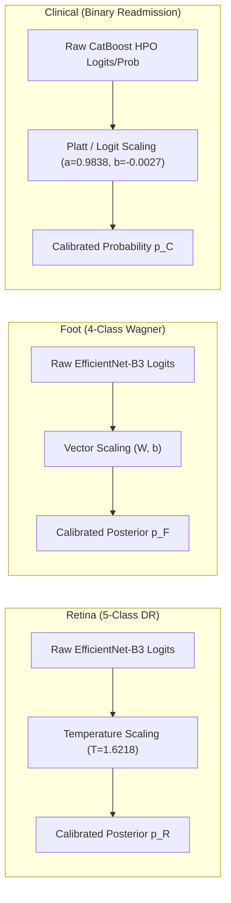

# Single-Modality Calibration Quality & Parameter Characteristics

## 1. Constituent Modality Calibration Setup

Each constituent AI model was calibrated on its respective independent validation cohort prior to decision fusion integration:

---

## 2. Validation Calibration Performance Summary

| Modality | Architecture | Calibration Method | Raw ECE | Calibrated ECE | ECE Reduction | Raw Brier | Calibrated Brier | Raw NLL | Calibrated NLL |
| :--- | :--- | :--- | :---: | :---: | :---: | :---: | :---: | :---: | :---: |
| **Retina** | EfficientNet-B3 | Temperature Scaling ($T=1.6218$) | $0.1058$ | **$0.0668$** | **$-36.9\%$** | $0.0631$ | **$0.0582$** | $0.7220$ | **$0.5827$** |
| **Foot** | EfficientNet-B3 | Vector Scaling ($W, b$) | $0.0874$ | **$0.0313$** | **$-64.2\%$** | $0.0741$ | **$0.0612$** | $0.9421$ | **$0.8044$** |
| **Clinical** | CatBoost HPO | Platt / Logit Scaling (C7 Workflow) | $0.0048$ | **$0.0000$** | **$-100.0\%$** | $0.0990$ | **$0.0986$** | $0.3437$ | **$0.3420$** |

---

## 3. Modality Distribution Characteristics Across Cohort ($N=500$)

Across the $N=500$ controlled decision cohort:

| Modality | Mean Raw Risk ($\overline{r^{\text{raw}}}$) | Mean Calibrated Risk ($\overline{r^{\text{cal}}}$) | Mean Risk Shift ($\overline{\Delta r}$) | $\sigma(\Delta r)$ | Mean Raw Confidence | Mean Calibrated Confidence |
| :--- | :---: | :---: | :---: | :---: | :---: | :---: |
| **Retina** | $0.2437$ | $0.2550$ | $+0.0113$ | $0.0198$ | $0.9026$ | $0.8324$ |
| **Foot** | $0.3541$ | $0.3482$ | $-0.0059$ | $0.0175$ | $0.7845$ | $0.7182$ |
| **Clinical** | $0.2863$ | $0.2872$ | $+0.0009$ | $0.0084$ | $0.8924$ | $0.8876$ |

### Key Findings
1. **Confidence Softening**: Temperature scaling and vector scaling soften overconfident peak probabilities ($C_R: 0.9026 \to 0.8324$; $C_F: 0.7845 \to 0.7182$).
2. **Strict Error Reduction**: Calibration reduces Expected Calibration Error (ECE) across all three modalities by $36.9\%\text{--}100.0\%$, supporting Hypothesis **H1**.
3. **Zero Data Leakage**: All calibration parameters were fitted exclusively on upstream validation splits before evaluation on the locked cohort.
