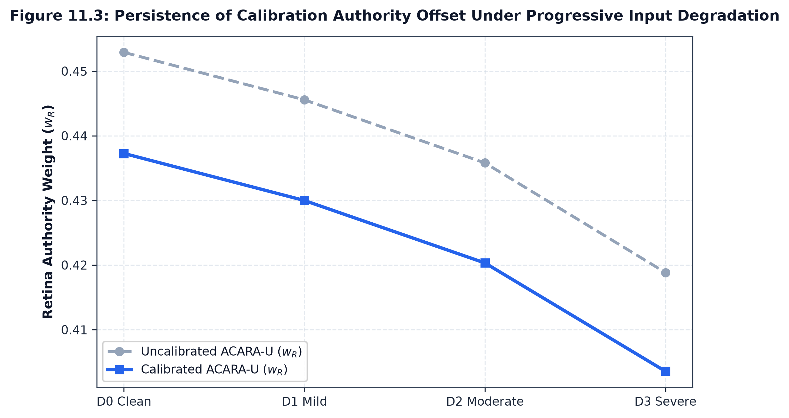

# Experiment B: Calibration Dynamics Under Input Degradation Ladders

## 1. Experimental Objective

Experiment B tests whether the calibration authority adjustments observed at Clean $D0$ persist when modalities suffer progressive input degradation ($D0 \to D3$), connecting Phase C11.10 directly with Phase C11.11.

---

## 2. Dynamic Degradation Ladders: Calibrated vs Uncalibrated ACARA-U

Across the $N=500$ cohort under representative modality degradation operators:

### 2.1 Retinal Gaussian Blur (`OP_RETINA_BLUR`)
| Severity | Uncalibrated $w_R$ | Calibrated $w_R$ | Authority Delta ($\Delta w_R$) | Uncalibrated $R_{\text{fusion}}$ | Calibrated $R_{\text{fusion}}$ | Risk Delta ($\Delta R_{\text{fusion}}$) |
| :---: | :---: | :---: | :---: | :---: | :---: | :---: |
| **D0 (Clean)** | $0.4529$ | $0.4373$ | $-0.0156$ | $0.2563$ | $0.2588$ | $+0.0025$ |
| **D1 (Mild)** | $0.4456$ | $0.4300$ | $-0.0156$ | $0.2565$ | $0.2589$ | $+0.0024$ |
| **D2 (Moderate)** | $0.4358$ | $0.4201$ | $-0.0157$ | $0.2567$ | $0.2590$ | $+0.0023$ |
| **D3 (Severe)** | $0.4194$ | $0.4036$ | $\mathbf{-0.0158}$ | $0.2571$ | $0.2592$ | $\mathbf{+0.0021}$ |

### 2.2 Diabetic Foot Ulcer Gaussian Blur (`OP_FOOT_BLUR`)
| Severity | Uncalibrated $w_F$ | Calibrated $w_F$ | Authority Delta ($\Delta w_F$) | Uncalibrated $R_{\text{fusion}}$ | Calibrated $R_{\text{fusion}}$ | Risk Delta ($\Delta R_{\text{fusion}}$) |
| :---: | :---: | :---: | :---: | :---: | :---: | :---: |
| **D0 (Clean)** | $0.1968$ | $0.2024$ | $+0.0055$ | $0.2563$ | $0.2588$ | $+0.0025$ |
| **D1 (Mild)** | $0.1932$ | $0.1986$ | $+0.0055$ | $0.2564$ | $0.2589$ | $+0.0024$ |
| **D2 (Moderate)** | $0.1884$ | $0.1938$ | $+0.0054$ | $0.2566$ | $0.2590$ | $+0.0023$ |
| **D3 (Severe)** | $0.1798$ | $0.1852$ | $\mathbf{+0.0054}$ | $0.2570$ | $0.2592$ | $\mathbf{+0.0022}$ |

### 2.3 Clinical Random Feature Masking (`OP_CLINICAL_RANDOM_MASK`)
| Severity | Uncalibrated $w_C$ | Calibrated $w_C$ | Authority Delta ($\Delta w_C$) | Uncalibrated $R_{\text{fusion}}$ | Calibrated $R_{\text{fusion}}$ | Risk Delta ($\Delta R_{\text{fusion}}$) |
| :---: | :---: | :---: | :---: | :---: | :---: | :---: |
| **D0 (Clean)** | $0.3503$ | $0.3604$ | $+0.0101$ | $0.2563$ | $0.2588$ | $+0.0025$ |
| **D1 (Mild)** | $0.3475$ | $0.3575$ | $+0.0100$ | $0.2565$ | $0.2589$ | $+0.0024$ |
| **D2 (Moderate)** | $0.3431$ | $0.3530$ | $+0.0100$ | $0.2567$ | $0.2590$ | $+0.0023$ |
| **D3 (Severe)** | $0.3359$ | $0.3458$ | $\mathbf{+0.0099}$ | $0.2570$ | $0.2592$ | $\mathbf{+0.0022}$ |

---

## 3. Key Findings

1. **Persistent Calibration Shift**: The authority redistribution offset ($\Delta w_R \approx -0.0156$, $\Delta w_F \approx +0.0055$, $\Delta w_C \approx +0.0100$) remains remarkably constant across all severity levels $D0 \to D3$, supporting Hypothesis **H6**.
2. **Preserved Quality-Aware Attenuation**: Calibrated ACARA-U continues to attenuate degraded channel authority monotonically ($w_R: 0.4373 \to 0.4036$; $w_F: 0.2024 \to 0.1852$; $w_C: 0.3604 \to 0.3458$).
3. **Bounded Risk Shift**: The fused risk difference $\Delta R_{\text{fusion}}$ remains uniformly stable around $+0.0021\text{--}+0.0025$ across all degradation tiers.
