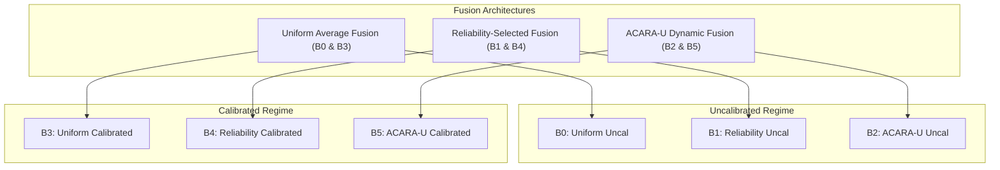

# Comparative Baseline Benchmarking (B0–B5)

## 1. Architecture Taxonomy & Calibration Integration

Phase C11.11 benchmarks three fusion architectures under both uncalibrated and calibrated probability regimes:

---

## 2. Comparative Scoreboard Across All 6 Conditions

| Baseline ID | Architecture Description | Probability State | Mean $w_R$ | Mean $w_F$ | Mean $w_C$ | Mean $R_{\text{fusion}}$ ($\sigma$) | Mean $\text{DCRI}$ | Routing Entropy $H(w)$ | Conflict Index | Dominant Channel Rate |
| :--- | :--- | :---: | :---: | :---: | :---: | :---: | :---: | :---: | :---: | :---: |
| **B0** | Uniform Average | Uncalibrated | $0.3333$ | $0.3333$ | $0.3333$ | $0.2947$ ($0.1268$) | $0.1309$ | $1.0986$ | $0.5368$ | Equal ($100\%$) |
| **B1** | Reliability-Selected | Uncalibrated | $1.0000$ | $0.0000$ | $0.0000$ | $0.2437$ ($0.2768$) | $0.1309$ | $0.0000$ | $0.5368$ | Retina ($100\%$) |
| **B2** | ACARA-U Dynamic | Uncalibrated | $0.4529$ | $0.1968$ | $0.3503$ | $0.2563$ ($0.1471$) | $0.1309$ | $1.0288$ | $0.5368$ | Retina ($88.0\%$) |
| **B3** | Uniform Average | Calibrated | $0.3333$ | $0.3333$ | $0.3333$ | $0.2968$ ($0.1227$) | $0.1333$ | $1.0986$ | $0.5203$ | Equal ($100\%$) |
| **B4** | Reliability-Selected | Calibrated | $1.0000$ | $0.0000$ | $0.0000$ | $0.2550$ ($0.2672$) | $0.1333$ | $0.0000$ | $0.5203$ | Retina ($100\%$) |
| **B5** | ACARA-U Dynamic | Calibrated | **$0.4373$** | **$0.2024$** | **$0.3604$** | **$0.2588$** ($0.1397$) | **$0.1333$** | **$1.0346$** | **$0.5203$** | **Retina ($80.4\%$)** |

---

## 3. Structural Architectural Comparison

1. **Uniform Fusion (B0 vs B3)**:
   - Weights remain statically fixed at $w_i = 1/3$.
   - Fused risk shifts slightly from $0.2947$ to $0.2968$ ($\Delta = +0.0021$) solely due to modality risk projection adjustments.
2. **Reliability-Selected Fusion (B1 vs B4)**:
   - Allocates $100\%$ weight to Retina ($R_R = 0.9300 > R_F = 0.9223 > R_C = 0.8254$).
   - Fused risk shifts from $0.2437$ to $0.2550$ ($\Delta = +0.0113$), exhibiting high dispersion ($\sigma = 0.2672$).
3. **ACARA-U Dynamic Fusion (B2 vs B5)**:
   - Responds dynamically to both confidence calibration and risk transformations.
   - Retains the lowest risk dispersion among adaptive routers ($\sigma = 0.1397$), striking a balanced compromise between reliability, confidence, uncertainty, and quality.
