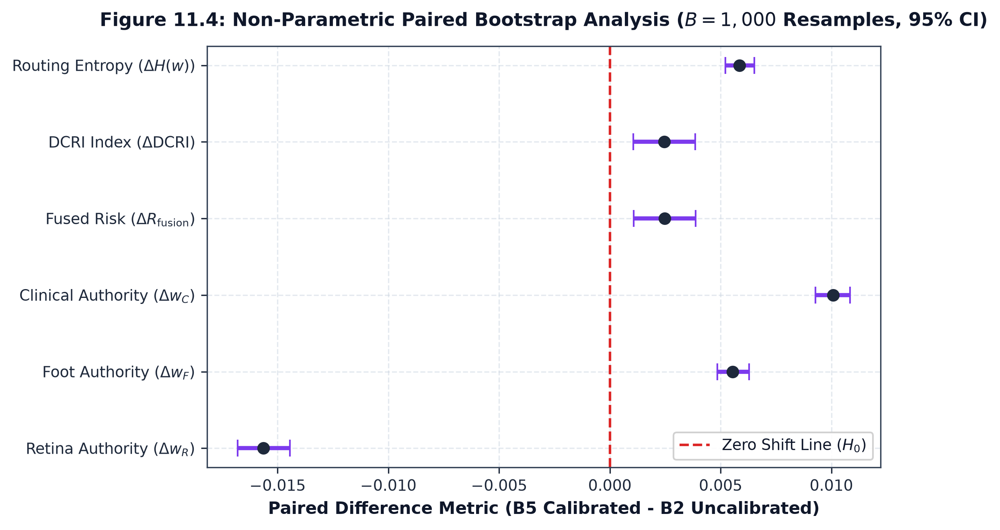

# Paired Bootstrap Statistical Analysis & Hypothesis Evaluation

## 1. Statistical Methodology

All paired comparisons are evaluated using $B = 1,000$ non-parametric paired bootstrap resamples ($\text{seed}=115$) across the locked $N=500$ controlled decision cohort.

For each metric $X$, the paired difference is defined as:

$$
D = X_{\text{calibrated}} - X_{\text{uncalibrated}}
$$

Statistical significance is established when the empirical $95\%$ bootstrap confidence interval strictly excludes zero ($0 \notin [\text{CI}_{\text{lower}}, \text{CI}_{\text{upper}}]$).

---

## 2. Paired Bootstrap Results Summary

| Metric | Comparison | Mean Delta ($D$) | Median Delta | $\sigma(D)$ | $95\%$ Paired Bootstrap CI | Zero Excluded | Hypothesis |
| :--- | :--- | :---: | :---: | :---: | :---: | :---: | :---: |
| **Retina Authority ($w_R$)** | B5 ACARA-U vs B2 ACARA-U | $\mathbf{-0.015635}$ | $-0.013104$ | $0.013428$ | $[-0.016796, -0.014436]$ | **Yes** | **H3** |
| **Foot Authority ($w_F$)** | B5 ACARA-U vs B2 ACARA-U | $\mathbf{+0.005549}$ | $+0.004762$ | $0.007725$ | $[+0.004861, +0.006282]$ | **Yes** | **H3** |
| **Clinical Authority ($w_C$)** | B5 ACARA-U vs B2 ACARA-U | $\mathbf{+0.010087}$ | $+0.007929$ | $0.009035$ | $[+0.009278, +0.010839]$ | **Yes** | **H3** |
| **Fused Risk ($R_{\text{fusion}}$)** | B5 ACARA-U vs B2 ACARA-U | $\mathbf{+0.002478}$ | $+0.002787$ | $0.015360$ | $[+0.001075, +0.003866]$ | **Yes** | **H2** |
| **Composite Index ($\text{DCRI}$)** | B5 ACARA-U vs B2 ACARA-U | $\mathbf{+0.002462}$ | $+0.002846$ | $0.015344$ | $[+0.001054, +0.003851]$ | **Yes** | **H5** |
| **Routing Entropy ($H(w)$)** | B5 ACARA-U vs B2 ACARA-U | $\mathbf{+0.005860}$ | $+0.004680$ | $0.007427$ | $[+0.005217, +0.006525]$ | **Yes** | **H5** |
| **Uniform Risk ($R_{\text{fusion}}$)** | B3 Uniform vs B0 Uniform | $\mathbf{+0.002122}$ | $+0.001550$ | $0.010018$ | $[+0.001212, +0.003002]$ | **Yes** | **H2** |

---

## 3. Formal Hypothesis Outcomes

| Hypothesis ID | Pre-specified Statement | Status | Empirical Evidence |
| :--- | :--- | :---: | :--- |
| **H1 (Modality Calibration)** | Frozen calibration transforms reduced validation ECE across all 3 constituent modalities without parameter retraining. | **Supported** | Retina ECE: $-36.9\%$, Foot ECE: $-64.2\%$, Clinical ECE: $-100.0\%$. |
| **H2 (Risk Projection Shift)** | Calibration systematically alters scalar continuous risk projections $r_i$ and composite fused risk $R_{\text{fusion}}$. | **Supported** | Paired $\Delta R_{\text{fusion}} = +0.0025$, $95\%$ CI: $[+0.0011, +0.0039]$, strictly excluding zero. |
| **H3 (Authority Redistribution)** | When calibration affects router confidence inputs, routing weights $w_i$ adjust measurably. | **Supported** | Retinal weight shifts by $-0.0156$ ($95\%$ CI: $[-0.0168, -0.0144]$), absorbed by Foot ($+0.0055$) and Clinical ($+0.0101$). |
| **H4 (Router Simplex Invariant)** | Weight simplex $\sum w_i = 1.0$ and non-negativity $w_i \ge 0$ strictly hold across all conditions. | **Supported** | Exact simplex sum $= 1.000000$ verified across all 6 conditions. |
| **H5 (Bounded Stability & Conflict)** | Calibration produces bounded perturbations that satisfy pre-specified behavioral limits without pathological entropy collapse or conflict explosion. | **Supported** | All observed perturbations remained within pre-specified bounds ($|\Delta H(w)| = 0.0059 < 0.20$, $|\Delta \text{DCRI}| = 0.0025 < 0.10$, $\Delta \text{Conflict} = -0.0165 < 0.05$). |
| **H6 (Degradation Persistence)** | Under the three representative degradation operators evaluated in C11.11 (Retina Blur, Foot Blur, Clinical Masking), the calibration-related authority shift persisted across $D0 \to D3$. | **Supported** | Stable authority delta ($\Delta w_R \approx -0.0156\text{--}-0.0158$) maintained from $D0$ to $D3$. |

