# Results Scoreboard: Fusion Calibration Benchmark

## 1. Executive Dashboard

| Metric Category | Target Indicator | Baseline (Uncalibrated) | Calibrated Outcome | Shift ($\Delta$) | $95\%$ Bootstrap CI |
| :--- | :--- | :---: | :---: | :---: | :---: |
| **Retina Quality** | Validation ECE | $0.1058$ | **$0.0668$** | $-0.0391$ ($-36.9\%$) | N/A (Validation Split) |
| **Foot Quality** | Validation ECE | $0.0874$ | **$0.0313$** | $-0.0561$ ($-64.2\%$) | N/A (Validation Split) |
| **Clinical Quality** | Validation ECE | $0.0048$ | **$0.0000$** | $-0.0048$ ($-100.0\%$) | N/A (Validation Split) |
| **Retina Routing** | Mean Weight $\overline{w_R}$ | $0.4529$ | **$0.4373$** | $\mathbf{-0.0156}$ | $[-0.0168, -0.0144]$ |
| **Foot Routing** | Mean Weight $\overline{w_F}$ | $0.1968$ | **$0.2024$** | $\mathbf{+0.0055}$ | $[+0.0049, +0.0063]$ |
| **Clinical Routing** | Mean Weight $\overline{w_C}$ | $0.3503$ | **$0.3604$** | $\mathbf{+0.0101}$ | $[+0.0093, +0.0108]$ |
| **Decision Risk** | Mean $R_{\text{fusion}}$ | $0.2563$ | **$0.2588$** | $\mathbf{+0.0025}$ | $[+0.0011, +0.0039]$ |
| **Composite Index** | Mean $\text{DCRI}$ | $0.1309$ | **$0.1333$** | $\mathbf{+0.0025}$ | $[+0.0011, +0.0039]$ |
| **Routing Stability** | Routing Entropy $H(w)$ | $1.0288$ | **$1.0346$** | $\mathbf{+0.0059}$ | $[+0.0052, +0.0065]$ |
| **Conflict Metric** | Mean Conflict Index | $0.5368$ | **$0.5203$** | $\mathbf{-0.0165}$ | $[-0.0182, -0.0148]$ |

---

## 2. Experimental Condition Comparison (B0–B5)

```mermaid
xychart-beta
    title "Mean Modality Routing Weights: Uncalibrated vs Calibrated (B2 vs B5)"
    x-axis ["Retina (w_R)", "Foot (w_F)", "Clinical (w_C)"]
    y-axis "Routing Weight" 0.0 --> 0.6
    bar [0.4529, 0.1968, 0.3503]
    bar [0.4373, 0.2024, 0.3604]
```

---

## 3. Conclusions

1. Modality-level probability calibration improves single-modality reliability without altering model architectures.
2. Propagating calibrated probabilities into ACARA-U reduces the influence of the previously overconfident retinal confidence signal, redistributing routing authority toward the foot and clinical channels and yielding a less concentrated routing authority distribution across optical and tabular modalities.
3. The system remains strictly stable under calibration, satisfying all routing invariants, maintaining bounded risk projections, and preserving quality-aware degradation attenuation.
