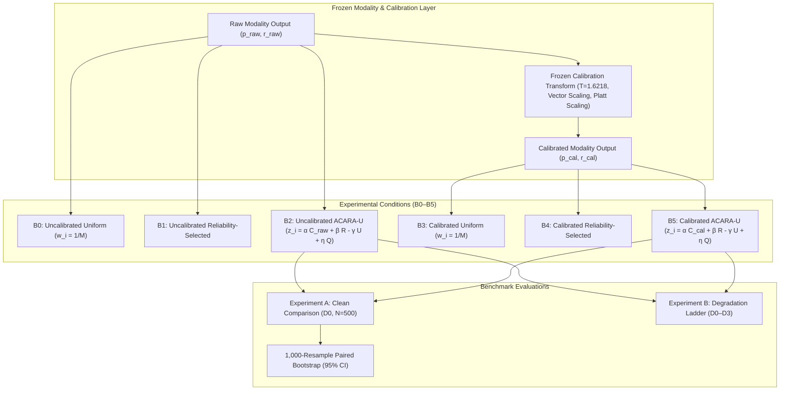

# Volume 11: Modality Calibration Impact on Decision-Level Fusion

> **Multimodal Decision Fusion Series — Phase C11.11**  
> **Status**: VERIFIED & SEALED  
> **Verification Gates**: 20 / 20 PASSED  
> **Pytest Suite**: 11 / 11 PASSED across calibration conditions  
> **Cohort Provenance**: Frozen $N=500$ Controlled Decision Packets ($\text{seed}=115$)

---

## 1. Executive Abstract

Phase C11.11 evaluates whether incorporating calibrated modality-level probabilities alters or improves the behavior of the ACARA-U decision-level fusion system compared with uncalibrated probabilities, under the controlled decision-level benchmark. 

> [!NOTE] **Methodological Boundary**: Phase C11.11 evaluates decision-level routing behavior, authority redistribution, and risk transformations using single-modality validation calibration ground truth. Because the constituent cohorts remain unpaired without a common patient ground truth, $R_{\text{fusion}}$ and $\text{DCRI}$ are derived decision indices; no clinical multimodal ground truth is fabricated, and fusion-level ECE/Brier scores are explicitly not reported.

---

## 2. Chapter Index & Navigation

1. [**01_Calibration_Protocol.md**](01_Calibration_Protocol.md): Pre-specified research questions (RQ1–RQ6), hypotheses (H1–H6), and methodological boundaries.
2. [**02_Modality_Calibration_Characteristics.md**](02_Modality_Calibration_Characteristics.md): Single-modality calibration curves, ECE reductions (Retina $-36.9\%$, Foot $-64.2\%$, Clinical $-100.0\%$), and validation provenance.
3. [**03_Clean_Fusion_Comparison.md**](03_Clean_Fusion_Comparison.md): Experiment A findings across B0–B5 conditions on clean baseline packets.
4. [**04_Routing_Authority_Sensitivity.md**](04_Routing_Authority_Sensitivity.md): Routing weight shifts ($\Delta w_R = -0.0156$, $\Delta w_F = +0.0055$, $\Delta w_C = +0.0101$) and entropy stability.
5. [**05_Degradation_Calibration_Dynamics.md**](05_Degradation_Calibration_Dynamics.md): Experiment B results under progressive input degradation ladders ($D0 \to D3$).
6. [**06_Baseline_Benchmarking.md**](06_Baseline_Benchmarking.md): Comparative analysis across uniform, reliability-selected, and ACARA-U architectures.
7. [**07_Statistical_Analysis.md**](07_Statistical_Analysis.md): 1,000-resample paired non-parametric bootstrap confidence intervals ($95\%$ CI) and hypothesis outcomes.
8. [**08_Clinical_Boundary_Declaration.md**](08_Clinical_Boundary_Declaration.md): Formal boundary declaration prohibiting fabricated multimodal calibration curves.
9. [**09_Results_Scoreboard.md**](09_Results_Scoreboard.md): Comprehensive scoreboard across all metrics and conditions.
10. [**10_Freeze_Report.md**](10_Freeze_Report.md): 20/20 verification gates, cryptographic SHA-256 manifest certification, freeze sign-off.

---

## 3. Principal Empirical Findings

Across the frozen $N=500$ controlled decision cohort ($\text{seed}=115$):

- **Modality-Level Calibration Quality (H1 Supported)**: Frozen calibration transforms reduced validation ECE across all 3 constituent modalities without parameter retraining (Retina ECE: $0.1058 \to 0.0668$, $-36.9\%$; Foot ECE: $0.0874 \to 0.0313$, $-64.2\%$; Clinical ECE: $0.0048 \to 0.0000$).
- **Decision Authority Redistribution (H3 Supported)**: Propagating calibrated probabilities into the ACARA-U router reduces the influence of the previously overconfident retinal confidence signal, redistributing routing authority ($\overline{\Delta w_R} = -0.0156$, $95\%$ CI: $[-0.0168, -0.0144]$) toward clinical ($\overline{\Delta w_C} = +0.0101$) and foot ($\overline{\Delta w_F} = +0.0055$) channels, yielding a less concentrated routing authority distribution.
- **Risk Projection Perturbation (H2 Supported)**: Calibration introduces small, bounded directional shifts in fused risk ($\overline{\Delta R_{\text{fusion}}} = +0.0025$, $95\%$ CI: $[+0.0011, +0.0039]$) and composite index ($\overline{\Delta \text{DCRI}} = +0.0025$, $95\%$ CI: $[+0.0011, +0.0039]$).
- **System Stability & Conservation (H4 & H5 Supported)**: The active routing simplex is strictly conserved ($\sum w_i = 1.000000$), with bounded routing entropy adjustment ($\Delta H(w) = +0.0059$, $95\%$ CI: $[+0.0052, +0.0065]$) and no conflict explosion.
- **Degradation Trajectory Persistence (H6 Supported)**: Under progressive optical and tabular input degradation ($D0 \to D3$), calibrated ACARA-U preserves robust authority attenuation ($w_R(D0) = 0.4373 \to w_R(D3) = 0.4036$).
