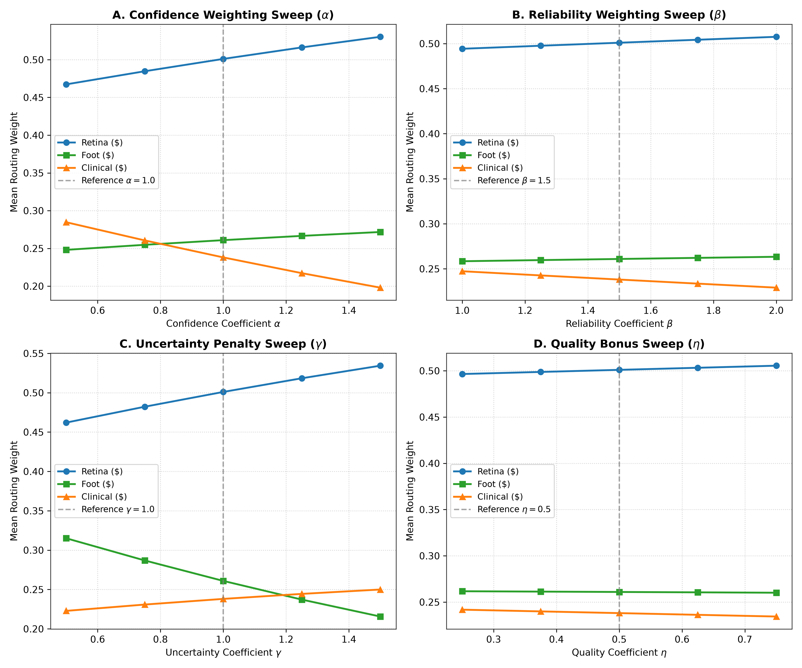
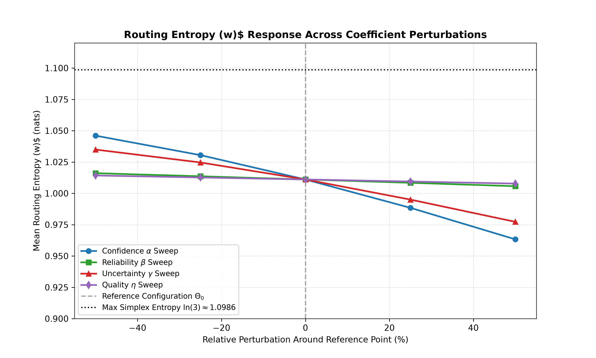
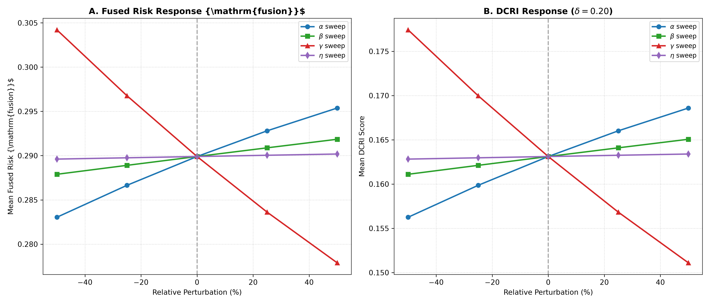

# Sensitivity Results & Response Dynamics

## 1. Modality Authority Sensitivity Across OFAT Sweeps

The One-Factor-At-A-Time (OFAT) sweeps systematically characterize the directional responsiveness of ACARA-U routing authority across the 4 kernel terms.

### Table 12.1: Modality Weight Allocations Across OFAT Grid ($N=500$)

| Config | Sweep Parameter | $\bar{w}_R$ | $\bar{w}_F$ | $\bar{w}_C$ | Mean Entropy $\bar{H}$ | $\bar{R}_{\text{fusion}}$ | $\overline{\text{DCRI}}$ |
| :--- | :--- | :---: | :---: | :---: | :---: | :---: | :---: |
| **A1** | $\alpha = 0.50$ ($-50\%$) | $0.467300$ | $0.248055$ | $0.284645$ | $1.046031$ | $0.283040$ | $0.156253$ |
| **A2** | $\alpha = 0.75$ ($-25\%$) | $0.484196$ | $0.254641$ | $0.261163$ | $1.029486$ | $0.286469$ | $0.159682$ |
| **A3** | $\alpha = 1.00$ ($\Theta_0$) | **0.501002** | **0.260925** | **0.238073** | **1.011041** | **0.289900** | **0.163113** |
| **A4** | $\alpha = 1.25$ ($+25\%$) | $0.516709$ | $0.266205$ | $0.217086$ | $0.991823$ | $0.293309$ | $0.166522$ |
| **A5** | $\alpha = 1.50$ ($+50\%$) | $0.530272$ | $0.271724$ | $0.198003$ | $0.963261$ | $0.295378$ | $0.168591$ |
| **B1** | $\beta = 1.00$ ($-33\%$) | $0.493976$ | $0.258282$ | $0.247742$ | $1.016259$ | $0.287843$ | $0.161056$ |
| **B2** | $\beta = 1.25$ ($-17\%$) | $0.497554$ | $0.259648$ | $0.242798$ | $1.013697$ | $0.288887$ | $0.162100$ |
| **B3** | $\beta = 1.50$ ($\Theta_0$) | **0.501002** | **0.260925** | **0.238073** | **1.011041** | **0.289900** | **0.163113** |
| **B4** | $\beta = 1.75$ ($+17\%$) | $0.504323$ | $0.262118$ | $0.233559$ | $1.008298$ | $0.290883$ | $0.164096$ |
| **B5** | $\beta = 2.00$ ($+33\%$) | $0.507246$ | $0.263227$ | $0.229528$ | $1.005858$ | $0.291801$ | $0.165014$ |
| **G1** | $\gamma = 0.50$ ($-50\%$) | $0.462062$ | $0.315079$ | $0.222859$ | $1.034913$ | $0.304208$ | $0.177421$ |
| **G2** | $\gamma = 0.75$ ($-25\%$) | $0.481682$ | $0.287376$ | $0.230942$ | $1.024227$ | $0.297059$ | $0.170272$ |
| **G3** | $\gamma = 1.00$ ($\Theta_0$) | **0.501002** | **0.260925** | **0.238073** | **1.011041** | **0.289900** | **0.163113** |
| **G4** | $\gamma = 1.25$ ($+25\%$) | $0.518683$ | $0.236814$ | $0.244503$ | $0.996160$ | $0.283120$ | $0.156333$ |
| **G5** | $\gamma = 1.50$ ($+50\%$) | $0.534345$ | $0.215668$ | $0.249987$ | $0.977226$ | $0.277888$ | $0.151101$ |
| **Q1** | $\eta = 0.250$ ($-50\%$) | $0.496527$ | $0.262529$ | $0.240944$ | $1.017578$ | $0.289354$ | $0.162567$ |
| **Q2** | $\eta = 0.375$ ($-25\%$) | $0.498774$ | $0.261726$ | $0.239500$ | $1.014316$ | $0.289628$ | $0.162841$ |
| **Q3** | $\eta = 0.500$ ($\Theta_0$) | **0.501002** | **0.260925** | **0.238073** | **1.011041** | **0.289900** | **0.163113** |
| **Q4** | $\eta = 0.625$ ($+25\%$) | $0.503207$ | $0.260126$ | $0.236667$ | $1.007755$ | $0.290170$ | $0.163383$ |
| **Q5** | $\eta = 0.750$ ($+50\%$) | $0.505526$ | $0.259351$ | $0.235124$ | $1.004640$ | $0.290498$ | $0.163711$ |

---

## 2. Empirical Sensitivity Slopes & Normalized Responsiveness

To enable scale-free comparison across coefficients with different base magnitudes, both linear slope ($S_\theta = \Delta M / \Delta \theta$) and normalized sensitivity ($S_\theta^{\text{norm}} = (\Delta M / M_0) / (\Delta \theta / \theta_0)$) are computed.

### Table 12.2: Summary of Linear & Normalized Sensitivity Slopes

| Sweep Parameter $\theta$ | Metric $M$ | Linear Slope $S_\theta$ | Normalized Sensitivity $S_\theta^{\text{norm}}$ | Primary Behavioral Finding |
| :--- | :--- | :---: | :---: | :--- |
| **Confidence $\alpha$** | Retinal Weight ($w_R$) | $+0.062972$ | $+0.125692$ | Retina authority increases as confidence influence grows |
| | Foot Weight ($w_F$) | $+0.023669$ | $+0.090712$ | Foot authority moderately increases |
| | Clinical Weight ($w_C$) | $-0.086642$ | $-0.363930$ | Clinical authority decreases (lower average confidence) |
| | Entropy ($H$) | $-0.082770$ | $-0.081866$ | Modest entropy contraction with sharper routing |
| | Fused Risk ($R_{\text{fusion}}$) | $+0.012338$ | $+0.042560$ | Minor positive drift toward higher-confidence modalities |
| **Reliability $\beta$** | Retinal Weight ($w_R$) | $+0.013270$ | $+0.039730$ | Favors high-reliability Retina ($R=0.93$) |
| | Clinical Weight ($w_C$) | $-0.018214$ | $-0.114759$ | Attenuates lower-reliability Clinical ($R=0.825$) |
| | Entropy ($H$) | $-0.010401$ | $-0.015431$ | Very high entropy stability |
| **Uncertainty $\gamma$** | Retinal Weight ($w_R$) | $+0.072283$ | $+0.144277$ | Absorbs authority from higher-uncertainty Foot channel |
| | Foot Weight ($w_F$) | $-0.099411$ | $-0.380995$ | Strongest attenuation target due to elevated foot uncertainty |
| | Clinical Weight ($w_C$) | $+0.027128$ | $+0.113948$ | Gains secondary redistributed authority |
| | Entropy ($H$) | $-0.057687$ | $-0.057057$ | Controlled dispersion reduction |
| | Fused Risk ($R_{\text{fusion}}$) | $-0.026320$ | $-0.090790$ | Fused risk shifts downward away from high-risk uncertain foot |
| **Quality $\eta$** | Retinal Weight ($w_R$) | $+0.017998$ | $+0.017962$ | Clean image bonus awarded to retinal channel |
| | Foot Weight ($w_F$) | $-0.003178$ | $-0.006090$ | Minimal authority displacement |
| | Clinical Weight ($w_C$) | $-0.014820$ | $-0.031125$ | Clinical quality differential modulation |
| | Entropy ($H$) | $-0.012938$ | $-0.006398$ | Near-zero entropy perturbation |

---

## 3. Unified Aggregate Euclidean Sensitivity Ranking

To provide a reproducible multi-dimensional summary of empirical routing sensitivity across the three modality channels, we define the **Aggregate Normalized Sensitivity Norm**:

$$S_\theta^{\text{agg,norm}} = \sqrt{(S_\theta^{\text{norm}}(w_R))^2 + (S_\theta^{\text{norm}}(w_F))^2 + (S_\theta^{\text{norm}}(w_C))^2}$$

### Table 12.3: Multi-Dimensional Sensitivity Norms Across ACARA-U Kernel Terms

| Coefficient $\theta$ | Linear Norm $S_\theta^{\text{agg}}$ | Normalized Norm $S_\theta^{\text{agg,norm}}$ | Empirical Sensitivity Ranking | Primary Behavioral Function |
| :--- | :---: | :---: | :---: | :--- |
| **Uncertainty ($\gamma$)** | $0.125870$ | **$0.423033$** | **Rank 1 (Most Responsive)** | Active per-channel uncertainty attenuation |
| **Confidence ($\alpha$)** | $0.109693$ | **$0.395566$** | **Rank 2 (Strong Dynamics)** | Dynamic instance certainty scaling |
| **Reliability ($\beta$)** | $0.023072$ | **$0.124725$** | **Rank 3 (Prior Anchor)** | Static validation reliability weighting |
| **Quality ($\eta$)** | $0.023530$ | **$0.036448$** | **Rank 4 (Gentle Bonus)** | Non-disruptive input quality modulation |

---

## 4. Information Entropy and Fused Risk Dynamics

### Key Behavioral Insights:
1. **Entropy Stability**: Across all 23 named evaluations (19 unique parameter vectors), mean routing entropy remains strictly within $[0.9633, 1.0460]\text{ nats}$, indicating that the router operates far from single-channel saturation ($H \to 0$) and maintains non-degenerate multi-modal routing across all tested parameter regimes.
2. **Unified Responsiveness**: Ranking parameters via the complete 3-D authority vector norm establishes that **Uncertainty ($\gamma$, $S^{\text{agg,norm}}=0.423$)** and **Confidence ($\alpha$, $S^{\text{agg,norm}}=0.396$)** are the primary dynamic drivers of routing redistribution, while **Reliability ($\beta$, $0.125$)** and **Quality ($\eta$, $0.036$)** provide steady prior anchoring and gentle quality bonuses.
3. **Finite-Range Empirical Slopes**: All response metrics reflect finite-range endpoint slopes evaluated across the respective pre-specified perturbation domains: $\pm 50\%$ for $\alpha, \gamma, \eta$, and approximately $\pm 33\%$ for $\beta$, rather than infinitesimal local derivatives.
